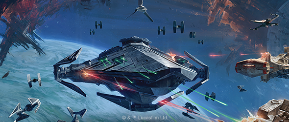
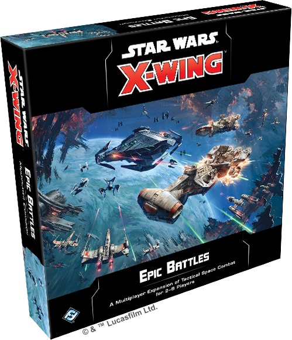
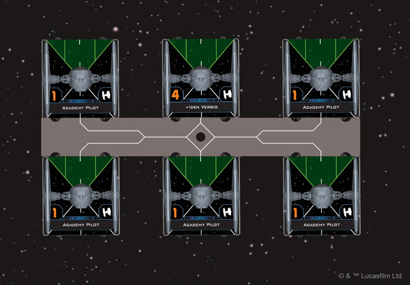
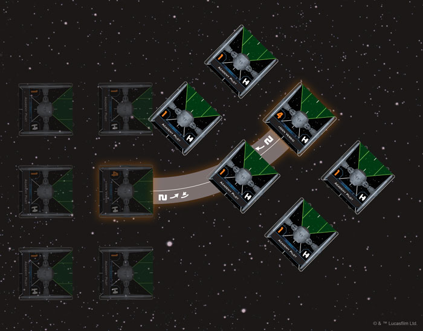
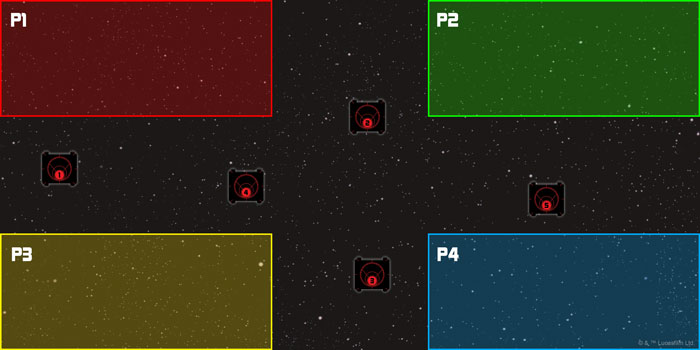

This article was originally published on [https://www.fantasyflightgames.com/en/news/2019/7/11/a-larger-world/](https://www.fantasyflightgames.com/en/news/2019/7/11/a-larger-world/)

&laquo; [Back to index](../index.md)

---

11 July 2019

A Larger World
==============

Announcing the Epic Battles Multiplayer Expansion for X-Wing

_"You've taken your first step into a larger world."_  
   –Obi-Wan Kenobi, _Star Wars: A New Hope_

Whether fought between the Galactic Empire and Rebel Alliance, the Resistance and the First Order, or the Galactic Republic and the Separatist Alliance, the _Star Wars_ saga is defined by massive space battles that pit groups of heavily-armed warships and dozens of smaller starfighters against one another. Soon, you’ll have the chance to enter these battles and test your mettle in some of the most intense and chaotic space battles in the _Star Wars_ galaxy.    

Fantasy Flight Games is happy to announce the _[Epic Battles Multiplayer Expansion](https://drafts.fantasyflightgames.com/en/products/x-wing-second-edition/products/epic-battles-multiplayer-expansion/)_ for [_Star Wars_™: X-Wing!](https://www.fantasyflightgames.com/en/products/x-wing-second-edition/) _Epic Battles_ introduces a totally new way to play _X-Wing_, inviting two to eight players to engage in epic multiplayer battles as they command massive fleets in large-scale games that evoke iconic _Star Wars_ scenes.

Featuring eleven cinematic scenarios—from team games to chaotic, eight-player, free-for-all battles—_Epic Battles_ broadens the possibilities of _X-Wing_, creating an exciting new experience for players of all skill levels. In addition to the scenarios and rules for playing with more than two players, _Epic Battles_ also introduces wings, an exciting new way for players to control multiple ships in formation using only a single maneuver dial. Wings work particularly well when flying in conjunction with huge ships, the largest class of ships available in _X-Wing_. For more information on adding huge ships to your fleets, click [here](https://www.fantasyflightgames.com/en/news/3000/1/1/bigger-battles/)! 

No matter if you’re going head-to-head with a single opponent or coordinating your attacks with a teammate, the new game modes you find in _Epic Battles_ create an exciting new _X-Wing_ experience. Read on for more of what to expect in the _Epic Battles Multiplayer Expansion_!

Stay on Target
--------------

In the white-knuckle space battles of _X-Wing_, the only thing a pilot can rely on is their wingmates. When flying together, pilots can cover each other with valuable fire support and, if your squadron includes limited pilots, their abilities can synergize to benefit the entire squadron. Now, _Epic Battles_ lets you use wings to truly harness the power of groups of starfighters flying in formation.

Moving together using a single dial, wings let you easily navigate groups of three to six ships through the chaos of battle and use them as a combined force to complete your objectives. Within the _Epic Battles Multiplayer Expansion_, you’ll find everything you need to form complete wings of starfighters, including two full-size wing tools, two mini wing tools, and a corner wing tool, as well as eight wing upgrade cards, seven wing Quick Build Cards, and twenty-four wing ID cards to easily track every ship in your wings.

  
_The full-size wing tool makes it easy to arrange your ships in formation!_

No matter how many wings you choose to fly, each wing is commanded by one wing leader, who executes maneuvers normally while their wingmates form up around them. Each ship in the wing has a specific position in the formation and the five wing tools found in _Epic Battles_ help to quickly arrange your ships. To arrange ships around a full-size wing tool, for example, you'll simply align each ship’s center line with the corresponding line on the tool.

Wings not only make flying in formation easier, they also speed up gameplay considerably, accelerating resolution even when there are many ships in play. But wings also change the makeup of your squadrons, granting special abilities. If you choose to make a TIE Advanced x1 or TIE Advanced v1 pilot an [Agent of the Empire,](d7d7b0561fee60aeb693d1d04b74f5b9.png) for example, they can be accompanied by a complement of TIE/ln fighters that can put themselves in harm’s way to defend their leader.

  
_When flying as a wing, the wing leader executes maneuvers normally and their wingmates form around them!_

New Battles
-----------

Wings of starfighters are usually just one part of larger battles and _Epic Battles_ expands the scale of _X-Wing_ to accommodate these groups of fighters. In addition to the tools you need to form and fly wings, this expansion also features eleven unique scenarios and all the components you need to play them.

From taking desperate defensive actions as friendly transports escape to daring assaults on enemy fortifications, each scenario provides a new way to play _X-Wing_. While many of these scenarios see two players facing off in tense head-to-head combat, others bring in more players for team battles or epic free-for-alls between three or more players.

  
_In the Intel Pickup scenario, two to four players deploy their ships to collect data from satellites!_

In Intel Pickup, for example, two to four players compete for control of satellites that have been gathering key hyperlane data. Eager to seize this information, several factions have appeared to claim the satellites as their own. During this game, players must contend with enemy ships while trying to secure the data from five satellites placed around the board.

The scenarios you find in _Epic Battles_ don't just add a cinematic feel to your games. Many allow you to exceed the squad-building restrictions placed on other games of _X-Wing_, giving you the chance to build massive 500-point or 20-threat squadrons. As such, these engagements are a natural fit for huge ships, such as the _Raider_\-class corvette and the C-ROC cruiser. While they are not required for the Epic game mode, these massive vessels give you powerful new options for you fleets, allowing you to strike at long range with devastating turbolasers, command smaller fighters, and disrupt enemy battle plans with electronic warfare. For more information about the return of huge ships to _X-Wing_, click [here](https://www.fantasyflightgames.com/en/news/3000/1/1/bigger-battles/)!

We’ll take a closer look at specific scenarios included in the _Epic Battles Multiplayer Expansion_ in future previews and livestreams!

Enter the Saga
--------------

The chaos of battle surrounds you as enemy fighters dart between massive warships. It will take more than just fancy flying to lead your squadron to victory in battles like this. Step up to the largest _X-Wing_ battles yet with the _Epic Battles Multiplayer Expansion_!