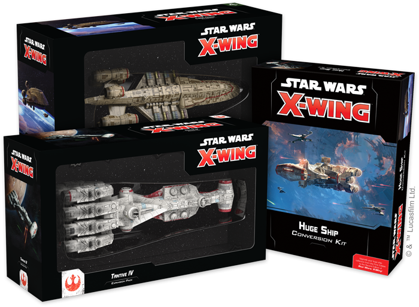
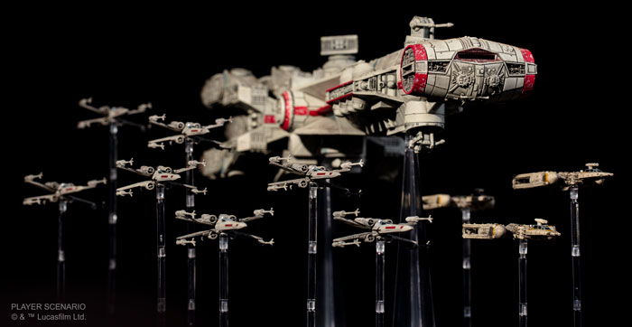
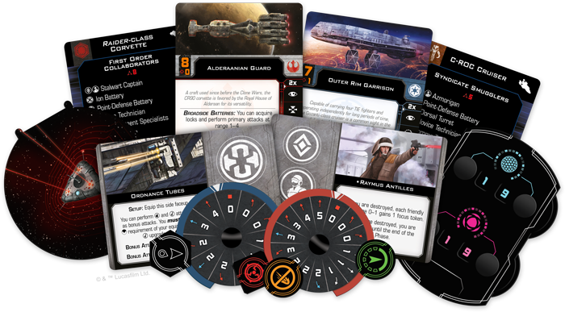
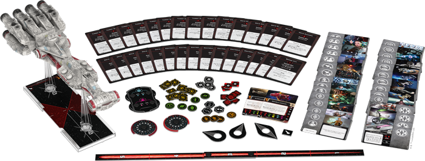
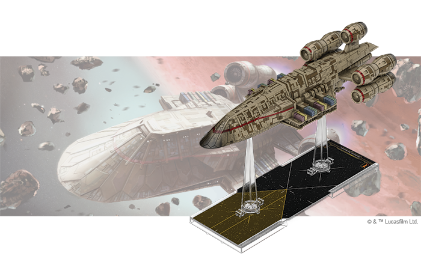
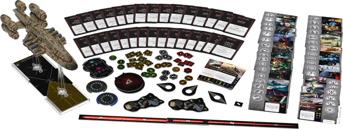
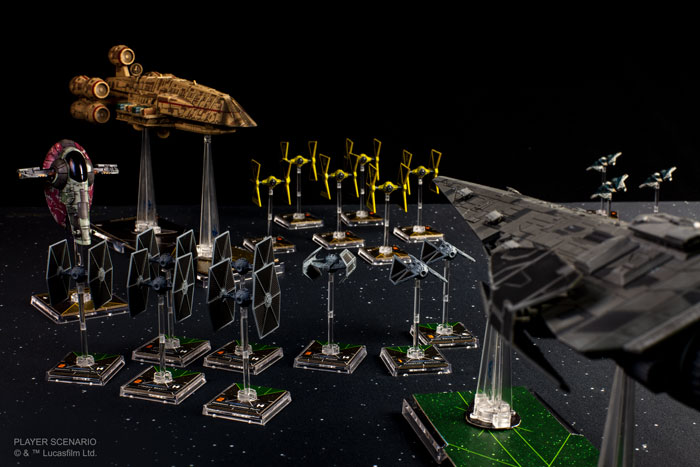

This article was originally published on [https://www.fantasyflightgames.com/en/news/2019/7/11/bigger-battles/](https://www.fantasyflightgames.com/en/news/2019/7/11/bigger-battles/)

&laquo; [Back to index](../index.md)

---

11 July 2019

Bigger Battles
==============

Huge Ships Are Coming to X-Wing

_"To defeat an enemy, you must know them. Not simply their battle tactics, but their history, philosophy, art."_  
   –Grand Admiral Thrawn, _Star Wars: Rebels_

As T-65 X-wings and TIE/ln fighters engage in frantic ship-to-ship combat, turbolasers from massive warships flash across the darkness of space, pummeling their targets. Soon, you’ll be able to launch your squadrons into bigger battles, coordinating your plan of attack between imposing warships and swift starfighters. Fantasy Flight Games is happy to announce three expansions for [_Star Wars_™: X-Wing](https://www.fantasyflightgames.com/en/products/x-wing-second-edition/):

*   _[Huge Ship Conversion Kit](https://www.fantasyflightgames.com/en/products/x-wing-second-edition/products/huge-ship-conversion-kit/)_
*   _[Tantive IV Expansion Pack](https://www.fantasyflightgames.com/en/products/x-wing-second-edition/products/x-wing-second-edition-tantive-iv-expansion-pack/)_
*   _[C-ROC Cruiser Expansion Pack](https://www.fantasyflightgames.com/en/products/x-wing-second-edition/products/x-wing-second-edition-c-roc-cruiser-expansion-pack/)_

These expansions put devastating new options for your starfighter squadrons at your fingertips, letting you conduct deadly electronic warfare and unleash barrages of powerful turbolaser or ion cannon fire as you bring the full weight of the largest _X-Wing_ ship class to bear against your opponents. The largest ships available in _X-Wing_, huge ships can be used during casual games of _X-Wing_, and they're also great when used in conjunction with the _[Epic Battles Multiplayer Expansion](https://www.fantasyflightgames.com/en/products/x-wing-second-edition/products/epic-battles-multiplayer-expansion/)_. For more information on what that expansion adds to your games, click here! 

Within the _Huge Ship Conversion Kit_, veteran _X-Wing_ players will find two huge plastic bases and four plastic pegs, as well as all the punchboard and cards they need to upgrade their CR-90 Corellian corvette, C-ROC cruiser, _Gozanti_\-class cruiser, GR-75 medium transport, and _Raider_\-class corvette ships to the second edition, including cards to field each huge ship in two of _X-Wing_’s seven factions.

Meanwhile, the _Tantive IV Expansion Pack_ and _C-ROC Cruiser Expansion Pack_ invite new and veteran players alike to harness the might of these massive craft and utilize a variety of new upgrades only available for huge ships. Look for these expansions at your local retailer early in the fourth quarter of 2019, with the _Raider_\-class corvette following soon after, and read on for more information about what huge ships bring to your games of _X-Wing_!

Huge Ship Conversion Kit
------------------------

In the largest _Star Wars_ space battles, huge vessels launch volleys of devastating weaponry as starfighters nimbly avoid their point defenses, looking for any advantage they can find. With the _Huge Ship Conversion Kit_ and copies of huge ship expansions from the game's first edition, you can enter these epic battles, taking command of massive warships and small starfighters alike.

This conversion kit contains everything you need to incorporate every huge ship released in the game’s first edition into your squadrons, including ship cards, tokens, and maneuver dials. Many of these ships saw service in multiple conflicts, of course, and this kit also includes entirely new components that allow you fly them in new factions, ensuring you can command a huge ship no matter what era of the _Star Wars_ saga your squadron hails from.

Now, the CR90 corvette can be flown by the Rebel Alliance or the Galactic Republic; the GR-75 medium transport can be used by the Rebel Alliance or the Resistance; the _Raider_\-class corvette and the _Gozanti_\-class cruiser can fight for the Galactic Empire or the First Order; and the C-ROC cruiser can fly for the Separatist Alliance or Scum and Villainy.

But commanding huge ships goes far beyond the faction you play. Huge ships alter your entire strategy and a selection of 82 upgrade cards invite you to customize your huge ships, outfitting them with Commands, Teams, Cargo, and potent Hardpoints that grant additional attacks. Finally, while each huge ship has its own unique capabilities and unique roles within your squadron, like small ships, they all use the same set of tools for basic functions such as movement. This kit also contains a plastic huge ship maneuver tool, a huge ship range ruler, two huge ship resource trackers, and a huge ship damage deck that can be used with any huge ship!

Tantive IV Expansion Pack
-------------------------

With its powerful broadside batteries and advanced command capabilities, the CR90 Corellian corvette has served as the cornerstone of strike forces since the days of the old Republic. Now, these vessels are among the Rebellion’s most valuable warships, slipping Imperial blockades and delivering the decisive blow in space engagements.

The _Tantive IV Expansion Pack_ makes one of these swift ships available to commanders from both the Rebel Alliance and the Galactic Republic. Once in action, the CR90 can rapidly respond to incursions across the galaxy, using sophisticated sensors to acquire locks and fire on the enemy from great distances.

Within this expansion, you’ll find everything you need to add one CR90 Corellian corvette ship to your Rebel Alliance or Galactic Republic squadron, including ship cards, tokens and maneuver dials. Finally, this expansion also includes the components you need to fly this or any other huge ship in battle, including a huge ship maneuver tool and a huge ship damage deck.

C-ROC Cruiser Expansion Pack
----------------------------

The C-ROC cruiser is the heaviest vessel available to many criminal operations, cartels, and syndicates in the Outer Rim, capable of carrying massive weapons batteries and unique dirty tricks that keep it one step ahead of the law. Whether it's hauling illicit cargo or marauding the hyperlanes in search of easy targets, the C-ROC is a flexible and dangerous craft.

Despite its large size, the C-ROC cruiser’s overdrive burners make it a surprisingly elusive ship, capable of avoiding incoming fire. Many criminal operations take advantage of this elusiveness to move massive amounts of illicit materials under the nose of local authorities. During the Clone Wars, the Separatist Alliance would often make use of unsavory contacts such as these—including corsairs and criminal cartels—in its fight against the Galactic Republic.

The _C-ROC Cruiser Expansion Pack_ contains everything both Scum and Villainy and Separatist Alliance players need to incorporate one of these armed transports to their squadrons. A selection of ship cards, tokens, and maneuver dials gets your C-ROC into battle, while a suite of upgrade cards invites you to add a bevy of dirty tricks to your cruiser. Finally, a plastic maneuver tool, huge ship resource tracker, and huge ship damage deck make managing your ship fast and easy.

Battle for the Galaxy
---------------------

Fully operational warships are ready for your commands. Harness their power as you battle for the fate of the galaxy!