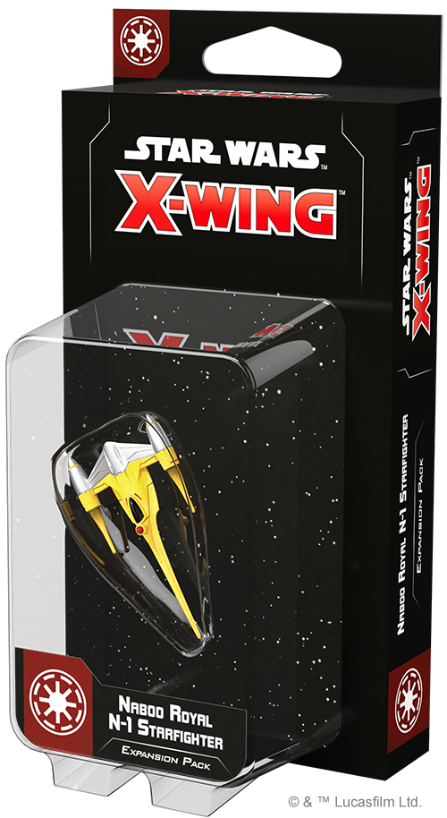
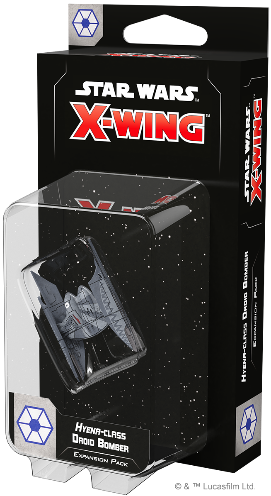
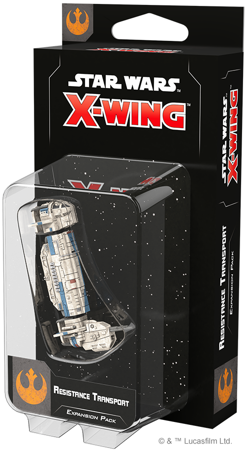
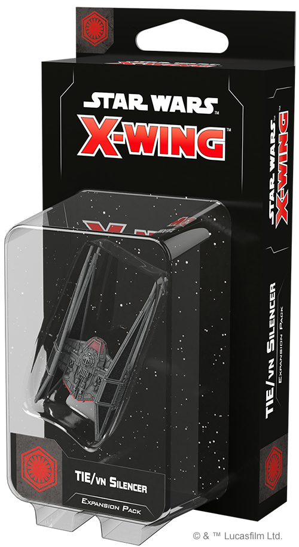
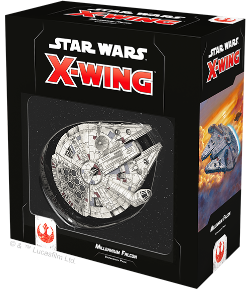
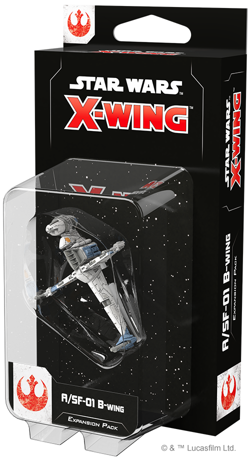
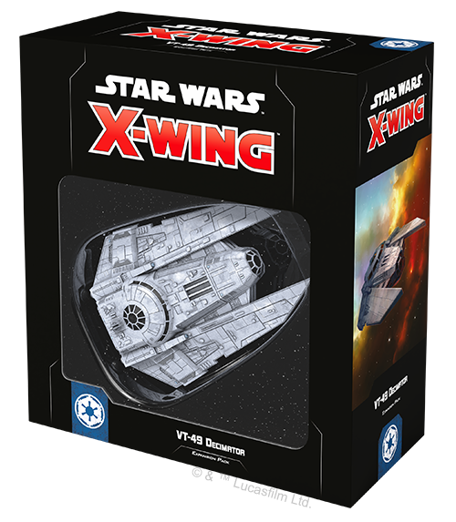
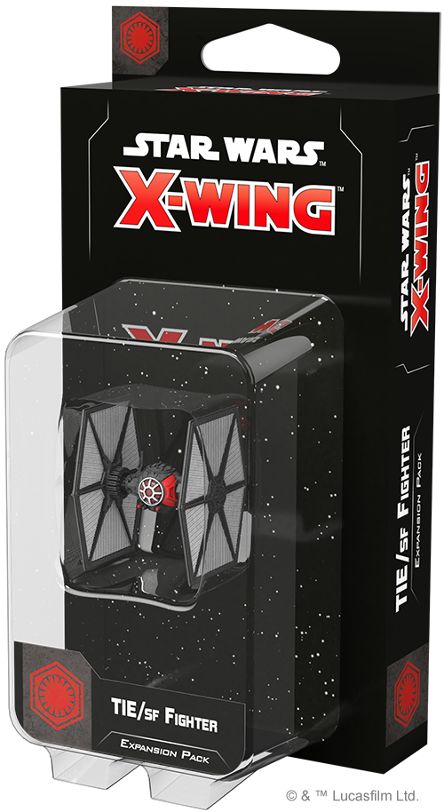

This article was originally published on [https://www.fantasyflightgames.com/en/news/2019/7/12/available-now-july-12/](https://www.fantasyflightgames.com/en/news/2019/7/12/available-now-july-12/)

&laquo; [Back to index](../index.md)

---

12 July 2019

Available Now — July 12
=======================

X-Wing Wave IV Is Now Available

_Take a look at the latest products from Fantasy Flight Games, now available at your local retailer or online through our webstore!_ 

* * *

 [Naboo Royal N-1 Starfighter Expansion Pack](https://www.fantasyflightgames.com/en/products/x-wing-second-edition/products/naboo-royal-n-1-starfighter-expansion-pack/)
--------------------------------------------------------------------------------------------------------------------------------------------------------------------------------------------------------------------------------------------------------------------------------------------------

Despite being a peaceful planet with no standing army, Naboo is still dedicated to supporting the Republic against the nefarious Separatist Alliance. The planet’s Royal Security Forces are ready to spring into action at a moment’s notice and—when these battles take them to the skies above the planet and beyond—they enter the fight in the Naboo Royal N-1 starfighter.

Sleek and agile, the Naboo Royal N-1 is well-suited to its role as a diplomatic escort for that planet’s ambassadors. Beneath the gleaming chromium of its elegant spaceframe are advanced Nubian engines further customized by the Theed Palace Engineering Corps, making the N-1 one of the fastest starfighters of its time.

In addition to the beautifully detailed and pre-painted Naboo Royal N-1 Starfighter miniature, this expansion contains six ship cards, seven upgrade cards that give you greater control over its prodigious speed, and the tokens and maneuver dial you need to defend Naboo or any other planet. 

Naboo Royal N-1 Starfighter Expansion Pack _(SWZ40) at your local retailer today or online through our website [here](https://www.fantasyflightgames.com/en/products/x-wing-second-edition/products/naboo-royal-n-1-starfighter-expansion-pack/)!_

* * *

 [Hyena-class Droid Bomber Expansion Pack](https://www.fantasyflightgames.com/en/products/x-wing-second-edition/products/hyena-class-droid-bomber-expansion-pack/)
--------------------------------------------------------------------------------------------------------------------------------------------------------------------------------------------------------------------------------------------------------------------------------------------

Baktoid Armor Workshop’s _Hyena_\-class droid bomber is a wartime evolution of the Trade Federation’s Vulture-class droid fighter. Carrying an extensive payload of experimental and deadly ordnance provided by the Techno Union, the _Hyena_ is a nasty surprise to any Republic loyalist who dismisses the danger posed by “mere” droids.

Compatible with _Vulture_ swarm tactics, _Hyena_\-class bombers add lethal new layers to Separatist squadrons. Within the Hyena_\-class Droid Bomber Expansion Pack_, you'll find everything you need to add some heavy firepower to your Separatist Alliance squadrons, including six ship cards, 10 upgrade cards, and two Quick Build cards.

_Pick up your copy of the Hyena_\-class Droid Bomber Expansion Pack _(SWZ41) at your local retailer today or online through our website [here](https://www.fantasyflightgames.com/en/products/x-wing-second-edition/products/hyena-class-droid-bomber-expansion-pack/)!_

* * *

 [Resistance Transport Expansion Pack](https://www.fantasyflightgames.com/en/products/x-wing-second-edition/products/resistance-transport-expansion-pack/)
------------------------------------------------------------------------------------------------------------------------------------------------------------------------------------------------------------------------------------------------------------------------------------

The Resistance Transport is a custom-built shuttle used by the Resistance as a troop carrier and gunship. Its modular design means the vessel's cockpit pod can be flown independently on missions that don't require heavy weaponry or transport capability. 

With the _Resistance Transport Expansion Pack_, you can put this versatile ship to use in both its forms. In addition to both a Resistance Transport ship miniature and a Resistance Transport Pod ship miniature, you'll also find several high-ranking Resistance officers ready to join your crew, eight pilots prepped for battle, and four Quick Build cards to help you jump into the fight right away. 

_Pick up your copy of the_ Resistance Transport Expansion Pack _(SWZ45) at your local retailer today or online through our website [here](https://www.fantasyflightgames.com/en/products/x-wing-second-edition/products/resistance-transport-expansion-pack/)!_

* * *

 [TIE/vn Silencer Expansion Pack](https://www.fantasyflightgames.com/en/products/x-wing-second-edition/products/tievn-silencer-expansion-pack/)
-------------------------------------------------------------------------------------------------------------------------------------------------------------------------------------------------------------------------------------------------------------------------

The TIE/vn silencer is the most elite starfighter developed for the First Order by Sienar-Jaemus Fleet Systems. Built in the depths of the Unknown Regions with the technologies that once made the TIE Defender an unprecedented menace, this dreaded craft can threaten any Resistance ship—provided the pilot can handle its power and speed.

The _TIE/vn Silencer Expansion Pack_ gives you everything you need to add one of these menacing ships to your First Order squadrons. Featuring a beautifully re-sculpted TIE/vn silencer miniature, this pack also contains six ship cards identical to the TIE/vn silencer ship cards found in the _[First Order Conversion Kit](https://www.fantasyflightgames.com/en/products/x-wing-second-edition/products/first-order-conversion-kit/)_ along with reprints of five upgrade cards uniquely tailored to take advantage of the silencer's capabilities. 

_Pick up your copy of the_ TIE/vn Silencer Expansion Pack _(SWZ27) at your local retailer today or online through our website [here](https://www.fantasyflightgames.com/en/products/x-wing-second-edition/products/tievn-silencer-expansion-pack/)!_

* * *

 [Millennium Falcon Expansion Pack](https://www.fantasyflightgames.com/en/products/x-wing-second-edition/products/x-wing-second-edition-millennium-falcon-expansion-pack/)
----------------------------------------------------------------------------------------------------------------------------------------------------------------------------------------------------------------------------------------------------------------------------------------------------

After winning the ship that would become legend from Lando Calrissian, Han Solo and Chewbacca made several special modifications to the _Millennium Falcon_ for their smuggling career. Now, these scruffy-looking smugglers turn their efforts to defeating the Galactic Empire alongside heroes of the Rebellion. 

With the Millennium Falcon _Expansion Pack_ you can fly this iconic ship into battle. Featuring a Modified YT-1300 Light Freighter ship miniature blasting off with a striking engine glow, this expansion also contains four YT-1300 ship cards identical to those found in the _[Rebel Alliance Conversion Kit](https://www.fantasyflightgames.com/en/products/x-wing-second-edition/products/rebel-alliance-conversion-kit/)_ and reprints of fourteen essential upgrade cards, inviting you to make your own personal modifications. Finally, two Quick Build Cards provide suggestions for combinations of pilots and upgrades, helping you get into the battle even sooner.

_Pick up your copy of the Millenium Falcon_ Expansion Pack _(SWZ39) at your local retailer today or online through our website [here](https://www.fantasyflightgames.com/en/products/x-wing-second-edition/products/x-wing-second-edition-millennium-falcon-expansion-pack/)!_

* * *

 [A/SF-01 B-Wing Expansion Pack](https://www.fantasyflightgames.com/en/products/x-wing-second-edition/products/sf-01-b-wing-expansion-pack/)
----------------------------------------------------------------------------------------------------------------------------------------------------------------------------------------------------------------------------------------------------------------------

Incorporating a revolutionary gyrostabilization system, the A/SF-01 B-Wing is dangerous to fly and difficult to master. In the right hands, however, the B-wing’s formidable weapons can be used to devasting effect, earning it a reputation as the premier assault fighter of the Rebel Alliance.

The _A/SF-01 B-Wing Expansion Pack_ contains everything you need to add one of these powerful fighters to your Rebel squadrons, including a A/SF-01 B-Wing ship miniature fully resculpted from the First Edition—now featuring folding wings, a spinning cockpit, and a body that can rotate on the peg. Additionally, you'll find four ship cards, identical to the A/SF-01 ship cards found in the _Rebel Alliance Conversion Kit_. Finally, you’ll also find reprints of eight upgrade cards and two new Quick Build cards that provide plenty of options for outfitting your B-wing for battle.

_Pick up your copy of the_ A/SF-01 B-Wing Expansion Pack _(SWZ42) at your local retailer today or online through our website [here](https://www.fantasyflightgames.com/en/products/x-wing-second-edition/products/sf-01-b-wing-expansion-pack/)!_

* * *

 [VT-49 Decimator Expansion Pack](https://www.fantasyflightgames.com/en/products/x-wing-second-edition/products/vt-49-expansion-pack/)
----------------------------------------------------------------------------------------------------------------------------------------------------------------------------------------------------------------------------------------------------------------

A durable vessel capable of independent patrols, the VT-49 Decimator’s size and power blurred the line between shuttle and corvette—but the same qualities that endeared it to up-and-coming Imperial officers also made it useful to agents of the Emperor, under whom failure was not an option.

With the _VT-49 Decimator Expansion Pack_, you can bring a single VT-49 Decimator to your Galactic Empire squadrons. In addition to one pre-painted and finely detailed VT-49 miniature, you’ll also find three ship cards matching the VT-49 Decimator ship cards from the _[Galactic Empire Conversion Kit,](https://www.fantasyflightgames.com/en/products/x-wing-second-edition/products/galactic-empire-conversion-kit/)_ as well as a selection of thirteen reprinted upgrade cards, giving you the freedom to add vital crew and deadly devices to your ship. Finally, two Quick Build cards let you get your Decimator in the fight right away with predefined combinations of ship and upgrade cards.

_Pick up your copy of the_ VT-49 Decimator Expansion Pack _(SWZ43) at your local retailer today or online through our website [here](https://www.fantasyflightgames.com/en/products/x-wing-second-edition/products/vt-49-expansion-pack/)!_

* * *

 [TIE/sf Fighter Expansion Pack](https://www.fantasyflightgames.com/en/products/x-wing-second-edition/products/tiesf-fighter-expansion-pack/)
-----------------------------------------------------------------------------------------------------------------------------------------------------------------------------------------------------------------------------------------------------------------------

Development of the TIE/sf fighter required Sienar-Jaemus Fleet Systems to pioneer new energy-cell technology to power the advanced systems demanded by the First Order Special Forces. The resulting starfighter boasts a versatile array of weapons, shields, and sensors, suitable for any situation.

Equipped with a Heavy Weapon Turret that can be rotated between its front and rear arcs, the TIE/sf is a threat from multiple angles. On top of the TIE/sf miniature, the _TIE/sf Fighter Expansion Pack_ also contains four TIE/sf ship cards identical to those in the _First Order Conversion Kit_, six upgrade cards, and two new Quick Build cards.

_Pick up your copy of_ TIE/sf Fighter Expansion Pack _(SWZ44) at your local retailer today or online through our website [here](https://www.fantasyflightgames.com/en/products/x-wing-second-edition/products/tiesf-fighter-expansion-pack/)!_

* * *

 [Deluxe Movement Tools and Range Ruler](https://www.fantasyflightgames.com/en/products/x-wing-second-edition/products/deluxe-movement-tools-and-range-ruler/)
----------------------------------------------------------------------------------------------------------------------------------------------------------------------------------------------------------------------------------------------------------------------------------------

Upgrade every move you make in the intense space battles of [_Star Wars_™: X-Wing](https://www.fantasyflightgames.com/en/products/x-wing-second-edition/) with the _Deluxe Movement Tools and Range Ruler_! This pack contains premium plastic maneuver templates and a range ruler to upgrade the corresponding components from your _[X-Wing Core Set.](https://www.fantasyflightgames.com/en/products/x-wing-second-edition/products/x-wing-second-edition/)_ In addition to the eleven movement templates, you’ll also find a range ruler base and four range ruler segments that can be used individually or combined to make your measurements quick and precise.

_Pick up your copy of the_ Deluxe Movement Tools and Range Ruler _(SWZ46) at your local retailer today or online through our website [here](https://www.fantasyflightgames.com/en/products/x-wing-second-edition/products/deluxe-movement-tools-and-range-ruler/)!_

