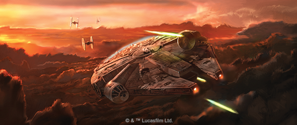
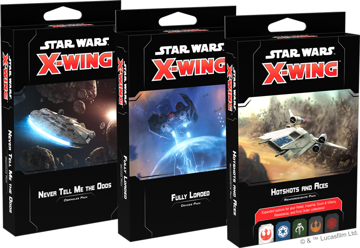
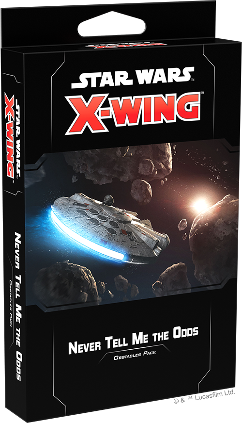
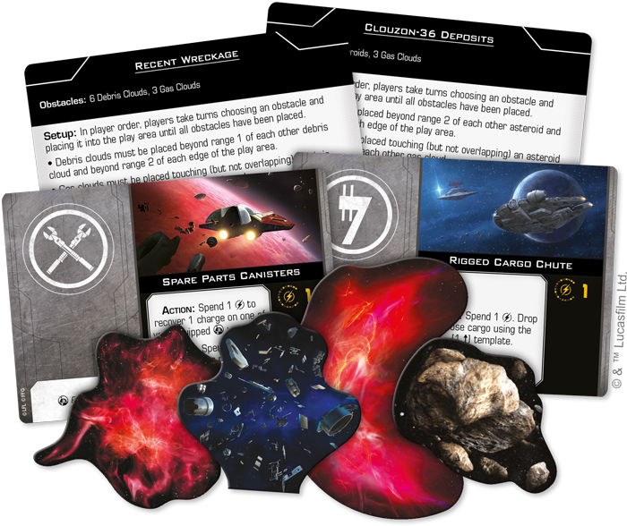
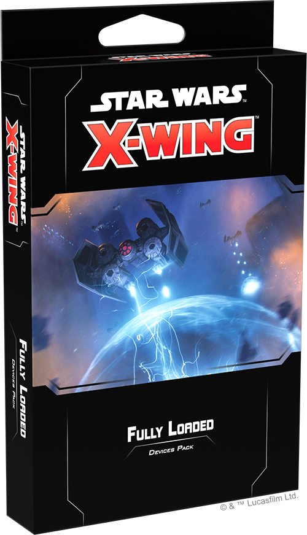
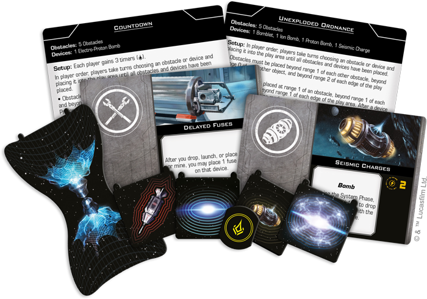
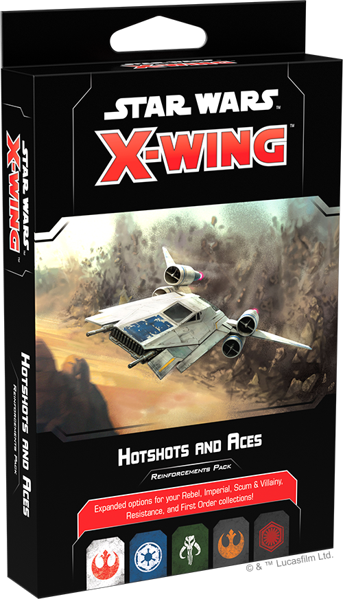
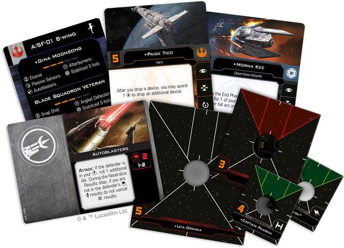

This article was originally published on [https://www.fantasyflightgames.com/en/news/2019/8/1/aces-in-the-hole/](https://www.fantasyflightgames.com/en/news/2019/8/1/aces-in-the-hole/)

&laquo; [Back to index](../index.md)

---

1 August 2019

Aces in the Hole
================

Announcing Three Expansions for Star Wars: X-Wing

_“Traveling through hyperspace ain’t like dusting crops, boy. Without precise calculations, we’d fly right through a star or bounce too close to a supernova and that’d end your trip real quick, wouldn’t it?”_  
   –Han Solo, _Star Wars: A New Hope_

From the skies above Coruscant to distant nebulas on the edge of the Outer Rim, there’s no telling where the next space battle in the _Star Wars_ galaxy might erupt. When it does, squad leaders need to use the pilots under their command, their ship’s weapons and systems, and even the environment itself if they hope to claim victory. Soon, your games of [_Star Wars_™: X-Wing](https://www.fantasyflightgames.com/en/products/x-wing-second-edition/) will be more varied than ever before.

_Pre-order your own copies of these_ X-Wing _expansions_ _at your local retailer or online through our website—with free shipping in the continental United States—today!  
 _ 

Fantasy Flight Games is excited to announce three expansions for _X-Wing:_

*   _[Never Tell Me the Odds Obstacles Pack](https://www.fantasyflightgames.com/en/products/x-wing-second-edition/products/never-tell-me-odds-obstacles-pack/)_
*   _[Fully Loaded Devices Pack](https://www.fantasyflightgames.com/en/products/x-wing-second-edition/products/fully-loaded-devices-pack/)_
*   _[Hotshots and Aces Reinforcements Pack](https://www.fantasyflightgames.com/en/products/x-wing-second-edition/products/hotshots-and-aces-reinforcements-pack/)_

These expansions gather a range of obstacles and upgrades released across multiple _X-Wing_ products, giving you a wide variety of options for customizing your ships and the environments where your battles take place. More than simply collecting previously released content, however, these expansions also introduce new ways to play _X-Wing_, drastically reshaping your games. In addition to new pilots and upgrades, you’ll also find environment cards that offer a way to quickly add scenarios with new combinations of obstacles and special rules that change the fabric of your games.

Read on for more information on these expansions and what they bring to _X-Wing_!

Never Tell Me the Odds Obstacles Pack
-------------------------------------

In the vast depths of space, one can find countless wonders—comets with icy trails, nebulas filled with ionizing gas, or even living creatures, like mynocks, hiding within the wreckage of past battles. When starfighters come into contact with these features during a dogfight, there’s no telling what might happen.

The _Never Tell Me the Odds Obstacles Packs_ collects every _X-Wing_ obstacle in one convenient package. In addition to adding nine asteroids, three debris fields, and three gas clouds to your collection, this pack also contains six environment cards that reflect the strange and terrifying places a space battle could take place.

Each environment card changes the placement or rules around obstacles, adding even more variety to your games. If you find yourself battling amidst an [Asteroid Shower,](swz64_asteroid-shower.png) for example, you’ll find yourself maneuvering around an increasing number of asteroids as you attempt to gain the upper hand on your opponent.

We’ll take a look at even more environment cards from the _Never Tell Me the Odds Obstacles Pack_ in a future preview!

Fully Loaded Devices Pack
-------------------------

The space battles of _X-Wing_ are fought with much more than laser cannons and torpedoes. These battles also see heavily armed bombers wreak havoc on enemy formations by dropping powerful bombs into the middle of enemy flight paths, causing massive damage to any ships unfortunate enough to be caught in the blast radius.

Within the _Fully Loaded Devices Pack_, you’ll find numerous deadly devices that can be used to arm your squadron to the teeth, including the upgrade cards and tokens for Proximity Mines, Proton Bombs, Seismic Charges, and Bomblets, as well as an Electro-Proton Bomb and a Connor Net. Additionally, this pack also sees the return of Cluster Mines and Ion Bombs from _X-Wing_’s first edition.

On top of these cards and tokens, this pack also contains an additional six environment cards that use devices as part of their setup, allowing players to battle in [deadly minefields,](swz65_minefield.png) fly their ships through starfields riddled with unexploded ordnance, or even maneuver to avoid continuous bombardments.

We’ll take a look at more of the environment cards included in the _Fully Loaded Devices Pack_ in a future preview!

Hotshots and Aces Reinforcements Pack
-------------------------------------

A squadron is only as good as the pilots that make it up. From the Rebellion’s ragtag band of freedom fighters assembled from across the galaxy to TIE/fo pilots trained in space combat from childhood, every _X-Wing_ faction has pilots that put their own spin on piloting the galaxy’s most iconic starfighters.

Now, with the _Hotshots and Aces Reinforcements Pack_, you can enhance your squadron options and launch new pilots into battle. This pack contains a variety of new pilots for numerous ships in the Rebel, Imperial, Scum, Resistance, and First Order factions, allowing you to add iconic characters like [K-2SO](swz66_k-2so.png) to your squads.

No matter how skilled they are, any pilot could use some upgraded weapons or technology, so _Hotshots and Aces_ gives you even more ways to customize your ships. In addition to new pilots, this pack also contains a suite of 31 sought-after upgrade cards—including [Mag-Pulse Warheads](swz62_mag-pulse-warheads.png) —giving you the opportunity to tailor your ships to better fit their pilot’s individual abilities.

We’ll take a look at everything included in this pack—including all the new ship cards—in a future preview!

Prepare for Battle
------------------

The space battles of _X-Wing_ could take you anywhere in the _Star Wars_ galaxy. Be prepared for any situation and take your squadrons to the next level with these expansions!

