This article was originally published on [https://www.fantasyflightgames.com/en/news/2019/8/1/echoes-of-war/](https://www.fantasyflightgames.com/en/news/2019/8/1/echoes-of-war/)

&laquo; [Back to index](../index.md)

---

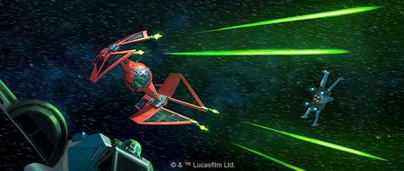

1 August 2019

Echoes of War
=============

Announcing Wave VI for Star Wars: X-Wing

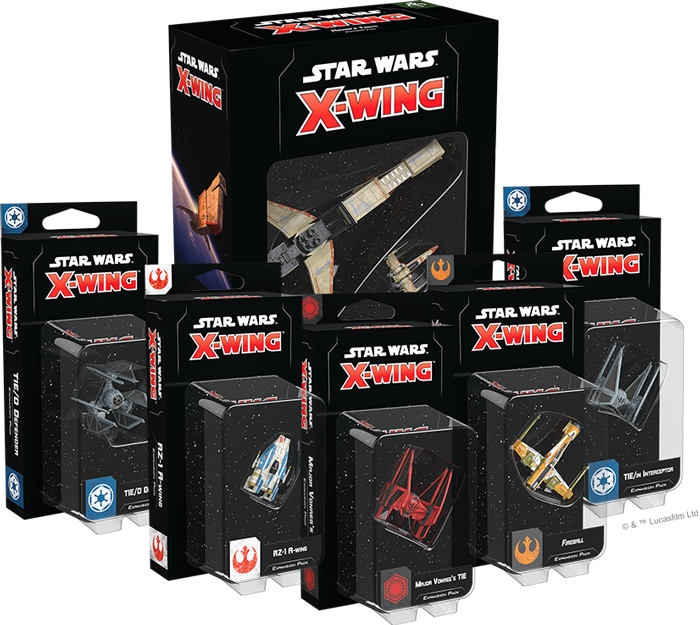

_"When I was a kid that’s all I wanted. To be the best.”_  
   –Kazuda Xiono, _Star Wars: Resistance_

The Galactic Civil War may be over, but the battle for the _Star Wars_ galaxy continues. The effects of this conflict reverberate to the farthest reaches of space and no one is truly free from their grasp. Soon, fresh-faced pilots will be ready to take up the fight and enter the white-knuckle battles of [_Star Wars_™: X-Wing.](https://www.fantasyflightgames.com/en/products/x-wing-second-edition/)

_Pre-order your own copies of Wave VI for_ X-Wing _at your local retailer or online through our website—with free shipping in the continental United States—today!  
 _ 

Fantasy Flight Games is happy to announce a new wave of six expansions for _X-Wing_:

*   _[Major Vonreg’s TIE Expansion Pack](https://www.fantasyflightgames.com/en/products/x-wing-second-edition/products/major-vonregs-tie-expansion-pack/)_
*   _[Fireball Expansion Pack](https://www.fantasyflightgames.com/en/products/x-wing-second-edition/products/fireball-expansion-pack/)_
*   _[Hound’s Tooth Expansion Pack](https://www.fantasyflightgames.com/en/products/x-wing-second-edition/products/x-wing-second-edition-hounds-tooth-expansion-pack/)_
*   _[TIE/in Interceptor Expansion Pack](https://www.fantasyflightgames.com/en/products/x-wing-second-edition/products/x-wing-second-edition-tie-interceptor-expansion-pack/)_
*   _[TIE/D Defender Expansion Pack](https://www.fantasyflightgames.com/en/products/x-wing-second-edition/products/x-wing-second-edition-tied-defender-expansion-pack/)_
*   _[RZ-1 A-Wing Expansion Pack](https://www.fantasyflightgames.com/en/products/x-wing-second-edition/products/x-wing-second-edition-rz-1-wing-expansion-pack/)_

Continuing to explore the conflict between the Resistance and First Order, this wave adds bold new options to both factions, inviting you to assemble new squadrons and continue the fight. Meanwhile, the Rebel Alliance, Galactic Empire, and the galaxy’s most notorious Scum and Villainy can also expand their squadrons with ships returning from the game’s first edition, broadening the possibilities for casual and competitive play alike.

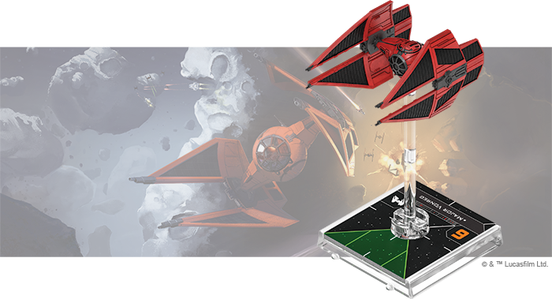

Major Vonreg’s TIE Expansion Pack
---------------------------------

As the personal ship of the First Order elite ace Major Baron Elrik Vonreg, the Sienar-Jaemus Fleet Systems TIE/ba Baron Space Superiority Interceptor strikes fear in the hearts of even the most grizzled Resistance pilots. Major Vonreg personally guided the enhancement of proven designs to create this precise and lethal craft.

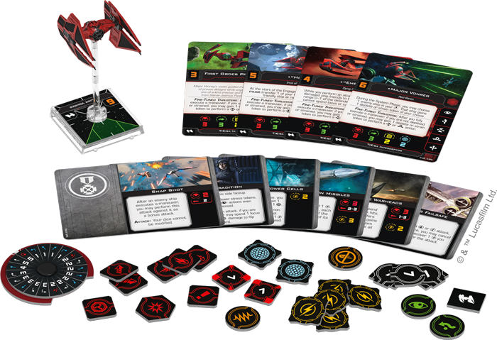

Engineered with precision and lethality in mind, the TIE/ba interceptor has many ways to put pressure on your opponents. Whether you're using its prodigious speed, fine-tuned thrusters, or missiles such as [Mag-Pulse Warheads,](swz62_mag-pulse-warheads.png) a single skilled pilot can wreak havoc on squadrons unprepared to face them.

Within this expansion, you’ll find four pilots ready to fight for the First Order, as well as six upgrade cards to fine-tune your TIE/ba interceptor’s capabilities. Accompanying these are two Quick Build cards with pre-built combinations of pilots and upgrades to help you get flying right away. We’ll take a look at everything included in _Major Vonreg’s TIE Expansion Pack_ in a future preview! 

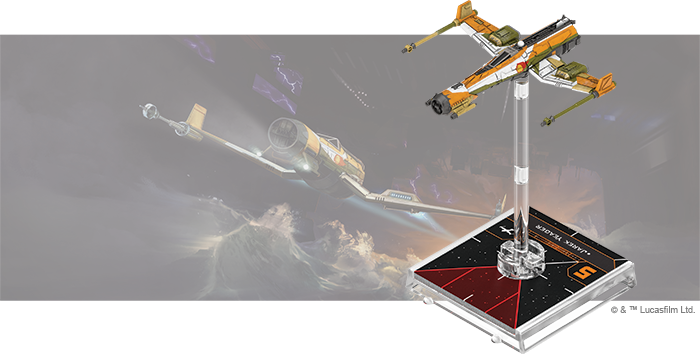

Fireball Expansion Pack
-----------------------

A labor of love to the crew of Jarek Yeager’s garage, the _Fireball_ is a highly combustible, scratch-built racing ship. Flown by undercover Resistance operative Kazuda Xiono, this explosion with wings is able to push the limit around the course before living up to its name. Lightly armed but lightning fast, the _Fireball_ can careen around the battlefield, gaining superior position on almost any enemy.

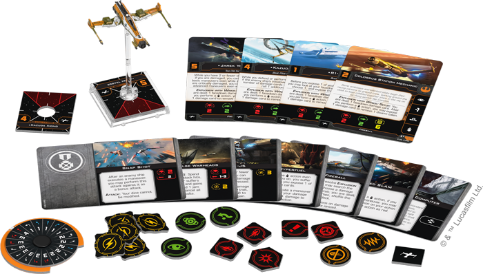

Already an explosively-fast racing machine, adding a little [Coaxium Hyperfuel](swz63_coaxium-hyperfuel.png) can send the _Fireball_ careening forward at a breakneck pace. Cobbled together as it is, though, you must be careful not to push the ship too far lest it break apart mid-battle.

The _Fireball Expansion Pack_ contains everything you need to add one of these swift ships to your Resistance squadrons, including one _Fireball_ miniature, four ship cards, and seven upgrade cards. Additionally, two Quick Build cards help you easily combine pilots and upgrades and get your _Fireball_ to the start line as quickly as possible. We’ll look at everything inside this expansion—including all its upgrade cards—in a future preview!

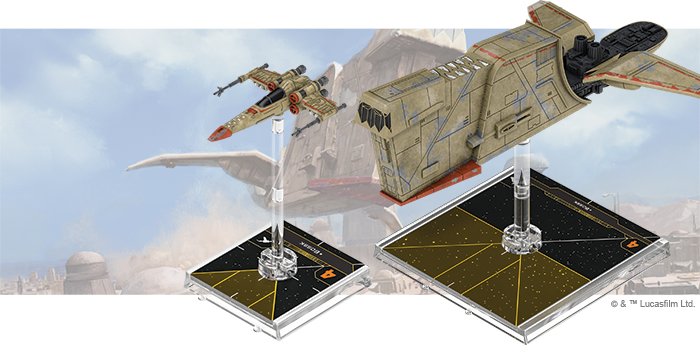

_Hound’s Tooth_ Expansion Pack
------------------------------

The reptilian bounty hunter Bossk is as tenacious as he is notorious, pursuing his targets doggedly in his customized YV-666 light freighter, the _Hound’s Tooth_, or launching his Z-95-AF4 Headhunter to engage other starfighters up-close and personal. Beside Bossk, the YV-666’s spacious triple-decker design makes it popular with bounty hunters of all stripes, who often retrofit an entire deck for prisoner transport.

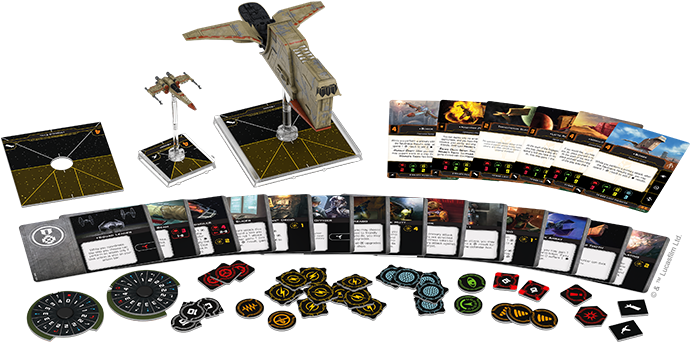

Now, the infamous _[Hound’s Tooth](swz58_hounds-tooth.png) himself can partner with whoever pilots the _Hound’s Tooth_ to track down a target together.

The _Hound’s Tooth Expansion Pack_ contains everything you need to start your own bounty hunting career, including a YV-666 light freighter miniature and a Z-95-AF4 Headhunter miniature painted in the striking _Nashtah Pup_ scheme. Joining these miniatures are six ship cards—four for the YV-666 and two for the Z-95-AF4 Headhunter—and fourteen upgrade cards. Finally, three Quick Build Cards give you even more options for deploying your YV-666. The Bossk Z-95-AF4 ship card contained in this expansion will also be available in the _Hotshots and Aces Reinforcement Pack_ for the benefit of veteran players.

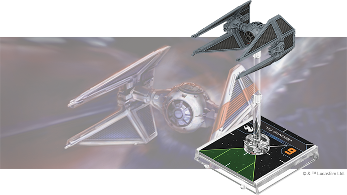

TIE/in Interceptor Expansion Pack
---------------------------------

With incredible engine output, a lightweight frame, and precise thrusters for close maneuvering, the TIE/in interceptor is a vessel for the most elite Imperial aces. Only those with nerves of steel can ride the knife’s edge to draw out this craft’s full potential. This includes the ship’s four wing-mounted laser cannons, a dramatic increase in firepower over its predecessors.

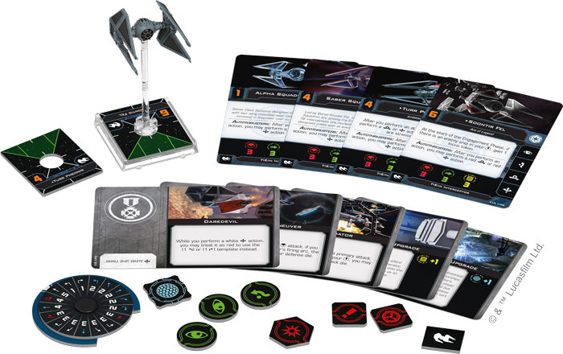

Not only is the TIE/in interceptor the craft of choice of the Empire’s elite Saber Squadron, this fighter group is led by the legendary [Soontir Fel,](swz59_soontir-fel.png) one of the best starfighter pilots in the galaxy. Taking full advantage of the ship’s maneuverability, Fel is the bane of Rebel squadrons across the galaxy.

The _TIE/in Interceptor Expansion Pack_ gives you the chance to put Fel and three other pilots at the controls of this swift and deadly craft. Joining them are five upgrade cards that give these elite pilots even more advantages in the thick of a space battle. Finally, two Quick Build cards provide useful combinations of pilots and upgrades, allowing you to test all of the TIE/in interceptor’s capabilities.

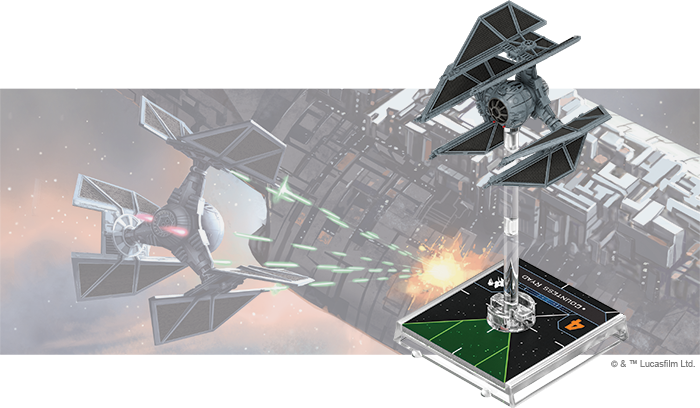

TIE/D Defender Expansion Pack
-----------------------------

A fighter so powerful and advanced that Phoenix Squadron feared its mass production could make the Imperial Navy unbeatable, the TIE/D defender features powerful shields, speed and maneuverability, and a suite of potent weapons including missiles and cannons. In the right ace’s hands, the TIE/D defender can bring down nearly any target.

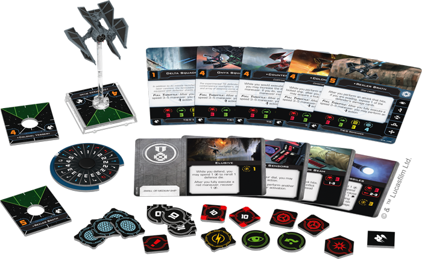

As a departure from the design of most Imperial starfighters, the Defender opens a wide range of possibilities for Imperial squadrons. Rather than rely on large numbers of small fighters, this ship gives the Empire an option that can match more powerful Rebel fighters. The TIE/D defender is also highly customizable, and systems like a set of [Advanced Sensors](swz60_advanced-sensors.png) can give it an advantage over your opponents.

Within the _TIE/D Defender Expansion Pack_, you’ll find everything you need to bulk up your Imperial squadrons, including a TIE/D defender miniature, five ship cards, and four upgrade cards inviting you to outfit your ship with new systems, missiles, and cannons. Meanwhile, two Quick Build cards provide exciting combinations of pilots and upgrades, inviting you to see everything the ship can do.

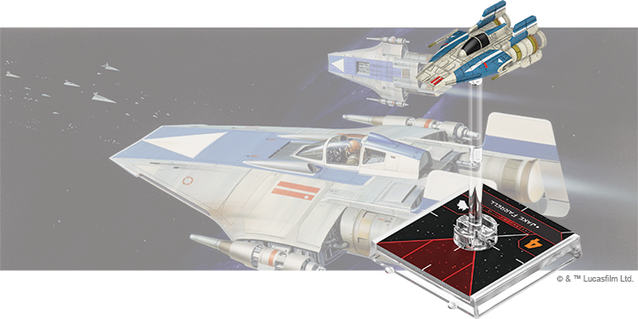

RZ-1 A-Wing Expansion Pack
--------------------------

The favored craft of Rebel aces who value precision handling, the RZ-1 A-wing can fit through narrow gaps between obstacles or fly circles around enemy craft. What these nimble interceptors lack in durability, they more than make up for in speed and maneuverability.

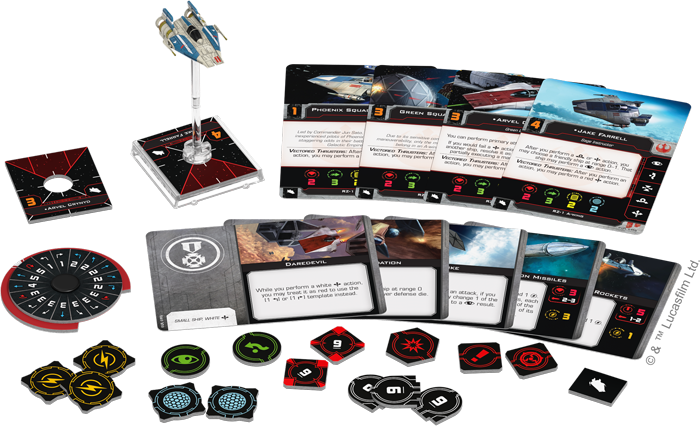

The RZ-1 proved its worth by crippling Star Destroyers during the Battle of Endor, and it now adds its deadly speed to Rebel squadrons across the galaxy. Skilled pilots make the most of the RZ-1’s capabilities, turning the ship’s maneuverability into an offensive asset as they [Juke](swz14_juke.png)  their targets.

The _RZ-1 A-Wing Expansion Pack_ includes everything you need to add one of these speedy ships to your Rebel Alliance squadrons. An RZ-1 A-wing miniature painted in the colors of Phoenix Squadron is accompanied by four ship cards representing the Rebel pilots willing to take on the challenge of flying this craft. You can improve these pilots’ capabilities in battle with five upgrade cards of your choosing, or you can take the recommendations of two Quick Build cards for even more ways to use your RZ-1 A-wing.

Make Your Name
--------------

As the effects of past conflicts ripple into the future, new aces emerge to battle for their faction and the title of the galaxy's best pilot. With the tools you find in Wave VI for _X-Wing_, you'll have everything you need to claim superiority in the battles of _X-Wing_. 

