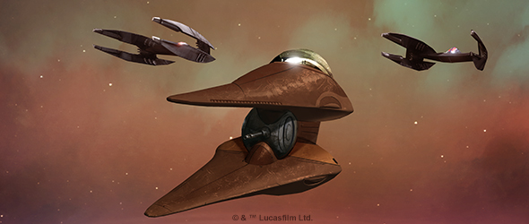
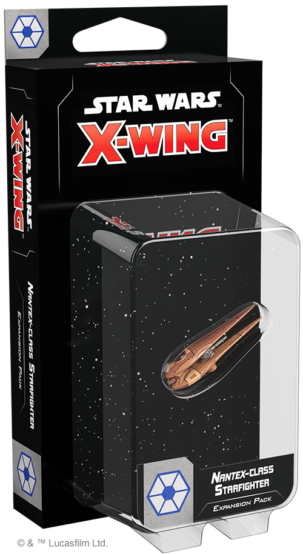
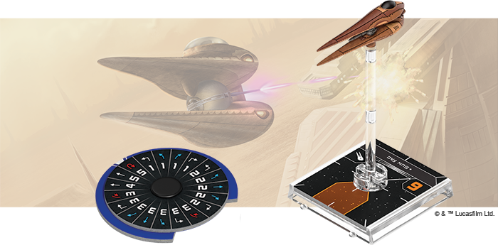
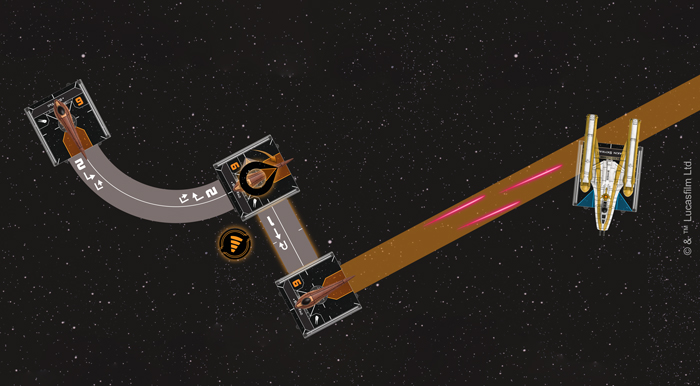
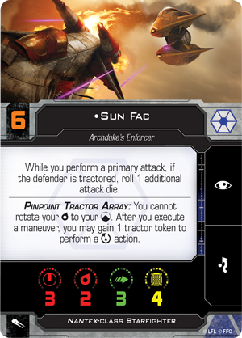
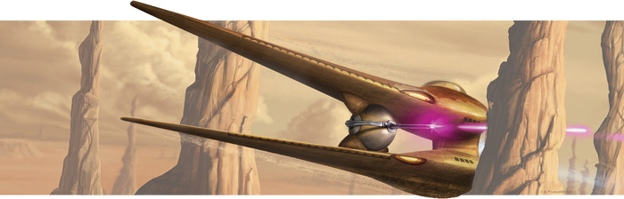

This article was originally published on [https://www.fantasyflightgames.com/en/news/2019/8/13/pulling-the-strings/](https://www.fantasyflightgames.com/en/news/2019/8/13/pulling-the-strings/)

&laquo; [Back to index](../index.md)

---

13 August 2019

Pulling the Strings
===================

Preview the Nantex-class Starfighter Expansion Pack for Star Wars: X-Wing

_"May I ask why a Jedi Knight is all the way out here on Geonosis?"_  
   —Count Dooku: _Star Wars: Attack of the Clones_

The Separatist Alliance’s power flows from the planet of Geonosis. Home to the Separatist’s main battle droid foundries, this desert planet and its people are dedicated to producing the machines that will deliver the Confederacy of Independent Systems victory in the Clone Wars. To this end, Geonosians enter battle in starfighters specifically designed with their unique physiology in mind.

The _Nantex_\-class Starfighter gives its Geonosian pilots the ability to pull off awe-inspiring maneuvers that would rip most ships—and pilots—apart. Made possible by a pinpoint tractor array that allows expert pilots to manipulate both themselves and other ships, these maneuvers make the _Nantex_ an unpredictable addition to any Separatist squadron. Soon, you’ll be able to add one of these slippery ships to your Separatist squadrons with the [Nantex-_class Starfighter Expansion Pack_](https://www.fantasyflightgames.com/en/products/x-wing-second-edition/products/nantex-class-starfighter-expansion-pack/) for [_Star Wars_™: X-Wing](https://www.fantasyflightgames.com/en/news/2019/5/13/living-starfighters/)!

This expansion contains a beautifully-detailed, pre-painted _Nantex_\-class Starfighter miniature along with all the cards and tokens you need to add it to your Separatist Alliance squadrons. This includes six pilots who use the ship’s unique tractor capabilities in their own way as well six upgrade cards that invite you add new modifications to the ship or further expand how it uses tractor tokens.

Read on as we take a look at everything included in the Nantex-_class Starfighter Expansion Pack_! 

A Dangerous Dance
-----------------

On the surface, the _Nantex_\-class Starfighter seems similar to the droid starfighters employed by the Separatist Alliance. Cheap and lacking shields, the ship appears better suited for flying in large swarms than taking on enemy aces in head-to-head combat. Upon closer inspection, however, the _Nantex_ reveals an unusual amount of depth that makes it one of the most unconventional starfighters in the galaxy.

At the heart of the _Nantex_\-class starfighter's design is a pinpoint tractor array that help the craft overcome its apparent flaws. The ship may be limited to the focus and evade actions in its action bar, but this tractor array opens up even more strategic possibilities, enabling both precise targeting as well as unprecedented control over the ship itself. After executing a maneuver, a _Nantex-_pilot can engage their pinpoint tractor array, gaining a tractor token to rotate their mobile arc.

  
_Sun Fac executes a speed-2 turn and then gains a tractor token to perform a rotate action. They then use the tractor token to barrel roll, lining up a shot on the BTL-B Y-Wing with their primary weapon!_

While this all but guarantees the ship will have a target every round, expert flying might make the mobile arc unnecessary altogether. The tractor token gained from the array can be used to perform a boost or barrel that could line up a shot in the bullseye arc with the ship's more powerful primary weapon. Obviously powerful on its own, the pinpoint tractor array's capabilities can be enhanced with the use of upgrade cards. For example, if a _Nantex_\-class starfighter can't avoid an incoming attack, its tractor tokens can always become part of a  [Gravitic Deflection](caecb278655ffb637d7a2485c63a084d.png)  to the fire it takes aside.

 A tool as powerful as a pinpoint tractor array can be used in many different ways, and the Geonosians who pilot the _Nantex_\-class Starfighter often use it to suit their personal style. An ace like  [Sun Fac](695b5f22b6119f3f73d6e16ad68c6eed.png)    quickly and easily solves this problem. 

While these two aces create opportunities for themselves with creative use of tractor tokens, other _Nantex_\-class Starfighter pilots such as  [Berwer Kret](0e94301d91938b2d95cc30b1c64205b6.png)  these ships could perform this action before they even engage.

At the same time, an engineer such as  [Gorgol](a49d59163a4f922dc69cd3d21cbd93cc.png)  to defend Geonosis from Republic invaders.

Accomplish the Impossible
-------------------------

Without Geonosis, the Separatist Alliance will fall. When the time comes, the Geonosians will defend their planet—and the Alliance—from the cockpit of the _Nantex_\-class Starfighter.