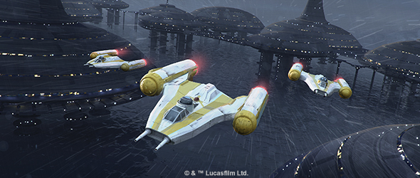
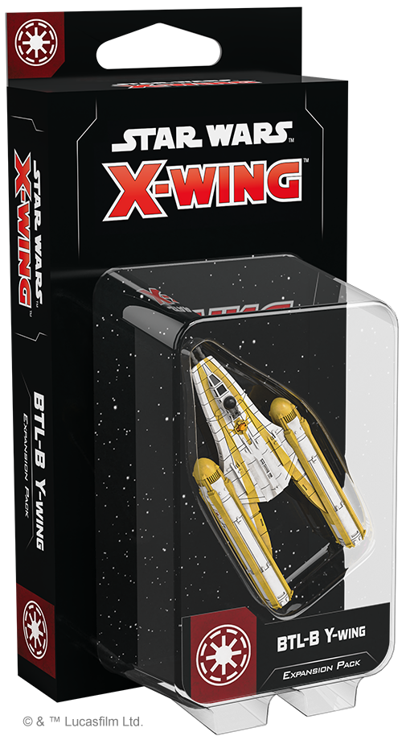
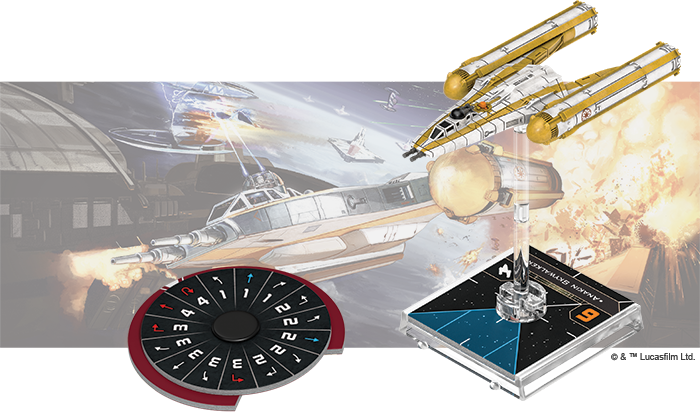
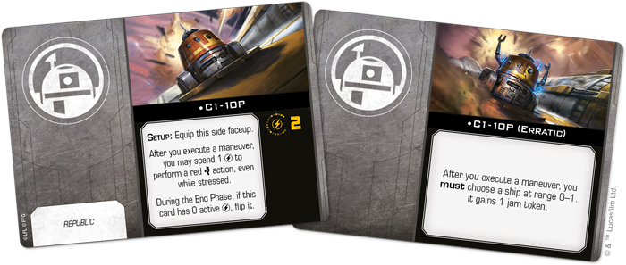
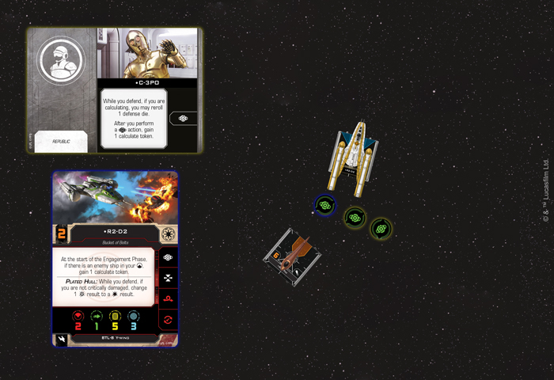
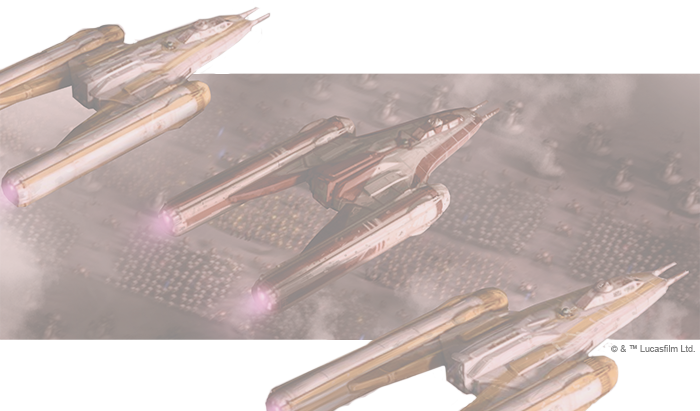

This article was originally published on [https://www.fantasyflightgames.com/en/news/2019/8/28/lead-the-attack/](https://www.fantasyflightgames.com/en/news/2019/8/28/lead-the-attack/)

&laquo; [Back to index](../index.md)

---

28 August 2019

Lead the Attack
===============

Preview the BTL-B Y-Wing Expansion Pack for Star Wars: X-Wing

_"Shadow Squadron, tighten formation."_  
   —Anakin Skywalker, _Star Wars: The Clone Wars_

In the face of swarms of Separatist droid fighters, Galactic Republic pilots cannot rely on laser cannons alone. They need a ship that can both strike multiple targets at once and handle the withering fire those ships produce. For Jedi and clone trooper alike, that ship is often the BTL-B Y-Wing. Built with durability and customizability in mind, the BTL-B can deliver powerful payloads or provide covering fire for other ships, making it a versatile addition to any Galactic Republic squadron. 

In addition to its plated hull, the BTL-B Y-Wing also features a bubble turret that allows teams of pilots and gunners—such as those from the Republic's famed Shadow Squadron—to launch strikes into the heart of enemy formations. Soon, you can harness the power of one of these fighters with the _[BTL-B Y-Wing Expansion Pack](https://www.fantasyflightgames.com/en/products/x-wing-second-edition/products/btl-b-y-wing-expansion-pack/)_ for [_Star Wars_™: X-Wing](https://www.fantasyflightgames.com/en/products/x-wing-second-edition/)!

This expansion contains a beautifully sculpted, pre-painted BTL-B Y-Wing miniature along with eight ship cards featuring pilots of all skill levels. In addition to these pilots, this expansion provides 10 upgrade cards that let you customize your BTL-B with bombs, turrets, gunners, and more.

Join us today as we take a closer look at the _BTL-B Y-Wing Expansion Pack_!

Deadly Combinations
-------------------

Long before the BTL-A4 Y-Wing became a workhorse of Rebel Alliance starfighter squadrons, the Galactic Republic employed the BTL-B to fight the Separatist threat in the Clone Wars. Despite sharing the same namesake, several key differences distinguish these ships from another, beginning with the BTL-B's plated hull. Where Rebel engineers valued the extra speed and maneuverability that came with stripping away the Y-Wing's layers of armor, the Republic version trades this speed for a thick hide that makes it highly resiliant to critical damage.

This lack of maneuverability may leave BTL-B pilots with few options for managing stress, but many of them have skills that allow them to overcome and even thrive under these conditions. A skilled Jedi like  [Anakin Skywalker,](swz48_pilot-anakin-skywalker.png)  to predict the enemy's position and launch a quick attack against them.

Not all Republic pilots are fortunate enough to have a connection to the Force, though, and the Clone Troopers who take the controls of the BTL-B Y-Wing take their own approach to managing the ship. A member of the acclaimed Shadow Squadron,  ["Matchstick"](swz48_pilot-matchstick.png)  and could lead to him jamming friendly ships.

Despite this apparent drawback, C1-10P also makes a good partner for a pilot like  ["Odd Ball,"](swz48_pilot-odd-ball.png)  manning this bubble turret, she can help other ships in the squadron maintain their focus. When paired with her her Jedi Master Anakin Skywalker, though, there are even greater benefits, with the two combining their Force abilities to give the ship even more potential.

  
_With C-3PO aboard his BTL-B Y-Wing, R2-D2 gains an additional calculate token after performing the calculate action. Then, the_ Nantex_\-class Starfighter is in his rear arc at the start of the Engagement Phase, so he gains another calculate token!_

This seat is typically reserved for a gunner like Tano who can fire an  [Ion Cannon Turret,](swz13_ion-cannon-turret.png)  on board his ship as a crew member, making it possible for them to generate three calculate tokens over the course of a round. Not only do these tokens give R2-D2 and C-3PO great power to modify their dice, the pair can also reroll a defense die so long as they hang on to one of them. 

Those who would like to take a more traditional approach, however, can always use the BTL-B Y-Wing for one of its intended purposes: as a bomber. In addition to being able to carry _**Bombs**_ like  [Proton Bombs](swz01_a3_proton-bombs.png)  

However powerful they may be, deploying these devices can bring a ship dangerously close to the enemy. These situations make a turret even more valuable, and a pilot like  ["Broadside"](swz48_pilot-broadside.png)  can fit your needs.

Pack a Punch
------------

Whether flown by battle-hardened Clone Troopers or a powerful Jedi Knight like Anakin Skywalker, the BTL-B Y-Wing can bring the fight to the Separatist Alliance. Add one to your squadron and strike the blow that ends the Clone Wars!

_The_ _(SWZ48) is releasing alongside the rest of Wave V on September 13th! Pre-order your copy at your local retailer or [through our website](https://shop.fantasyflightgames.com/preorders/create/SWZ48/)—with free shipping in the continental United States—today!_ 

