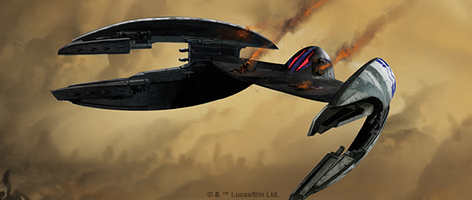
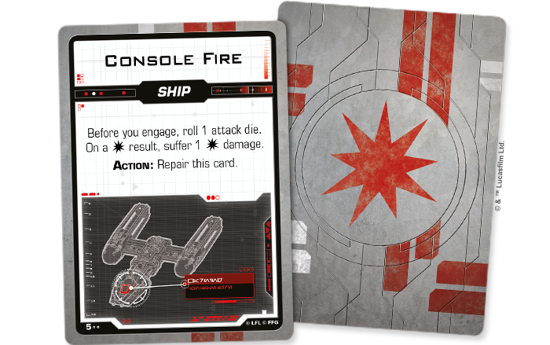
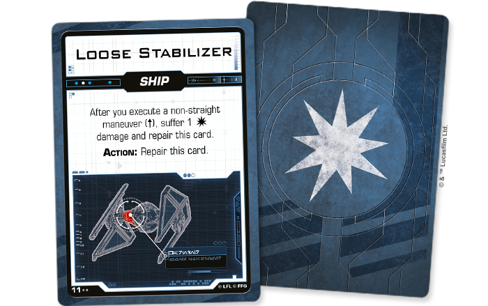
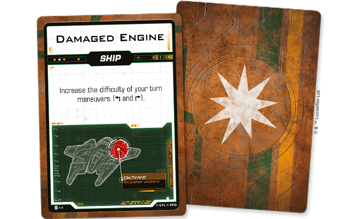
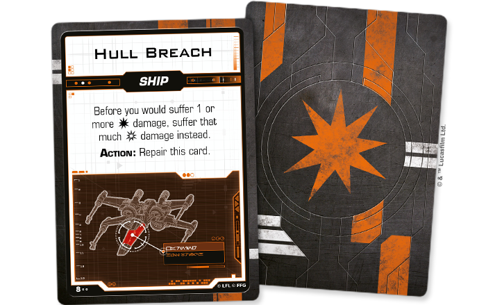
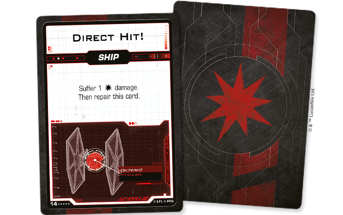
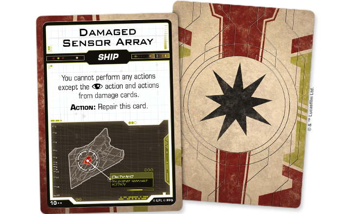
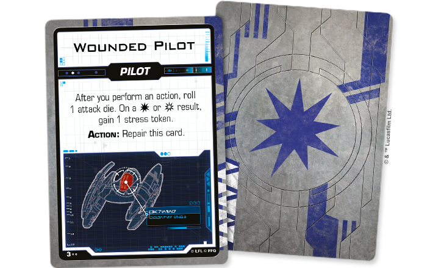

This article was originally published on [https://www.fantasyflightgames.com/en/news/2019/9/3/beautiful-destruction/](https://www.fantasyflightgames.com/en/news/2019/9/3/beautiful-destruction/)

&laquo; [Back to index](../index.md)

---

3 September 2019

Beautiful Destruction
=====================

Announcing Seven Damage Decks for Star Wars: X-Wing

_“R2, that stabilizer’s broken loose again! See if you can’t lock it down.”_  
   —Luke Skywalker, _Star Wars: A New Hope_

The space battles of [_Star Wars_™: X-wing](https://www.fantasyflightgames.com/en/products/x-wing-second-edition/) encompass every era of the _Star Wars_ saga, putting you in command of an array of starfighters from seven distinct factions. No matter if you fly T-65 X-wings in the name of the Rebellion or perform devastating bombing runs with the Separatist Alliance’s _Hyena_\-class Droid Bombers, one thing is sure: your ships will take damage.

Soon, you’ll be able personalize your _X-Wing_ squadrons while declaring loyalty to the faction of your choice. Fantasy Flight Games is happy to announce seven new damage decks for _X-Wing_:

*   _[Rebel Alliance Damage Deck](https://www.fantasyflightgames.com/en/products/x-wing-second-edition/products/rebel-alliance-damage-deck/)_
*   _[Galactic Empire Damage Deck](https://www.fantasyflightgames.com/en/products/x-wing-second-edition/products/galactic-empire-damage-deck/)_
*   _[Scum and Villainy Damage Deck](https://www.fantasyflightgames.com/en/products/x-wing-second-edition/products/scum-and-villainy-damage-deck/)_
*   _[Resistance Damage Deck](https://www.fantasyflightgames.com/en/products/x-wing-second-edition/products/resistance-damage-deck/)_
*   _[First Order Damage Deck](https://www.fantasyflightgames.com/en/products/x-wing-second-edition/products/first-order-damage-deck/)_
*   _[Galactic Republic Damage Deck](https://www.fantasyflightgames.com/en/products/x-wing-second-edition/products/galactic-republic-damage-deck/)_
*   _[Separatist Alliance Damage Deck](https://www.fantasyflightgames.com/en/products/x-wing-second-edition/products/separatist-alliance-damage-deck/)_

Stay on Target
--------------

Whether your ships are hit by blasters or proton torpedoes, the damage they take in a game of _X-Wing_ is normally tracked by the standard damage deck included in the _X-Wing Core Set_. With these damage decks, however, you can personalize the look of your squadron by replacing this deck with one that matches the colors of your chosen faction.

Each deck contains a complete set of thirty-three illustrated damage cards that correspond to those in the standard damage deck. While the text of these cards might match, their graphic design makes it clear that your squadron belongs to a particular faction. But these decks do more than simply indicate where your loyalties lie. The cards themselves cleary pinpoint the damaged portion of your ship in Aurebesh on a diagnostic display of one of your faction's starfighters.

Those flying as part of the Rebel Alliance, for example, will see their damage on a readout of a BTL-A4 Y-wing starfighter.

The damage cards in the _Galactic Empire Damage Deck_, meanwhile, feature a TIE/in Interceptor.

The galaxy’s most notorious Scum and Villainy have their damage highlighted on a Fang Fighter.

While an image of a T-70 X-wing helps Resistance pilots know exactly where their ships have been hit.

Heading into battle with the next generation of Imperial designs, damage to First Order ships is displayed on a TIE/sf Fighter.

Those loyal to the Galactic Republic can assess their damage with an image of a Delta-7 _Aethersprite_.

Finally, squadrons committed to the Separatist Alliance see their damage displayed on the faction’s most iconic starfighter: the _Vulture-_class Droid Fighter.

In addition to graphic design unique to each damage deck, the cards have been expanded to a larger size. Rather than using the Mini American Board Game card size, as in the _X-Wing Core Set_, these damage decks feature LCG® size cards, making them even easier to read and use in battle.

Show Your True Colors
---------------------

The tense starfighter battles of _X-Wing_ invite you to put your own spin on a squadron of fighters representing one of seven factions. Add even more personalization to your squadrons these damage decks!

