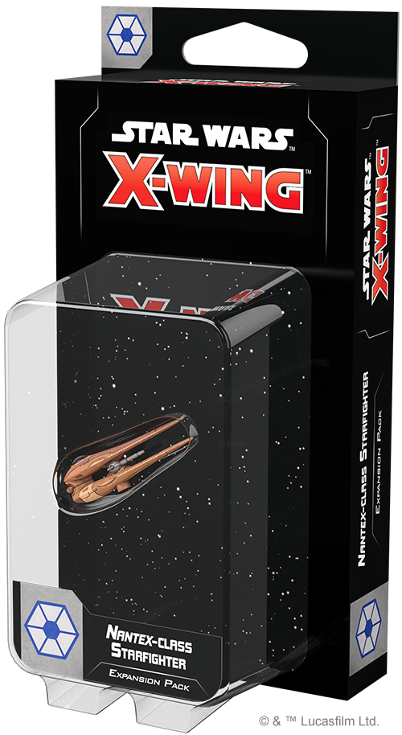
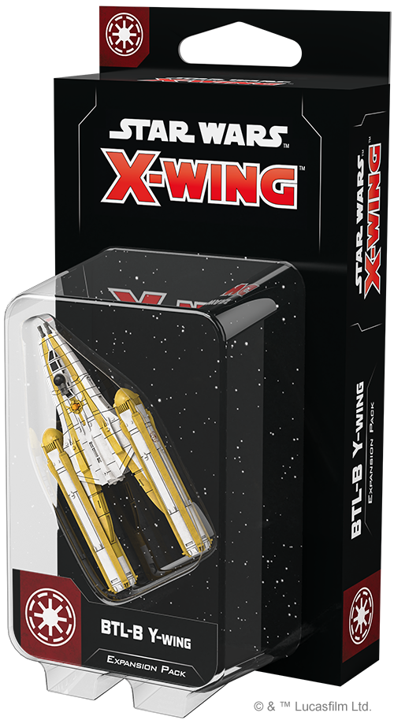
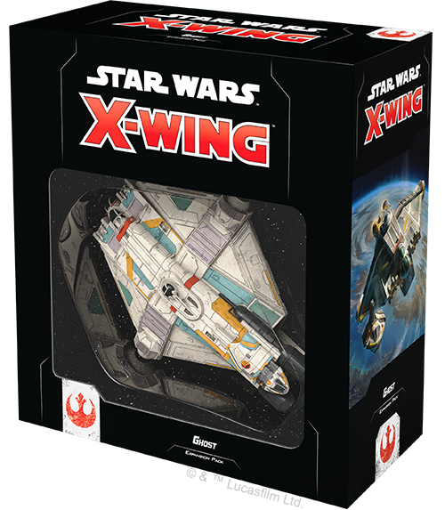
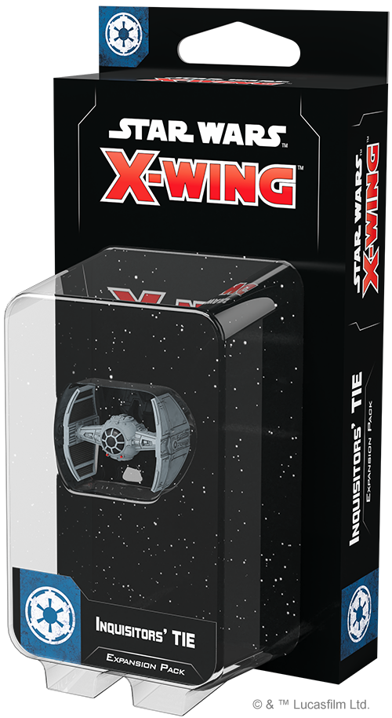
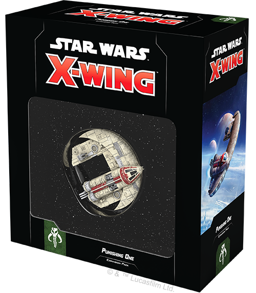
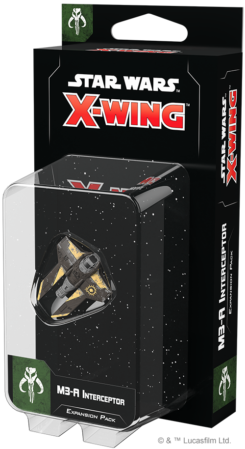
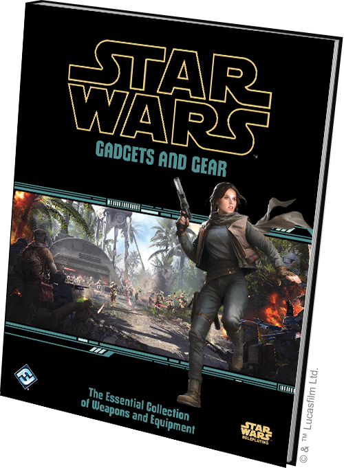

This article was originally published on [https://www.fantasyflightgames.com/en/news/2019/9/13/available-now-september-13/](https://www.fantasyflightgames.com/en/news/2019/9/13/available-now-september-13/)

&laquo; [Back to index](../index.md)

---

13 September 2019

Available Now – September 13
============================

X-Wing Wave V Is On Sale Now

_Take a look at the latest products from Fantasy Flight Games, now available at your local retailer or online through our webstore!_

* * *

 [_Nantex_\-class Starfighter Expansion Pack](https://www.fantasyflightgames.com/en/products/x-wing-second-edition/products/nantex-class-starfighter-expansion-pack/)
-----------------------------------------------------------------------------------------------------------------------------------------------------------------------------------------------------------------------------------------------------------------------------------------------

Dancing nimbly on invisible threads, the _Nantex_\-class starfighter uses an advanced tractor array to perform impossible maneuvers and guide its turret-mounted laser cannon with exceptional precision. Swarms of these agile fighters are the first line of defense for the key Separatist stronghold of Geonosis.

Within this expansion, you’ll find six pilots ready to fly the beautifully detailed and pre-painted _Nantex_\-class starfighter miniature. Six upgrade cards give these pilots even more control over their ship, while two Quick Build cards offer useful combinations of pilots and upgrades to get you flying as soon as possible.

  
 

* * *

 [BTL-B Y-Wing Expansion Pack](https://www.fantasyflightgames.com/en/products/x-wing-second-edition/products/btl-b-y-wing-expansion-pack/)
--------------------------------------------------------------------------------------------------------------------------------------------------------------------------------------------------------------------------------------------------------------------

Designed with an armored hull for extra durability and a bubble turret to keep enemies at bay, the Republic’s BTL-B Y-wing can run escort missions or lead an attack. Piloted by legendary Jedi and dedicated clone troopers, including Anakin Skywalker with his renowned Shadow Squadron, this fearsome bomber performs reliably over any battlefield, no matter where the battles of the Clone Wars may take you.

The _BTL-B Y-Wing Expansion Pack_ contains everything you need to add one of these formidable ships to your Galactic Republic squadrons. Within the expansion pack, you'll find a pre-painted BTL-B Y-wing miniature, eight ship cards, ten upgrade cards, and four Quick Build cards, along with the maneuver dial and all the tokens you need to add this powerful bomber to your squadron.

_Pick up your copy of the_ BTL-B Y-Wing Expansion Pack _(SWZ48) at your local retailer today or online through our website_ _with free shipping in the continental United States_ _[here](https://www.fantasyflightgames.com/en/products/x-wing-second-edition/products/btl-b-y-wing-expansion-pack/)!_

* * *

 [_Ghost_ Expansion Pack](https://www.fantasyflightgames.com/en/products/x-wing-second-edition/products/x-wing-second-edition-ghost-expansion-pack/)
------------------------------------------------------------------------------------------------------------------------------------------------------------------------------------------------------------------------------------------------------------------------------

The durable VCX-100 light freighter and nimble _Sheathipede_\-class shuttle can fight as a docked pair or split up to attack from multiple angles. When helmed by heroes like Hera Syndulla, Kanan Jarrus, and Ezra Bridger, these ships can be some of the greatest assets of the Rebellion.

You’ll find both a VCX-100 light freighter miniature and a _Sheathipede_\-class shuttle miniature that can physically dock with the larger ship in this expansion, giving you the freedom to fly them separately or as a powerful combined force. Alongside these miniatures, new players will also find reprints of eight ship cards—four for the VCX-100 and four for the _Sheathipede_\-class shuttle—as well as reprints of sixteen upgrade cards to further customize your ships. Finally, four Quick Build cards help you combine ships and and upgrades to get into the battle right away.

_Pick up your copy of the_ Ghost _Expansion Pack (SWZ49) at your local retailer today or online through our website_ _with free shipping in the continental United States_ _[here](https://www.fantasyflightgames.com/en/products/x-wing-second-edition/products/x-wing-second-edition-ghost-expansion-pack/)!_

* * *

 [Inquisitors' TIE Expansion Pack](https://www.fantasyflightgames.com/en/products/x-wing-second-edition/products/x-wing-second-edition-inquisitors-tie-expansion-pack/)
-------------------------------------------------------------------------------------------------------------------------------------------------------------------------------------------------------------------------------------------------------------------------------------------------

An experimental craft reserved for elite agents of the Empire, the TIE Advanced v1 features numerous cutting-edge technologies that skilled pilots can leverage to deadly effect. The craft’s high-precision thrusters and flexible controls let its pilots tirelessly pursue their prey across the galaxy. Most famously used by the deadly Inquisitors, Force users and Force sensitives across the galaxy have learned to fear this craft.

This expansion pack includes everything you need to add one TIE Advanced v1 ship to your Imperial squadrons, including reprints of four ship cards and five upgrade cards for the benefit of new players, as well as two Quick Build cards to get you off the ground even faster. What's more, you'll find the maneuver dial and all of the tokens you need to bring this ship into your starfighter squadrons.

_Pick up your copy of the_ Inquisitors' TIE Expansion Pack _(SWZ50) at your local retailer today or online through our website_ _with free shipping in the continental United States_ _[here](https://www.fantasyflightgames.com/en/products/x-wing-second-edition/products/x-wing-second-edition-inquisitors-tie-expansion-pack/)!_

* * *

 [_Punishing One_ Expansion Pack](https://www.fantasyflightgames.com/en/products/x-wing-second-edition/products/x-wing-second-edition-punishing-one-expansion-pack/)
----------------------------------------------------------------------------------------------------------------------------------------------------------------------------------------------------------------------------------------------------------------------------------------------

The JumpMaster 5000 is the chosen vessel of Dengar, a vengeful bounty hunter feared across the galaxy. With a nimble turret and potent engines that give it an unpredictable flight pattern, Dengar's _Punishing One_ can keep pace with even the most desperate fugitives.

Within the _Punishing One Expansion Pack_, you’ll find everything you need to add one JumpMaster 5000 to your Scum and Villainy squadrons. Reprints of three pilots join Dengar in the pursuit of profit while twelve reprinted upgrade cards give new players plenty of options for putting a personal touch on their ships. Finally, two Quick Build cards offer useful combinations of pilots and upgrades to maximize your JumpMaster 5000’s effectiveness.

_Pick up your copy of the_ Punishing One _Expansion Pack (SWZ51) at your local retailer today or online through our website_ _with free shipping in the continental United States_ _[here](https://www.fantasyflightgames.com/en/products/x-wing-second-edition/products/x-wing-second-edition-punishing-one-expansion-pack/)!_

* * *

 [M3-A Interceptor Expansion Pack](https://www.fantasyflightgames.com/en/products/x-wing-second-edition/products/x-wing-second-edition-m3-interceptor-expansion-pack/)
------------------------------------------------------------------------------------------------------------------------------------------------------------------------------------------------------------------------------------------------------------------------------------------------

In the Outer Rim, justice is often decided through superior firepower. The M3-A interceptor is a light, maneuverable craft favored by cartels and syndicates, thanks to the modular hardpoint that lets it equip destructive torpedoes, powerful cannons, and other weapons to threaten much larger vessels.

This expansion contains everything you need to supplement your Scum and Villainy squadrons with one of these inexpensive and highly customizable fighters. In addition to an M3-A Interceptor ship miniature featuring a striking black and gold Black Sun paint scheme, new players will also find eight reprinted ship cards—including six limited pilots—as well as reprints of five valuable upgrades and four Quick Build cards that help you jump into battle right away.

_Pick up your copy of the_ M3-A Interceptor Expansion Pack _(SWZ52) at your local retailer today or online through our website _with free shipping in the continental United States_ [here](https://www.fantasyflightgames.com/en/products/x-wing-second-edition/products/x-wing-second-edition-m3-interceptor-expansion-pack/)!_

* * *

 [Gadgets and Gear](https://www.fantasyflightgames.com/en/products/star-wars-age-of-rebellion/products/gadgets-and-gear/)
---------------------------------------------------------------------------------------------------------------------------------------------------------------------------------------------------------------------------------------------------

As the Galactic Civil War dominates life in the galaxy, no one is safe. From civilians and common thieves to troopers and Jedi, protection and ingenuity are paramount to survival. In the quest for victory, every tool and weapon holds the potential to tip the scales in the war for the galaxy.

Discover the perfect tool for the job with _Gadgets and Gear_, a 142-page essential collection of weapons and equipment for _Star Wars Roleplaying_!

With _Gadgets and Gear_, Game Masters and players have a huge selection of equipment right at their fingertips! This sourcebook gathers weapons, armor, attachments, and gear from all three _Star Wars Roleplaying_ game lines, including _Edge of the Empire_, _Age of Rebellion_, and _Force and Destiny_. It also adds new pieces of equipment, along with weapons and armor of heroic and villainous characters whose deeds are whispered about across the stars.

With hundreds of gadgets and gear cataloged in an easily readable new format, finding the perfect tool for the job has never been easier.

_Pick up your copy of_ Gadgets and Gear _(SWR17) at your local retailer today or online through our website_ _with free shipping in the continental United States_ _[here](https://www.fantasyflightgames.com/en/products/star-wars-age-of-rebellion/products/gadgets-and-gear/)!_

