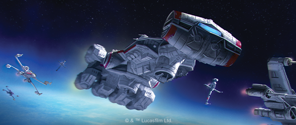
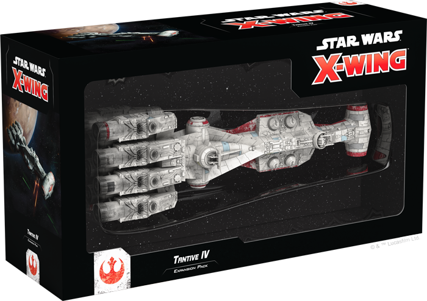
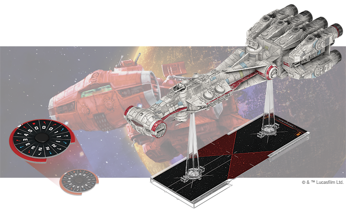
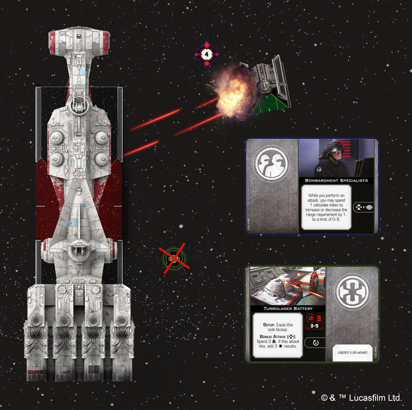
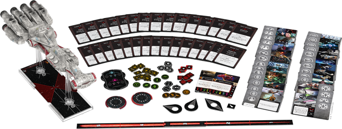
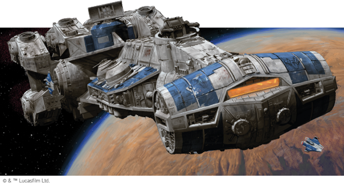

This article was originally published on [https://www.fantasyflightgames.com/en/news/2019/9/24/delivering-hope/](https://www.fantasyflightgames.com/en/news/2019/9/24/delivering-hope/)

&laquo; [Back to index](../index.md)

---

24 September 2019

Delivering Hope
===============

Preview the Tantive IV Expansion Pack for Star Wars: X-Wing

_"What is it they've sent us?"_  
   –Raymus Antilles, _Rogue One: A Star Wars Story_

In conflicts across the _Star Wars_™ galaxy, it’s not uncommon to see ships originally built for one purpose refitted as warships. This is certainly the case with the Corellian Engineering Corporation’s CR90 corvette. First designed as a diplomatic vessel, the CR90 was valued by both the Galactic Republic and the Rebel Alliance for its ability to rapidly respond to incidents across the galaxy.

With its powerful engines propelling it, the CR90 can enter combat with the fastest of starfighters, bringing an array of deadly weaponry that can turn the tides of battle. Soon, you can bolster your [_Star Wars_™: X-Wing](https://www.fantasyflightgames.com/en/products/x-wing-second-edition/) squadrons with one of these huge ships with the [Tantive IV _Expansion Pack_](https://www.fantasyflightgames.com/en/products/x-wing-second-edition/products/x-wing-second-edition-tantive-iv-expansion-pack/)!

Within this expansion, you’ll find one beautifully painted CR90 Corellian corvette miniature, along with all the cards and tokens you need to add it to your Rebel Alliance or Galactic Republic squadrons. In addition to outfitting your CR90 with deadly weaponry, you can place some of the Rebellion’s best tactical minds in command of the ship. Meanwhile, a variety of teams and cargo help give the ship an even more specialized role in your squadron. Finally, five title upgrade cards can turn your CR90 into one of the Rebellion’s most iconic ships and give it even more special abilities.

Players who already own a CR90 miniature from the first edition of _X-Wing_ can also find the cards and tokens in this expansion pack in the _[Huge Ship Conversion Kit](https://www.fantasyflightgames.com/en/products/x-wing-second-edition/products/huge-ship-conversion-kit/)_. Read on as we take a closer look at the Tantive IV _Expansion Pack_!

Fighting for Freedom
--------------------

Even before the outbreak of the Clone Wars, the CR90 corvette served many functions across the galaxy. The versatile craft can easily be converted from consular ship to troop transport to freight hauler. Continuing this tradition, the CR90 you find in this expansion can supplement starfighter squadrons in multiple ways, no matter if it’s flown by an [Alderaanian Guard](7e1fbf342ae07eafc68feb08ff6057f0.png) fending off a Separatist attack.

Equipped with Broadside Batteries that allow it to acquire locks and perform primary attacks at range 1–4, the CR90 is a powerful attack platform that can take multiple approaches to combat. Installing a [Targeting Battery](4250ac6053d0e1a4663ecf171ba7f955.png) to your crew continues to enhance this strategy, both giving your ship the ability to maintain up to three locks on different objects and letting it acquire locks on small clumps of ships, such as those flying in formation, all at once.

  
_The CR90 corvette uses its Bombardment Specialists to acquire a lock on the TIE Advanced x1 and a calculate token. The TIE Advanced x1 is at range 2, so the CR90 can spend the calculate token after another attack to perform a bonus attack against it with its turbolaser battery!_

But the CR90 doesn’t just have to operate on the edges of battle. Sooner or later, an enemy starfighter is bound to make an attack run and a CR90 can keep all its weapons in play with a team of [Bombardment Specialists](8317490124379fbed380b9a764acbde5.png) on board. One of these teams can adjust the range a weapon can fire, while also locking a ship and generating the calculate token needed to make the range adjustment, keeping the CR90 as efficient as possible in the face of enemy fire.

No matter how helpful these teams can be, they’re no replacement for experience and leadership. Fortunately, some of the Rebellion’s most renowned leaders can take command of the CR90, offering a steady hand as it heads into battle. Taking evasive action with a ship as large as a CR90 corvette is a rare and risky strategy, but [Carlist Rieekan](08486d9a82eb0c8abece90935bc8ac5f.png) makes it possible, helping his ship avoid a bit of enemy fire. Better yet, Rieekan rallies friendly ships after one of their allies is destroyed, helping them regroup without taking too much damage.

Being a Rebel requires a willingness to make the ultimate sacrifice, of course, and no one exemplifies this more than [Raymus Antilles.](d4baacceff78c532577abe807322e7b3.png) Not only does he keep his crew fighting until they can unleash one final volley of fire, his sacrifice inspires any friendly ships at range 0–1 to keep fighting, granting them a focus token.

A leader like [Jan Dodonna,](ee134cc3c13053235ca81c3499d363f6.png)

No matter which Rebels you choose to join your crew, they don’t have to enter battle in any random CR90. Thanks to five title upgrade cards, some of the Rebellion’s most iconic CR90 Corellian corvettes can join your squadrons. For example, the courageous crew of the _[Tantive IV](14a5cc5366c494e0f487489547f0cfc4.png)_ carried the Death Star plans on a desperate mission to Tatooine. As a result, this ship can add two additional crew members and rolls an additional defense die against pursuers in its rear arc.

Other ships, like [Dodonna’s Pride,](a6a068bcd1bdd3c4a64cb1b844453f58.png)_ is never without an escort and has been outfitted with the means to dock two small ships. These ships deploy ready for action, either performing a focus or barrel roll action after launching from the _Liberator_.

If you’re looking to concentrate as much firepower as possible into a single vessel, however, the _[Thunderstrike](1ee1e4563fb17b4d87cf823c11803215.png)_ offers a powerful defensive bonus to friendly ships taking cover behind obstacles.

Seek Justice
------------

With the speed to outrun all but the fastest ships and the firepower to support any squadron, the CR90 corvette is an invaluable addition to any starfighter squadron. Add one to your Rebel Alliance or Galactic Republic squadron and seek out your own justice throughout the galaxy!