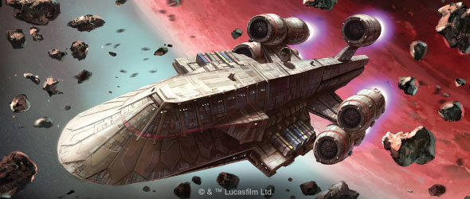
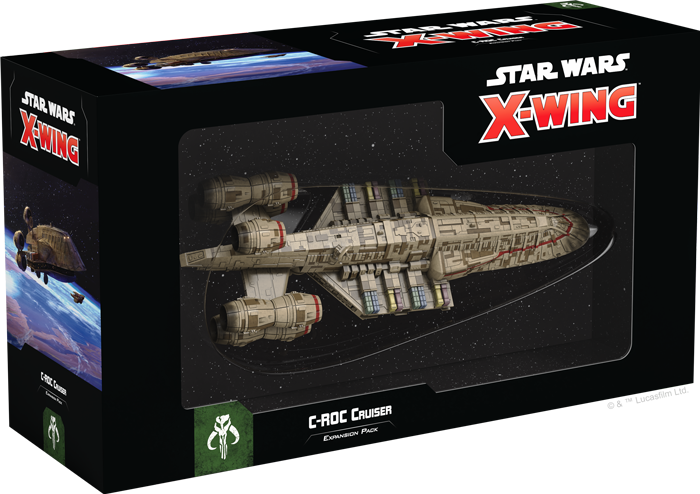
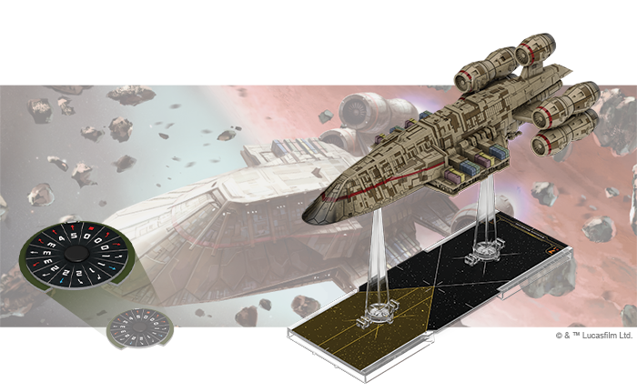
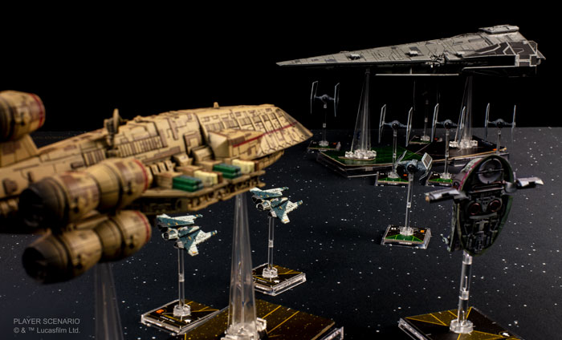
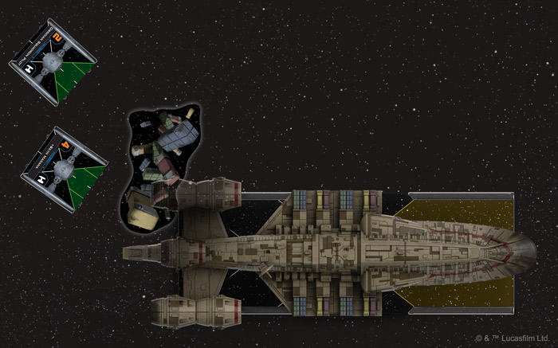
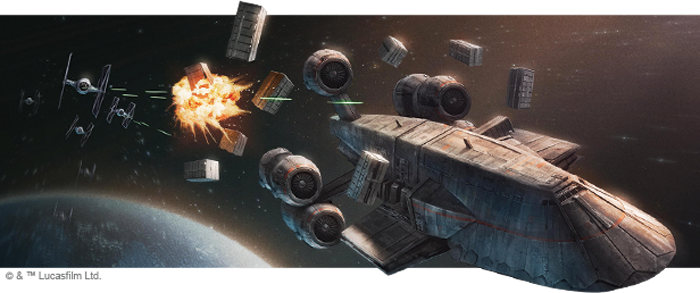

This article was originally published on [https://www.fantasyflightgames.com/en/news/2019/10/2/outside-the-law-1/](https://www.fantasyflightgames.com/en/news/2019/10/2/outside-the-law-1/)

&laquo; [Back to index](../index.md)

---

2 October 2019

Outside the Law
===============

Preview the C-ROC Cruiser Expansion Pack for Star Wars: X-Wing

_“Business is all that matters.”_  
   –Cikatro Vizago, _Star Wars Rebels_

The Outer Rim presents many opportunities for those bold enough to pursue them. In the absence of the Republic or the Empire, intrepid smugglers and pirates haul illicit cargo from one end of the galaxy to the other in search of both fame and fortune. While most of these scoundrels limit their activities to smaller ships like the YT-1300 light freighter, the more ambitious among them set their sights higher.

Vessels like the C-ROC cruiser allow criminal operations across the Outer Rim, like the Broken Horn Syndicate, to move massive amounts of contraband goods through the galaxy's seedy black markets—or project enough power to bully small colonies into complying with their demands. Soon, you can support your own criminal enterprises with the _[C-ROC Cruiser Expansion Pack](https://www.fantasyflightgames.com/en/products/x-wing-second-edition/products/x-wing-second-edition-c-roc-cruiser-expansion-pack/)_ for [_Star Wars_™: X-Wing](https://www.fantasyflightgames.com/en/products/x-wing-second-edition/)!

Whether flown by smugglers seeking a sizeable profit or privateers employed by the Separatist Alliance, this expansion contains everything you need to make a C-ROC cruiser the centerpiece of your Scum or Separatist squadrons. A beautifully painted C-ROC cruiser miniature is accompanied by a suite of upgrade cards that invite you to outfit some of the most infamous C-ROC cruisers from across the _Star Wars_ galaxy with an array of weaponry and dirty tricks. Meanwhile, two quick build cards help you easily combine these upgrades and launch your C-ROC cruiser as quickly as possible.

Veteran players with a C-ROC cruiser miniature from the first edition of _X-Wing_ can also find the ship, upgrade, and quick build cards and tokens from this expansion pack in the _Huge Ship Conversion Kit_. Join us today as we take a closer look at what you’ll find in the _C-ROC Cruiser Expansion Pack_!

Rule the Underworld
-------------------

Building a criminal empire is no easy task. In addition to armies of unquestioningly loyal cronies to carry out their orders, crime lords like Cikatro Vizago and Azmorigan need ships that can navigate these lawless regions if they are going to reliably deliver the goods their clients request. To them, the C-ROC cruiser’s durable construction and ample cargo space represent an enticing opportunity to churn out even more profits, no matter how illicit they may be.

In service since the Clone Wars, the C-ROC cruiser is used by [privateers](52b1dcbd821cf44f3c4a668a0adad97e.png) alike and—like any good ship looking to avoid entanglements with the authorities—it excels at running away from enemy ships rather than facing them head-on. No matter what faction is controlling the ship, the C-ROC's Overdrive Burners let you roll an extra defense die as long as its revealed maneuver is Speed 3–5, making it much more likely to dodge enemy fire than other huge ships.

But this is only the beginning of the C-ROC’s ability to deter any pursuit. Installing an [Ion Cannon Battery](9c57808ee6e5c15dfbdcd7ef17852623.png) to quickly recover the energy you need to power the C-ROC's weapons and other systems.

More than weapons or powerful engines, the criminals and pirates of the galaxy can be counted on to make their own special alterations to their ships. As the only huge ship with an Illicit upgrade slot, the _C-ROC Cruiser Expansion Pack_ invites you to outfit your cruiser with some dirty tricks that can come in handy at the first sign of trouble. For example, while it does mean jettisoning some of its precious cargo, activating the ship’s [Quick-Release Locks](0a84c4c54bd6b84986aba0a8fc28765a.png) makes it even harder for enemy squadrons to reach the C-ROC and its allies, planting mines in their path from the very beginning of the game.

  
_The C-ROC cruiser uses its Quick-Release Locks to drop a cargo crate drift in the path of the pursuing TIE/ln fighters!_

Not every trick the C-ROC cruiser has up its sleeve involves placing new impediments in your opponents’ path, though. An upgrade like a [Scanner Baffler](63823eb9ae9f1037b510a8e38a244fba.png) is personally overseeing the mission, he can further capitalize on this advantage, allowing two ships to carry over their calculate or evade tokens into the next round.

Most crime syndicates operate in the shadows, drawing as little attention as possible. But the most successful operations eventually take on a legendary status in the galactic underworld and the most infamous C-ROC cruisers are revered for their ability to shake patrols and make deliveries. With the three title cards found in this expansion pack, you can bring these legendary ships—and their abilities—to your squadrons. Azmorigan’s personal ship, _[_Merchant One_,](958e3033c15f3ae6a4058c97b40482b0.png)_  for instance, accentuates his natural leadership style, giving him a platform to coordinate the ships around him and giving his own ship the ability to evade.

A ship like the _[_Broken Horn_,](cea602103ec2d36cc12b7b83799f7016.png)_ is built to haul cargo, trading weakened shields and a lower energy capacity for a thick hull.

As the heart of large-scale smuggling outfits, the C-ROC cruiser is primarily valued for its ability to carry large amounts of cargo. But this has not kept pirates from using the ship as an alternative to other huge ships. Making use of the [Corsair Refit](79cbcc5ad82cb5515dca1dc2fe9f00e8.png) are sure to help you maximize the damage these attacks inflict.

Protect Your Interests
----------------------

On the outskirts of the galaxy, trade in illegal goods is flourishing. To carry these goods from world to world, crime syndicates and profiteers turn to one of the galaxy's most reliable transports. Add a C-ROC cruiser to your fleet and begin building your own criminal empire!