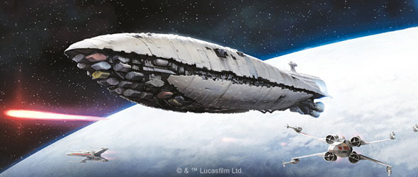
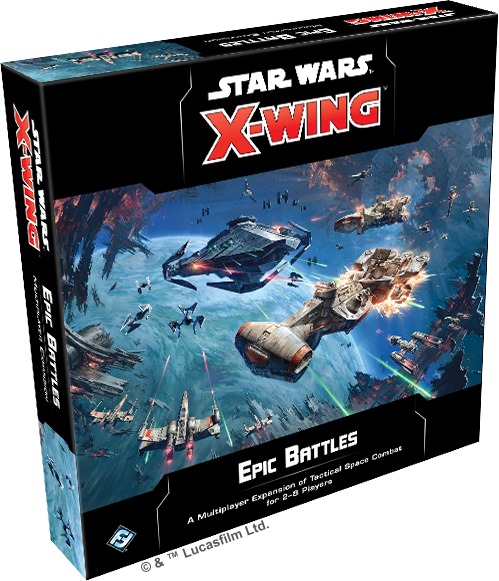
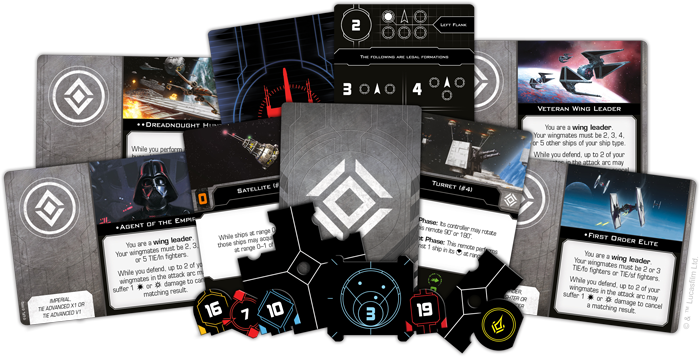
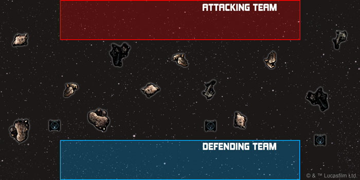
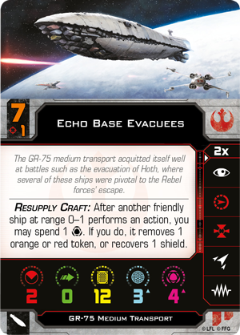
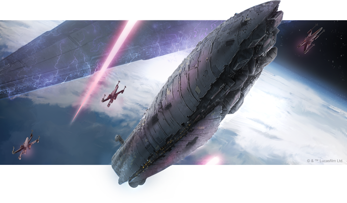

This article was originally published on [https://www.fantasyflightgames.com/en/news/2019/10/11/escalated-tensions/](https://www.fantasyflightgames.com/en/news/2019/10/11/escalated-tensions/)

&laquo; [Back to index](../index.md)

---

11 October 2019

Escalated Tensions
==================

Preview a Scenario from the Epic Battles Multiplayer Expansion for Star Wars: X-Wing

_“I don’t think we can protect two transports at a time.”_  
   –Carlist Rieekan, _Star Wars: The Empire Strikes Back_

From small skirmishes between scouting craft to unexpected encounters in the depths of space, every engagement between starfighters in the _Star Wars_™ galaxy has the chance to escalate into a fully pitched battle between ships of all sizes. You’ll soon have the chance to create your own large-scale starfighter battles with the _[Epic Battles Multiplayer Expansion](https://www.fantasyflightgames.com/en/products/x-wing-second-edition/products/epic-battles-multiplayer-expansion/)_ for [_Star Wars_™: X-Wing](https://www.fantasyflightgames.com/en/products/x-wing-second-edition/)!

In addition to new rules for flying groups of ships in formation, this expansion broadens the possibilities of _X-Wing_ with eleven cinematic scenarios that evoke iconic _Star Wars_ scenes. Featuring unique objectives and mechanics, each scenario invites players to tackle new challenges as they enter chaotic free-for-all battles, intense team-based conflicts, and much more.

Whether you’re mobilizing your squadrons to intercept a planetary strike or escorting a wave of devastating warheads as they barrel toward key targets, these scenarios can put you in command of individual starfighters or massive fleets, including new huge ships like the CR90 Corellian corvette or the C-ROC cruiser. Join us today as we take a closer look at one of the scenarios included in the _Epic Battles Multiplayer Expansion_!

Prepare for Evacuation
----------------------

Few moments across the _Star Wars_ saga are as thrilling as desperately evacuating a planet while the enemy closes in. When this happens, fighting is just as likely to break out in the space above the planet as on the surface. Whether you’re looking to recreate the Rebellion’s hurried escape from Hoth, the Resistance’s bold evacuation of D’Qar, or something of your own creation, the _Epic Battles Multiplayer Expansion_ puts you directly into one of these tense confrontations.

In the “Cover the Evacuation” scenario, three transport vessels attempt to plot a jump to hyperspace as an attacking force approaches. Each team is composed of one to three players, with one side playing as the defenders, hoping to buy time for the vulnerable transports to escape, while the other side becomes the attackers hoping to destroy them.

  
_The defending team must buy enough time for the three shuttles to make the jump to hyperspace!_

Taking place on a 6’ x 3’ play area, the defending team begins this scenario with three shuttle remotes scattered across the battlefield. Unfortunately, performing the precise calculations required to jump to hyperspace prevents these shuttles from moving, making them vulnerable to attack.

But that does not mean they are totally defenseless. In addition to their thick hulls, every [shuttle](380fd44fe4ff1e37f957f3ca66ca7285.png) is better at evading attacks when it has an escort. These remote shuttles add an evade to their defenses while a friendly ship is in the attack arc, helping them shrug off some of the attacks headed their way.

Ultimately, though, a shuttle’s goal is not to survive, but to make the jump to hyperspace, a task that becomes easier the longer the scenario continues. During each end phase, the defending team rolls attack dice equal to the round number, placing one objective token on a shuttle’s remote card for each standard and critical damage result.

  
_It is the End Phase of Round 3, so the defending player rolls three attack dice, placing one objective token on Shuttle #1 for the standard damge result and one objective token on Shuttle #2 for the critical damage result!_

Once a shuttle accumulates three objective tokens on its card, it jumps to hyperspace and the defending team scores all of its objective tokens, claiming 25 points per objective token (added to their standard score for destroying and damaging ships). The attacking team, on the other hand, scores all of a shuttle’s objective tokens after the shuttle is destroyed.

The struggle to accomplish these goals will involve more than just a handful of starfighters. This is a large-scale evacuation where both teams have 500 points, putting each player in command of one chunk of a larger fleet. Each team is free to select any ships from the faction of their choice, of course, but “Cover the Evacuation” leaves plenty of room for teams to make use of the huge ships, no matter if they’re using the cards from the _Huge Ship Conversion Kit_ or the cards and miniatures from huge ship expansion packs.

 A GR-75 Medium Transport loaded with a group of [Echo Base Evacuees,](710a7ad44c49a21b00960259ac1fac07.png)    spending energy or sacrificing its own shields to cancel damage against friendly ships.

If the situation becomes truly dire, the GR-75 can use its considerable bulk to shield a shuttle from incoming fighters and grant it an extra defense die as long as the transport is obstructing the attack. In fact, a transport such as the _[Luminous](16b0b2a49a41c7dcb218eff3f70534f0.png)_ is particularly well suited for such a task. It can begin in the play area close to a friendly ship, giving it a chance to move in and block the easiest paths to at least one shuttle before the enemy can reach it.

On the opposite side, the attacking team has plenty of options to counter these defense plans. With both ships and obstacles in their path, attacking ships will have to rely on precise flying to get clean shots on the shuttles. If they choose to play as the Empire, this task becomes all the easier with some of the Imperial Navy’s best officers commanding their forces. An experienced officer like [Captain Needa,](ec2579ce8f8e890de1e4972a254f1993.png) is accustomed to directing both large and huge ships, however clumsily.

But the attacker doesn’t have to base their strategy solely on commands from officers. They can also designate one of their starfighters a [Dreadnought Hunter](59171176416bfb8a2a5e8f97d64c4b6d.png) and directly target any huge ships that might be blocking their path to the shuttles. As long as the huge ship is in your bullseye arc, your ship bearing this designation can apply the extra **Precision Shot** effect on a huge ship damage card no matter what arc it attacks from. No matter what factions you're playing, "Cover the Evacuation" presents a cinematic scenario that broadens the possibilities of your games of _X-Wing_.

New Battles
-----------

"Cover the Evacuation" only gives you a taste of what to expect in the _Epic Battles Multiplayer Expansion_. Ten more scenarios await, each putting you in thrilling new engagements that shake _X-Wing_ to its core. For more Epic _X-Wing_, check out our stream of the Free-for-All "Aces High" scenario on YouTube [here](https://www.youtube.com/watch?v=QQP7vxnsGRA) and our stream of the Head-to-Head scenario "Atmospheric Entry" [here](https://www.youtube.com/watch?v=klxN3gwDN7E)! 

