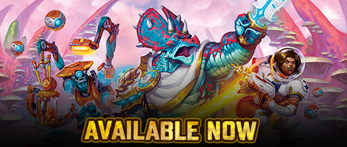
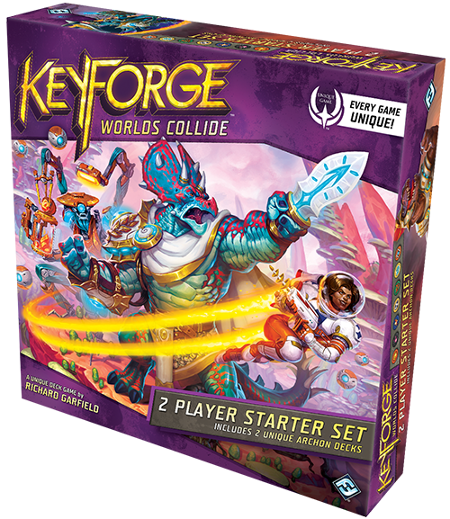
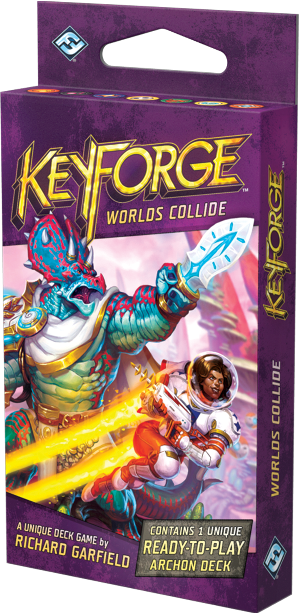
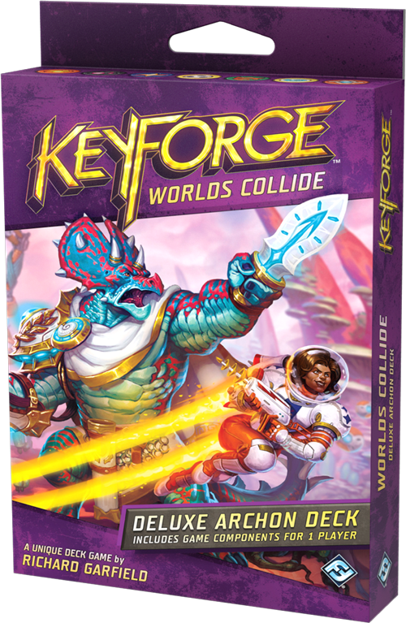
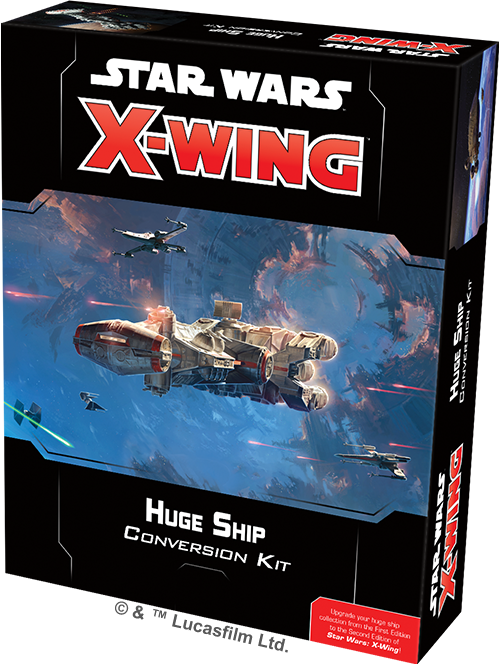
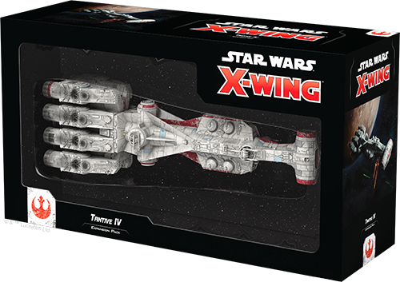
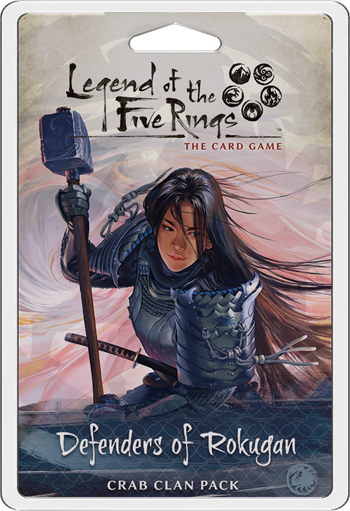
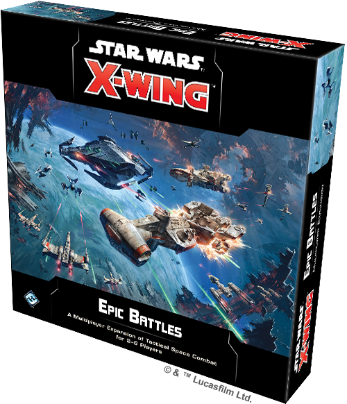
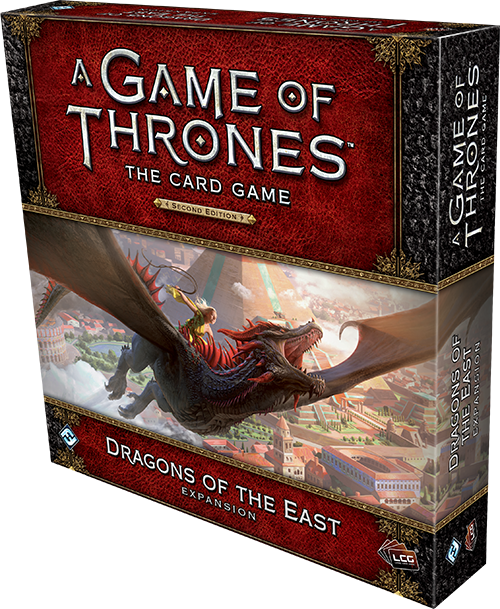

This article was originally published on [https://www.fantasyflightgames.com/en/news/2019/11/8/available-now-october-25-1/](https://www.fantasyflightgames.com/en/news/2019/11/8/available-now-october-25-1/)

&laquo; [Back to index](../index.md)

---

8 November 2019

Available Now – November 8
==========================

Check Out What's Available Now from Fantasy Flight Games

_Take a look at the latest products from Fantasy Flight Games, now available at your local retailer or online through our webstore!_

* * *

_[KeyForge: Worlds Collide Two-Player Starter Set](https://store.us.asmodee.com/preorders/create/KF07/)_
--------------------------------------------------------------------------------------------------------

 The Crucible is about to be shaken up in _Worlds Collide_, the third age of _[_KeyForge_](https://www.fantasyflightgames.com/en/products/keyforge/)_! In this continuation of the world’s first Unique Deck Game, two brand-new Houses enter the fray as 284 new cards are seamlessly integrated into the existing card pool. With new Houses come more new keyword abilities and new styles of play to create an entirely new collection of Archon Decks for you to discover, explore, and master!

The _[_KeyForge: Worlds Collide Two-Player Starter Set_](https://www.fantasyflightgames.com/en/products/keyforge/products/keyforge-worlds-collide-two-player-starter-set/)_ provides you with all the tools you need to either begin or expand your adventures on the Crucible, including two unique _Worlds Collide Archon Decks_, a QuickStart Rulebook, two poster playmats, and all the keys, tokens, and chain trackers you and your opponent need to start playing!

* * *

_[KeyForge: Worlds Collide Premium Box](https://store.us.asmodee.com/preorders/create/KF08/)_
---------------------------------------------------------------------------------------------

For those ready to take their battles on the Crucible to the next level, the _[_Worlds Collide Premium Box_](https://www.fantasyflightgames.com/en/products/keyforge/products/keyforge-worlds-collide-premium-box/)_ offers everything you need to keep your valued _KeyForge_ components safe and organized. Complete with two unique _Worlds Collide Archon Decks_, five tuckboxes designed for sleeved decks, a chain dial, a collection of tokens and a box to house them, and vibrant stickers to display your pride for any of the nine _KeyForge_ Houses, you’ll be ready to jump into the Crucible with style!

_Pick up your copy of the_ Keyforge: World’s Collide Premium Box _(KF08) at your local retailer today or online through our website with free shipping in the continental United States [here](https://store.us.asmodee.com/preorders/create/KF08/)!_

* * *

_[Keyforge: World’s Collide Archon Deck](https://store.us.asmodee.com/preorders/create/KF05a/)_   
---------------------------------------------------------------------------------------------------------------------------------------------------------------------------------------------------------------------------------

As you continue to explore the endlessly evolving planet and get to know the new beings you find there, you can expand your arsenal with _[_Worlds Collide Archon Decks_](https://www.fantasyflightgames.com/en/products/keyforge/products/keyforge-worlds-collide-archon-deck/)_. Each unique deck offers a full play experience without the need of deckbuilding or boosters. Filled with strategic potential, every _Worlds Collide Archon Deck_ has its own unique name, Archon design, and distinct mix of cards just waiting for you to discover the synergies and power within. _Worlds Collide Archon Decks_ are equally matched against Archon Decks from other ages of _KeyForge_. All you have to do is pick up a deck and let your battles begin!

_Pick up your copy of the_ Keyforge: World’s Collide Archon Deck _(KF05a) at your local retailer today or online through our website with free shipping in the continental United States [here](https://store.us.asmodee.com/preorders/create/KF05a/)!_

* * *

_[KeyForge: Worlds Collide Deluxe Archon Deck](https://store.us.asmodee.com/preorders/create/KF06/) _ 
-------------------------------------------------------------------------------------------------------------------------------------------------------------------------------------------------------------------------------

If you are ready to join the fray, the _[_KeyForge: Worlds Collide Deluxe Archon Deck_](https://www.fantasyflightgames.com/en/products/keyforge/products/keyforge-worlds-collide-deluxe-archon-deck/)_ is the perfect first step for your exploration of the Crucible. This deluxe box provides you with all the tools one player needs to either begin or expand their adventures on the Crucible, including one unique _KeyForge: Worlds Collide Archon Deck_, a Quickstart Rulebook, a chain tracker, three keys, and all the tokens required to begin your cosmic clashes!

_Pick up your copy of the_ Keyforge: World’s Collide Deluxe Archon Deck _(KF06) at your local retailer today or online through our website with free shipping in the continental United States [here](https://store.us.asmodee.com/preorders/create/KF06/)!_

* * *

_[Huge Ship Conversion Kit](https://store.us.asmodee.com/preorders/create/SWZ53/)_
----------------------------------------------------------------------------------

 Launch your [_Star Wars_™: X-Wing](https://www.fantasyflightgames.com/en/products/x-wing-second-edition/) game into bigger battles with the _[_Huge Ship Conversion Kit_](https://www.fantasyflightgames.com/en/products/x-wing-second-edition/products/huge-ship-conversion-kit/)_! This kit contains the components to upgrade your huge ship experience from the First Edition to the Second Edition, including ship cards, upgrade cards, and ship tokens, as well as a new maneuver tool, new huge ship damage deck, and more!

Many of these ships served in multiple conflicts, of course, and you'll also find entirely new components here that allow you to field a huge ship no matter which faction you choose. Finally, this kit features a variety of new upgrades exclusive to huge ships, including Commands, Teams, Cargo, and potent Hardpoints that grant additional attacks.

_Pick up your copy of the_ Huge Ship Conversion Kit _(SWZ53) at your local retailer today or online through our website with free shipping in the continental United States [here](https://store.us.asmodee.com/preorders/create/SWZ53/)!_

* * *

[Tantive IV Expansion Pack](https://store.us.asmodee.com/preorders/create/SWZ55/)
---------------------------------------------------------------------------------

 With its powerful broadside batteries and advanced command capabilities, the CR90 Corellian Corvette has served as the cornerstone of strike forces since the days of the old Republic. Now these vessels are among the Rebellion’s most valuable warships, slipping Imperial blockades and delivering the decisive blow in space engagements.

Within this expansion, you’ll find everything you need to add one CR90 Corellian Corvette ship to your Rebel Alliance or Galactic Republic squadron, including ship cards, tokens and maneuver dials. Finally, this expansion also includes the components you need to fly this or any other huge ship in battle, including a huge ship maneuver tool and a huge ship damage deck.

_Pick up your copy of the_ [Tantive IV Expansion Pack](https://www.fantasyflightgames.com/en/products/x-wing-second-edition/products/x-wing-second-edition-tantive-iv-expansion-pack/) _(SWZ55) at your local retailer today or online through our website with free shipping in the continental United States [here](https://store.us.asmodee.com/preorders/create/SWZ55/)!_

* * *

[Defenders of Rokugan](https://store.us.asmodee.com/preorders/create/L5C26/)
----------------------------------------------------------------------------

 For centuries, the Crab Clan have manned the Kaiu Wall with a ruthless efficiency. They stand against the legion of Shadowlands hordes with fierce determination and will do whatever it takes to make sure the Emerald Empire does not fall. These are the warriors who keep the horrors of Fu Leng at bay, these are the defenders of Rokugan. The Kaiu Wall stands in defiance to the Shadowland hordes, daring these monstrosities to try and cross into Rokugan, where the vigilant Crab Clan wait. Will you join the ranks of these fierce samurai?

Defend the Emerald Empire with [_Defenders of Rokugan_](https://www.fantasyflightgames.com/en/products/legend-of-the-five-rings-the-card-game/products/defenders-rokugan/), a Crab Clan Pack for _[_Legend of the Five Rings: The Card Game_](https://www.fantasyflightgames.com/en/products/legend-of-the-five-rings-the-card-game/)_.

Defenders of Rokugan includes 78 new cards (3 copies each of 23 different cards and 1 copy each of 9 different cards) mostly focusing on the Crab Clan and their role as protectors of the Emerald Empire from the deadly southern Shadowlands. 

_Pick up your copy of_ Defenders of Rokugan _(L5C26) at your local retailer today or online through our website with free shipping in the continental United States [here](https://store.us.asmodee.com/preorders/create/L5C26/)!_

* * *

_[Epic Battles Multiplayer Expansion](https://store.us.asmodee.com/preorders/create/SWZ57/)_
--------------------------------------------------------------------------------------------

 Broaden the possibilities of your _Star Wars_™: X-Wing games with the _[_Epic Battles Multiplayer Expansion_](https://www.fantasyflightgames.com/en/products/x-wing-second-edition/products/epic-battles-multiplayer-expansion/)_! This expansion introduces a totally new way to play _X-Wing_, inviting two to eight players to engage in epic multiplayer battles as they command massive fleets in large-scale games that evoke iconic _Star Wars_ scenes.

Featuring eleven cinematic scenarios, _Epic Battles_ gives players the chance to fly coordinated wings of starfighters into a wide variety of situations. From desperate defensive actions to daring assaults on enemy fortifications, each scenario creates an exciting _X-Wing_ experience. Within this expansion, you'll find five wing tools, eight upgrade cards, seven Wing Quick Build Cards, and everything else you need to stage your own epic _X-Wing_ battles!

_Pick up your copy of the_ Epic Battles Multiplayer Expansion_(SWZ57) at your local retailer today or online through our website with free shipping in the continental United States [here](https://store.us.asmodee.com/preorders/create/SWZ57/)!_

* * *

_[Dragons of the East](https://www.fantasyflightgames.com/en/products/a-game-of-thrones-the-card-game-second-edition/products/dragons-east/)_
---------------------------------------------------------------------------------------------------------------------------------------------

 From the ashes of Robert’s Rebellion, House Targaryen has risen to strength once more. An army of mercenaries, Unsullied, and Dothraki has assembled in Essos, prepared to sail for Westeros and reclaim the Iron Throne for Daenerys Targaryen. All will kneel before the Mother of Dragons!

In _[_Dragons of the East_](https://www.fantasyflightgames.com/en/products/a-game-of-thrones-the-card-game-second-edition/products/dragons-east/)_, House Targaryen rises to the fore with new versions of their most iconic characters, including Daenerys Targaryen, Khal Drogo, and three terrifying, fully grown dragons. Of course, every other faction also receives two new non-loyal cards to swell their forces and help them explore new strategies against the Targaryens. With a wealth of neutral cards and plots rounding out the expansion, every faction has good reason to explore what awaits in _Dragons of the East_. 

_Pick up your copy of the_ Dragons of the East expansion _(GT53) at your local retailer today or online through our website with free shipping in the continental United States [here](https://store.us.asmodee.com/preorders/create/GT53/)!_