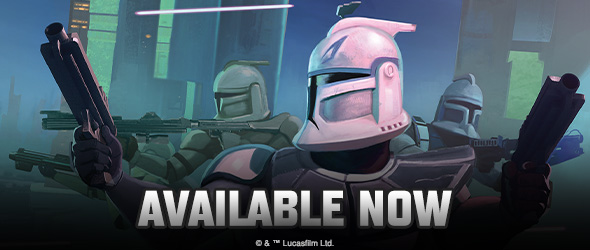
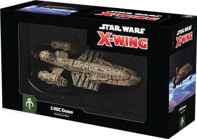
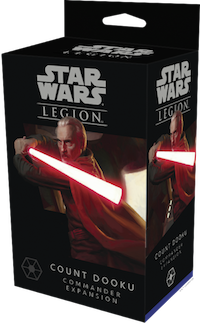
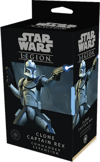
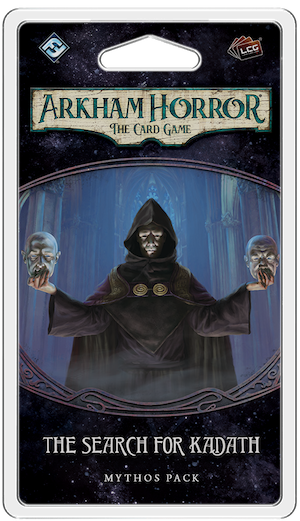
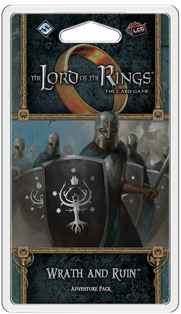

This article was originally published on [https://www.fantasyflightgames.com/en/news/2019/11/15/available-now-november-15/](https://www.fantasyflightgames.com/en/news/2019/11/15/available-now-november-15/)

&laquo; [Back to index](../index.md)

---

15 November 2019

Available Now – November 15
===========================

Check Out What's Available Now from Fantasy Flight Games

_Take a look at the latest products from Fantasy Flight Games, now available at your local retailer or online through our webstore!_

* * *

_[C-ROC Cruiser Expansion Pack](https://www.fantasyflightgames.com/en/products/x-wing-second-edition/products/x-wing-second-edition-c-roc-cruiser-expansion-pack/)_ __ 
-------------------------------------------------------------------------------------------------------------------------------------------------------------------------------------------------------------------------------------------------------------------------------------------------

The C-ROC cruiser is the heaviest vessel available to many criminal operations, cartels, and syndicates in the Outer Rim, capable of carrying massive weapons batteries and unique dirty tricks that keep it one step ahead of the law. Whether it's hauling illicit cargo or marauding the hyperlanes in search of easy targets, the C-ROC is a flexible and dangerous craft.

The _C-ROC Cruiser Expansion Pack_ contains everything both Scum and Villainy and Separatist Alliance players need to incorporate one of these armed transports into their [_Star Wars_™: X-Wing](https://www.fantasyflightgames.com/en/products/x-wing-second-edition/) squadrons. A selection of ship cards, tokens, and maneuver dials gets your C-ROC into battle, while a suite of upgrade cards invites you to add a bevy of dirty tricks to your cruiser. Finally, a plastic maneuver tool, huge ship resource tracker, and huge ship damage deck make managing your ship fast and easy.

* * *

_[Count Dooku Commander Expansion](https://www.fantasyflightgames.com/en/products/star-wars-legion/products/count-dooku-commander-expansion/)_ __ 
----------------------------------------------------------------------------------------------------------------------------------------------------------------------------------------------------------------------------------------------------------------------------

While much of the galaxy knows him as the Separatist Alliance's Head of State, Count Dooku serves a more sinister purpose in the Clone Wars. Actually a powerful Sith lord, Dooku works behind the scenes to bring down the Jedi and destroy the Republic once and for all. As the rare Separatist unit powerful in the Force, he takes to the battles of [_Star Wars_™: Legion](https://www.fantasyflightgames.com/en/products/star-wars-legion/) ready to show off his skills to any bold enough to challenge him.

Within the _Count Dooku Commander Expansion_, you'll find one unpainted and finely detailed soft plastic Count Dooku miniature challenging all comers with his lightsaber. Additionally, four upgrade cards let you explore the depths of Dooku's Force powers, while three command cards invite you to make him a central piece of your army's strategy.

_Pick up your copy of the_ Count Dooku Commander Expansion _(SWL45) at your local retailer today or online through our website with free shipping in the continental United States [here](https://www.fantasyflightgames.com/en/products/star-wars-legion/products/count-dooku-commander-expansion/)!_ 

* * *

_[Clone Captain Rex Commander Expansion](https://www.fantasyflightgames.com/en/products/star-wars-legion/products/clone-captain-rex-commander-expansion/)_ __ 
----------------------------------------------------------------------------------------------------------------------------------------------------------------------------------------------------------------------------------------------------------------------------------------

Clone Captain Rex viewed military service as an honor, and his loyalty to the Republic and his Jedi Generals was absolute. Rex honed the use of twin blaster pistols into an art form, leading his fellow clones to victory on countless battlefields across the galaxy.

The _Clone Captain Rex Commander Expansion_ for _Star Wars:_ Legion contains everything you need to add this new commander to your Galactic Republic army, including an unpainted soft plastic Clone Captain Rex miniature that can be assembled without his helmet, or with either a Phase I or Phase II Clone Trooper helmet. This miniature comes with Rex's three signature command cards that give him the power to issue orders to his fellow clone troopers, as well as five upgrade cards inviting you to unlock Rex's full potential.

_Pick up your copy of the_ Clone Captain Rex Commander Expansion _(SWL46) at your local retailer today or online through our website with free shipping in the continental United States [here](https://www.fantasyflightgames.com/en/products/star-wars-legion/products/clone-captain-rex-commander-expansion/)!_ 

* * *

_[The Search for Kadath Mythos Pack](https://www.fantasyflightgames.com/en/products/arkham-horror-the-card-game/products/search-kadath/)_ __ 
-----------------------------------------------------------------------------------------------------------------------------------------------------------------------------------------------------------------------------------------------------------------

Journey across the Dreamlands in _The Search for Kadath_, the first Mythos Pack in _The Dream-Eaters_ cycle for _[Arkham Horror: The Card Game](https://www.fantasyflightgames.com/en/products/arkham-horror-the-card-game/)_! After taking your first steps into the Dreamlands, your mind teems with anxiety over the quest ahead, dangers you left in the waking world, and the fate of dreamers who have come before you. Are they also somewhere in these expansive lands? Perhaps if you find the lost castle and return with proof of the Dreamlands, you can save everyone: yourself, your friends, and the other dreamers as well. So, despite the advice of the Dreamlands’ inhabitants, you and your companions seek unknown Kadath, where the gods dwell.

The Search for Kadath is Scenario 2–A of "The Dream-Quest." This scenario can be played on its own in Standalone Mode or combined with the other expansions in _The Dream-Eaters_ cycle to form a larger four-part or eight-part campaign. As your team of investigators becomes separated between the dream and the waking world, you will need to work together across realms to return home. To help you achieve this, you will find new player cards that create new synergies between investigators, letting you offer aid during your turns or even the Mythos Phase. Discover the meaning behind your dreams and the proof you seek!

_Pick up your copy of_ The Search for Kadath Mythos Pack _(AHC39) at your local retailer today or online through our website with free shipping in the continental United States [here](https://www.fantasyflightgames.com/en/products/arkham-horror-the-card-game/products/search-kadath/)!_ 

* * *

_[Wrath and Ruin Adventure Pack](https://www.fantasyflightgames.com/en/products/the-lord-of-the-rings-the-card-game/products/wrath-and-ruin/)_ __ 
----------------------------------------------------------------------------------------------------------------------------------------------------------------------------------------------------------------------------------------------------------------------

_Wrath and Ruin_ is the first Adventure Pack in the _Vengeance of Mordor_ cycle for _[The Lord of the Rings: The Card Game](https://www.fantasyflightgames.com/en/products/the-lord-of-the-rings-the-card-game/)_. 

After traveling down the River Running to the city of Dorwinion, and to the cursed forgotten temples hidden in the Hills of Rhûn, you have managed to defeat the shadow of evil that haunted the city and earned some hard-won peace, or so you thought. But the agents of Mordor are not defeated so easily. An old enemy has returned with a vengeance and they now seek to destroy the city you worked so hard to save. Can you force back this evil once and for all, or will all your efforts to protect the lives of the innocent have been for naught? 

_Wrath and Ruin_ provides you with 60 new cards to expand your quests in Middle-earth, including a new dwarf hero and three copies of each new player card. This Adventure Pack also offers you a chance to brush shoulders with the enigmatic Tom Bombadil. Prepare you heroes for the fight of their lives and stand united against the shadow of Mordor! 

_Pick up your copy of_ Wrath and Ruin _(MEC78) at your local retailer today or online through our website with free shipping in the continental United States [here](https://www.fantasyflightgames.com/en/products/the-lord-of-the-rings-the-card-game/products/wrath-and-ruin/)!_ 

