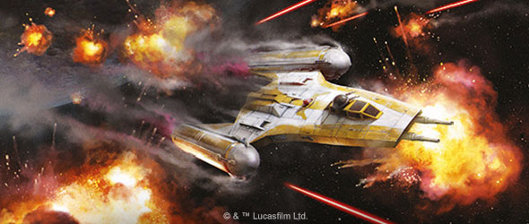
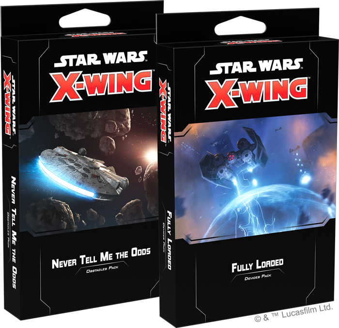
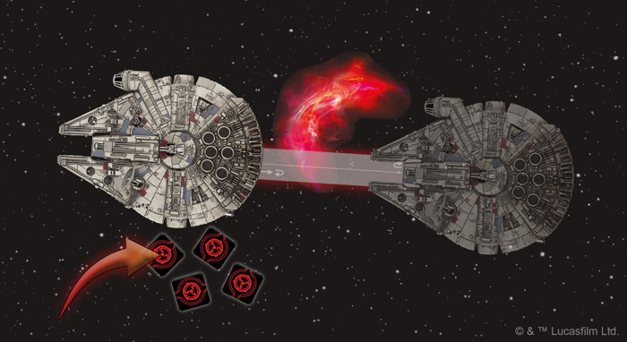
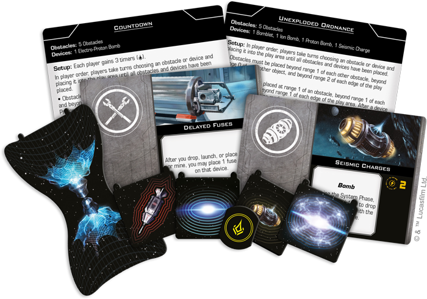
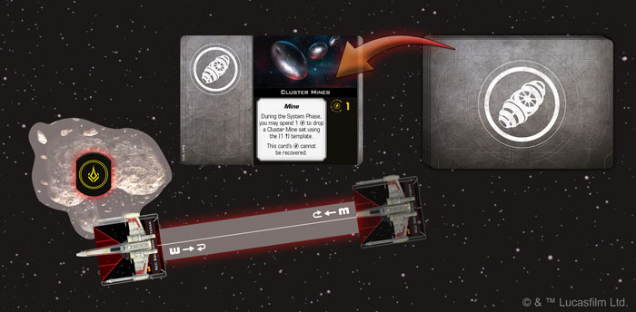

This article was originally published on [https://www.fantasyflightgames.com/en/news/2019/12/17/uncharted-territory/](https://www.fantasyflightgames.com/en/news/2019/12/17/uncharted-territory/)

&laquo; [Back to index](../index.md)

---

17 December 2019

Uncharted Territory
===================

Preview the New Environment Cards for Star Wars: X-Wing

_“Sir, the possibility of successfully navigating an asteroid field is approximately 3,720 to 1!”_  
   –C-3PO, _Star Wars: The Empire Strikes Back_

Starfighter pilots across the _Star Wars_™ galaxy must be prepared for any combat situation. Not only do they face off against enemy ships of every size and variety, they also need to be ready to fight in asteroid fields, ionizing gas clouds, and even among the wreckage of previous battles. Each obstacle alters the fabric of the battle itself, providing new hazards—and opportunities—for intrepid pilots. Soon, you can add even more environmental variety to your games of [_Star Wars_™: X-Wing](https://www.fantasyflightgames.com/en/products/x-wing-second-edition/) with the _[Never Tell Me the Odds Obstacles Pack](https://www.fantasyflightgames.com/en/products/x-wing-second-edition/products/never-tell-me-odds-obstacles-pack/)_!

In addition to nine asteroids, three debris fields, and three gas clouds in different shapes from those found in the _[Guardians of the Republic Squadron Pack](https://www.fantasyflightgames.com/en/products/x-wing-second-edition/products/guardians-republic-squadron-pack/)_ and the _[Servants of Strife Squadron Pack](https://www.fantasyflightgames.com/en/products/x-wing-second-edition/products/servants-strife-squadron-pack/)_, this pack also contains six environment cards that change the placement and rules around these obstacles, adding variety to your _X-Wing_ games.

But the asteroids and gas clouds aren’t the only environmental obstacles pilots face in battle. From mines to bombs, ships can make use of a range of deadly devices and the _[Fully Loaded Devices Pack](https://www.fantasyflightgames.com/en/products/x-wing-second-edition/products/fully-loaded-devices-pack/)_ provides even more ways to incorporate devices into your games. On top of templates and upgrade cards needed to outfit your ships with these devices, this pack contains a further six environment cards that use devices as part of setup, allowing you to battle in deadly minefields, fly your ships through starfields riddled with unexploded ordnance, or even maneuver to avoid continuous bombardments.

Join us today as we take a closer look at how these environment cards change the very landscape of your games of _X-Wing_!

The Depths of Space
-------------------

Before you even dispatch your squadrons, every game of _X-Wing_ begins with you and your opponent placing the obstacles that will define your battlefield. While a standard game features six obstacles on the board, the environment cards found in the _Never Tell Me the Odds Obstacles Pack_ fundamentally alter the way you set up your games, offering thematic new ways to stage your battles.

These cards change many of the rules regarding how obstacles are placed, creating a drastically different play area for each game. If you choose to set your battle in a [Comet Tail,](0190ac8f7b90f70b2ae77c2d6b02dc3a.png) for example, you’ll be forced to navigate around large clumps of obstacles to get a clean shot on opposing ships.

  
_The YT-1300 moves through a gas cloud in the Ion Clouds environment, gaining four ion tokens!_

But the environment cards can affect much more than how your games are set up. They also add new dimensions to the obstacles themselves. For instance, gas clouds are not normally much of a threat, simply forcing ships that overlap or fly through them to skip their perform action step. When a battle takes place among some [Ion Clouds,](03e6624d93d7f54922be40c3e24e90d2.png) however, they become a major threat by ionizing even the largest ships.

While the impact from an asteroid or debris field is dangerous enough, these obstacles can conceal even more threats to your starfighters. Whether it damages your ship or disables its weapons, passing through or overlapping a single obstacle [infested with mynocks](f7b986f19e0245d06c3e6ed6700a3925.png) will inevitably have some adverse effect on a ship, making skirting too close a risky proposition.

Deadly Space
------------

These natural impediments are far from the only features you’ll encounter in a space battle, of course. In addition to being deployed by bombers and starfighters, devices like bombs and mines can be strewn across an engagement area. The six environment cards found in the _Fully Loaded Devices Pack_ sew these devices into the fabric of your _X-Wing_ battles, giving you a variety of new challenges.

Like the cards found in the _Never Tell Me the Odds Obstacles Pack_, these new environments affect everything from the way you set up your obstacles to the way your battlefield evolves over the course of a game. Both sides could find themselves in the midst of a [Continuous Bombardment,](34d58c241bfd733cab3270dcddd304a7.png) for example, with players alternating adding a new device to the play area during the End Phase.

  
_The T-65 X-wing overlaps an asteroid with a cache, so it draws a set of Cluster Mines from the set aside upgrades and equips them!_

Under almost all circumstances, the obstacles you find in the play area are to be avoided. But if you come across a hidden [Munitions Cache,](5ac7b42f999ab2287d427effde46271a.png) obstacles can power up your ships in powerful and unexpected ways. With this environment card in effect, overlapping an obstacle could give you access to mines, bombs, or even proton torpedoes. Better yet, ships can equip these upgrades ignoring the normal restrictions, opening up a wealth of unexplored possibilities for your squadrons.

Into the Unknown
----------------

Space battles in the _Star Wars_ galaxy rarely take place in empty regions of space. Whether you find yourself in an asteroid field or a long-forgotten minefield, you need to be aware of your surroundings just as much as enemy ships. Add more variety to the environments you fight in with the _Never Tell Me the Odds Obstacles Pack_ and the _Fully Loaded Devices Pack_ for _X-Wing_!

