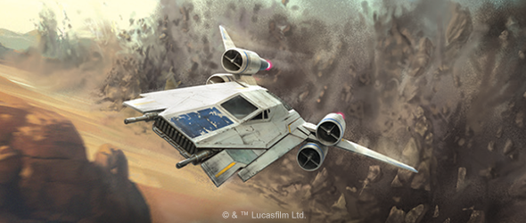
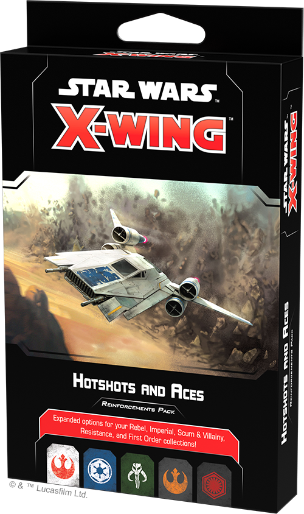
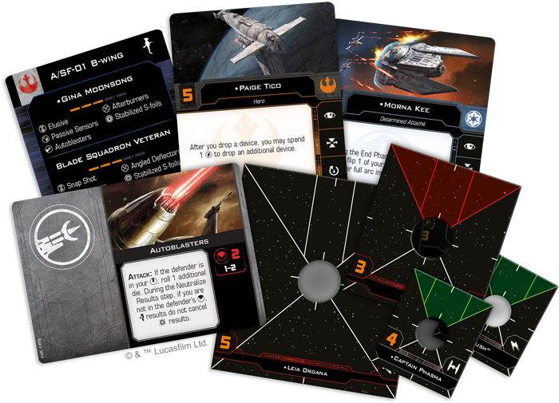
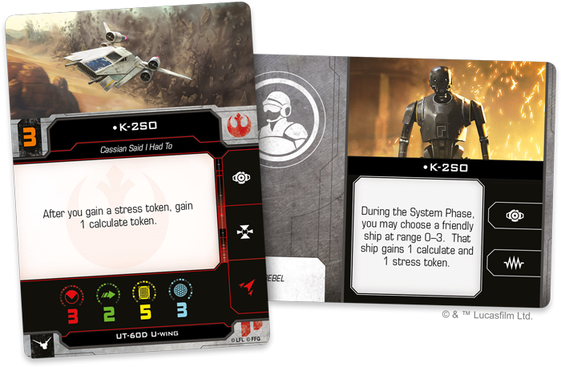
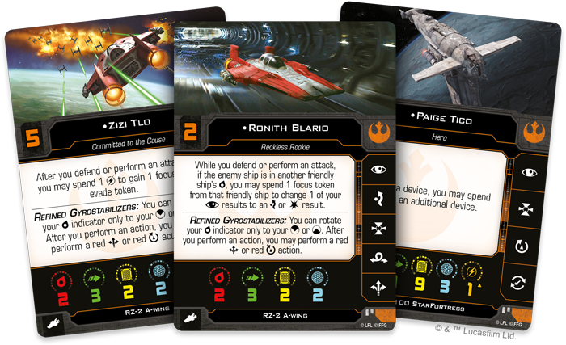
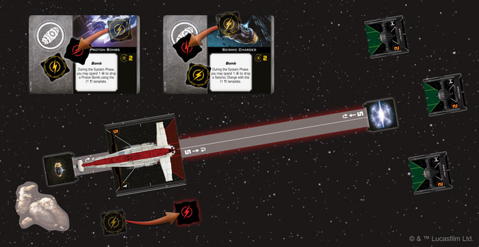

This article was originally published on [https://www.fantasyflightgames.com/en/news/2019/12/23/joining-the-cause/](https://www.fantasyflightgames.com/en/news/2019/12/23/joining-the-cause/)

&laquo; [Back to index](../index.md)

---

23 December 2019

Joining the Cause
=================

Preview the Rebel Alliance and Resistance Pilots in the Hotshots and Aces Reinforcements Pack

_"You're right, I should just wait on the ship."_  
   –K-2SO, _Rogue One: A Star Wars Story_

Despite the long odds they face in virtually every battle, both the Rebel Alliance and Resistance count some of the _Star Wars_™ galaxy’s best pilots among their numbers. Whether you enter the fight with Wedge Antilles or fly alongside Poe Dameron, the intense space battles of [_Star Wars_: X-Wing](https://www.fantasyflightgames.com/en/products/x-wing-second-edition/) invite you to add these iconic heroes to your squadrons and use their unique abilities to defeat your opponent. Soon, even more crack pilots will be ready to launch into battle in the name of freedom with the _[Hotshots and Aces Reinforcements Pack](https://www.fantasyflightgames.com/en/products/x-wing-second-edition/products/hotshots-and-aces-reinforcements-pack/)_!  

This pack provides sixteen ship cards that enhance your Rebel, Imperial, Scum, Resistance, and First Order squadrons with new ace pilots from every corner of the _Star Wars_ galaxy. These ship cards are accompanied by a collection of 31 upgrade cards that give you even more tools to get the most out of these pilots’ natural abilities.

Join us today as we take a closer look at the new Rebel Alliance and Resistance pilots and upgrades included in the _Hotshots and Aces Reinforcement Pack_!

Fanning the Flames
------------------

As a ragtag group of freedom fighters, the Rebel Alliance welcomes any who can fly a starship into their ranks. From smugglers and trained starfighter pilots to droids and untested rookies, every Rebel pilot can contribute to the cause in their own way. It takes a truly special pilot, however, to take on the challenge of flying the A/SF-01 B-wing. 

While the B-wing's heavy weapons and resilient shielding make it a threat to almost any target, most pilots find it difficult to overcome the ship's limited agility to take full advantage of this considerable firepower. But in the hands of an ace like [Gina Moonsong,](11b612661bf72fcbaadbddc03d6e26f8.png)  the B-wing becomes the focal point of your entire squadron. Not only does Moonsong easily shed a stress token to another friendly ship at the beginning of the Engagement Phase, she also neatly synergizes with her fellow B-wing pilot’s tendency to thrive in stressful situations during this phase.

  
_At the start of the Engagement Phase, Gina Moonsong transfers the stress token she gained from linking a focus action into a barrel roll action to Braylen Stramm!_

While Moonsong can clearly enhance an attack group of B-wings, another option improves the versatility of the ship itself. The B-wing’s [Stabilized S-foils](3cf4b8a3eb7187659333a04c15003e28.png)  meanwhile, the B-wing becomes even more of a powerhouse, able to sweep in and chain together two attacks with its cannons.

Moonsong isn’t the only Rebel capable of thriving in stressful situations, of course. As a reprogrammed Imperial security droid, [K-2SO](1f926b80f452a538981914124aca4d97.png) of one of your ships, granting a friendly ship a calculate token and a stress token. But—as this occurs during the System Phase—careful planning can easily remove this stress token, leaving the pilot free to perform their regular action.

In addition to military craft like the B-wing and U-wing, the Rebels often rely on civilian ships like freighters to fill out their squadrons. Despite their appearance as commercial vessels, these ships often mask heavy firepower that makes them a natural fit to fly alongside starfighters. Once an agent of the Imperial Security Bureau, [Alexsandr Kallus](65c033a0b31671892618bf68d46ce31a.png) also hides the surprising defensive capabilities of the VCX-100 light freighter, rolling an additional defense die if the attacker modified any of their attack dice.

Similarly, many Rebels pin their hopes on Luke Skywalker and his ability to use the Force in combat. But [Leia Organa](86fdb27e232b3b6274ffddcec86b3efb.png) is also sensitive to the Force and she uses it to fly the YT-1300 light freighter with expert precision. She can help her fellow Rebels be at their best no matter how difficult their maneuvers are, granting them a focus token or allowing them to recover a Force token after they fully execute a red maneuver. With the Force as her ally, Leia Organa can keep the flames of Rebellion burning bright!

New Recruits
------------

In the wake of the Galactic Civil War, young beings across the galaxy grew up hearing tales of the heroism of the Rebellion’s ace pilots. Many even learned to fly in the same cockpits from which their parents fought the Empire. Now, these same beings take up the fight against the First Order as members of the Resistance.

Eager to follow in the footsteps of their Rebel heroes, many Resistance pilots are ready to tackle some of the faction's most challenging ships, such as the RZ-2 A-wing. Featuring unmatched speed and maneuverability, the RZ-2 can outmaneuver almost any opponent, and a reckless rookie like [Ronith Blario](e9f868e22b48074f595d0af0cfb13bb1.png) is bound to use it to fly straight into the middle of an engagement. While this approach is bound to put him in the line of fire, Blario can always rely on his wingmates to get himself out of a difficult situation. He can simply borrow a focus token from another friendly ship to boost his own attacks or evasion attempts, ensuring that these valuable tokens don't go to waste.

  
_After dropping a Seismic Charge, Paige Tico uses her ability along with a Trajectory Simulator to launch a Proton Bomb into the incoming swarm of TIE/fo Fighters!_

Unlike Blario, veteran RZ-2 pilots such as [Zizi Tlo](525c8cdf2c6d579dae91d5adc84e620a.png)  Even though her lumbering ship may be functionally the opposite of an RZ-2 A-wing, Tico still knows how to get the most out of it. Unlike most ships that carry a heavy payload, she can drop two devices at once, giving her the chance creatively combine different devices or make use of other upgrades to cover large swaths of the battlefield with deadly weaponry.

Fight for Freedom
-----------------

Whether they're facing the Galactic Empire, the First Order, or something in between, there will always be brave heroes willing to protect the _Star Wars_ galaxy from the forces of tyranny and oppression. Add some new aces to your Rebel Alliance and Resistance squadrons with the _Hotshots and Aces Reinforcements Pack_!