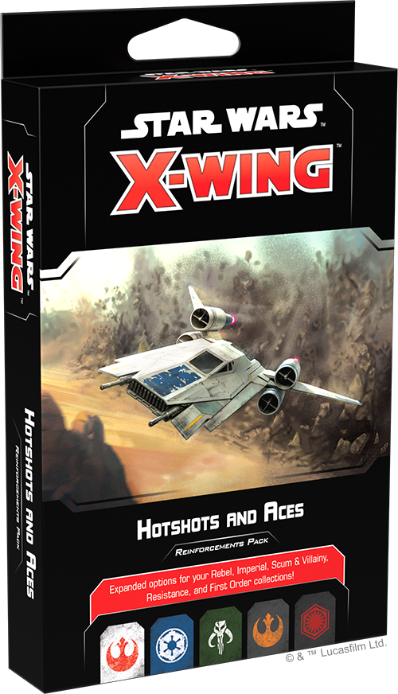
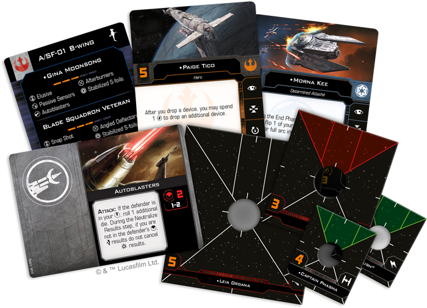

This article was originally published on [https://www.fantasyflightgames.com/en/news/2020/1/2/seizing-power/](https://www.fantasyflightgames.com/en/news/2020/1/2/seizing-power/)

&laquo; [Back to index](../index.md)

---

2 January 2020

Seizing Power
=============

Preview the Imperial, First Order, and Scum Pilots in the Hotshots and Aces Reinforcements Pack

_“Fear will keep the local systems in line.”_  
   –Grand Moff Tarkin, _Star Wars: A New Hope_

Whether the Empire is trying to tighten its grip on the Core Worlds or a criminal cartel is looking to corner the market on smuggled goods in the Outer Rim, these organizations rely on a variety of spacecraft to enforce their will across the _Star Wars_™ galaxy. But the pilots who fly these ships are just as valuable as the ships themselves. Now, more pilots are on their way to help you maintain power with the _[Hotshots and Aces Reinforcements Pack](https://www.fantasyflightgames.com/en/products/x-wing-second-edition/products/hotshots-and-aces-reinforcements-pack/)_ for [_Star Wars_™: X-Wing](https://www.fantasyflightgames.com/en/products/x-wing-second-edition/)!

Within this pack, you’ll find sixteen new ship cards to enhance your Rebel, Imperial, Scum, Resistance, and First Order squadrons, along with a suite of 31 sought-after upgrade cards that give you even more ways to use these pilots in battle. We’ve already taken a look at the pilots joining the Rebellion and Resistance. Join us today as we review the aces entering the fight for the Galactic Empire, the First Order, and the galaxy’s most notorious Scum and Villainy!

Tighten Your Grip
-----------------

The Galactic Empire’s influence is felt in every corner of the galaxy. Still, the Emperor’s reign will not be secure until all traces of rebellion have been stamped out and the last vestiges of the Jedi Order have been swept out. To this end, the Empire dispatches elite agents across the galaxy to relentlessly pursue any who would dare defy the Empire.

Some of these agents, such as the [Fifth Brother,](swz66_fifth-brother.png) even more dangerous.

  
_"Vagabond" drops a proximity mine during the System Phase. Then, they use their ability to drop another proximity mine in the path of the incoming T-65 X-wings after using the **Adaptive Ailerons** ship ability!_ 

The dark side of the Force can be a powerful tool in the midst of battle, but it isn’t the only way an Imperial pilot can be aggressive. A TIE/sk Striker pilot like [“Vagabond,”](swz66_vagabond.png) for instance, takes advantage of the ship’s natural abilities to cover a wide swath of the battlefield with devices. They can swoop in front of an enemy formation and drop one device during the System Phase and another after using **_Adaptive Ailerons_**, setting up a deadly danger zone for any oncoming enemies.

When it isn’t spreading fear through small ships like the TIE Advanced v1 or the TIE Striker, the Empire intimidates its enemies with large ships like the VT-49 Decimator. These bulky ships may lack the agility of their smaller counterparts, but a pilot like [Morna Kee](swz66_morna-kee.png)  excels at mitigating the damage her ship takes. Rather than removing her reinforce tokens during the End Phase, Kee can choose to keep them and flip them to her other full arc instead, freeing her to cover her entire ship with another reinforce action the following round.

Echoes of the Empire
--------------------

 The First Order seeks power above all else. Relegated to the Unknown Regions of the galaxy for too long, it will stop at nothing to sweep away the New Republic and build the Empire anew. It is no surprise, then, that this lust for power often extends to the pilots who fly into battle to accomplish this goal. These pilots are so relentless, in fact, that they are willing to do whatever it takes to accomplish their goals, even if it means harming their own wingmates.  

An expert TIE/sf pilot like [Lieutenant LeHuse,](swz66_lieutenant-lehuse.png) to slam two targets all at once.

While Lieutenant LeHuse is brutally efficient on offense, [Captain Phasma](swz66_captain-phasma.png) who thrives on the pressure of battle.

Making Your Way
---------------

Unlike the other factions in _X-Wing_, the galaxy’s Scum and Villainy aren’t united in a common goal. Instead, they each look out for their own interests and make use of their own dirty tricks as they engage in ship-to-ship combat. A bounty hunter like [Bossk,](swz66_bossk.png) for instance, tends to work alone and can turn even a small Z-95-AF4 Headhunter into a fearsome opponent.

At the same time, syndicates like the Black Sun are focused on maintaining their criminal operations and can't always afford professionals like Bossk. Rather than recruit expensive, highly-skilled pilots, then, they often send droids like [G4R-GOR V/M](swz66_g4r-g0r_vm.png) into the heart of battle to pester enemy fighters. Not only can G4R block the flight paths of better pilots, it deals a critical damage to every ship at range 0 after defending, making it particularly difficult to remove from the fight without paying a high price.

Similarly, [Nom Lumb](swz66_nom-lumb.png)

Build Your Empire 
------------------

Some ace pilots fly for something greater than themselves; others enter battle with their own interests in mind. Whatever cause you fight for, bolster your squadrons with the pilots in the _Hotshots and Aces Reinforcements Pack_!

_Look for the_ Hotshots and Aces Reinforcements Pack _(SWZ66)_ _at your local retailer in the first quarter of 2020. You can pre-order your copies of theis expansion at your local retailer or online through our website with free shipping in the continental United States [here](https://store.us.asmodee.com/preorders/create/SWZ66/)!_

