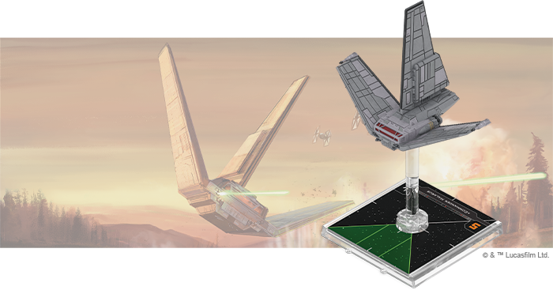
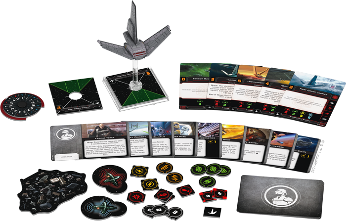
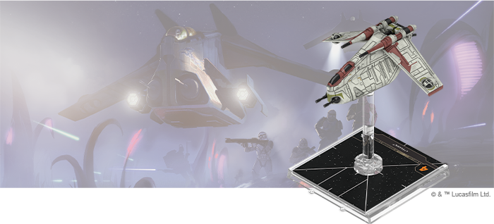
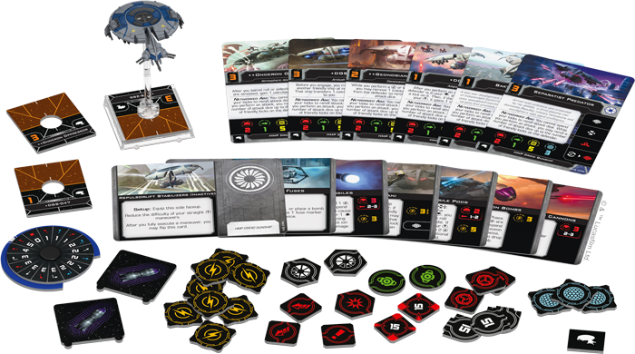

This article was originally published on [https://www.fantasyflightgames.com/en/news/2020/1/8/attack-on-all-fronts/](https://www.fantasyflightgames.com/en/news/2020/1/8/attack-on-all-fronts/)

&laquo; [Back to index](../index.md)

---

8 January 2020

Attack on All Fronts
====================

Announcing Three Expansions for Star Wars: X-Wing

_"Attack those Federation starships, quickly!"_  
   –Obi-Wan Kenobi, _Star Wars: Attack of the Clones_

_Pre-order your own copies of these_ X-Wing _expansions_ _at your local retailer or online through our website today!  
 _ 

As war rages across the _Star Wars_™ galaxy, battles can take place from a planet’s surface to beyond its atmosphere. While some starfighters focus their attention on the fight in space, others cross boundaries, supporting their troops on the ground while dueling with other fighters. Now, new ships are on their way to help their squadrons fight on multiple fronts.

Fantasy Flight Games is happy to announce three new expansions for [_Star Wars_™: X-Wing](https://www.fantasyflightgames.com/en/products/x-wing-second-edition/):

*   [Xi_\-class Light Shuttle Expansion Pack_](https://www.fantasyflightgames.com/en/products/x-wing-second-edition/products/xi-class-light-shuttle-expansion-pack/)
*   _[LAAT/i Gunship Expansion Pack](https://www.fantasyflightgames.com/en/products/x-wing-second-edition/products/laati-gunship-expansion-pack/)_
*   _[HMP Droid Gunship Expansion Pack](https://www.fantasyflightgames.com/en/products/x-wing-second-edition/products/hmp-droid-gunship-expansion-pack/)_

With powerful new abilities and a wealth of customization options, these versatile ships open exciting new strategies for your squadrons. New Clone Wars-era fighters diversify the ships available to both sides, while the agents of the First Order plot the end of the Resistance from a new shuttle. Read on for more information on these expansions!

_Xi_\-class Light Shuttle Expansion Pack
----------------------------------------

The First Order lurks in the shadowy corners of the galaxy, slowly spreading its insidious influence. Connecting these secretive enclaves is the _Xi_\-class Light Shuttle, which conveys First Order VIPs quickly but surreptitiously from base to base. In addition to transports, these swift shuttles also make ideal command craft, directing forces in raids before slipping away into the depths of space.

Many of the First Order’s most nefarious operatives unfold their schemes from a _Xi_\-class Light Shuttle, including the devious provocateur [Agent Terex.](b622d7fc5968fea56bf73934db2c69dd.png) A particularly cold and calculating member of the First Order Security Bureau, Terex becomes even more of a menace once he’s been outfitted with a cyborg construct.

Within this expansion, you’ll find a beautifully detailed _Xi_\-class Light Shuttle miniature, along with everything you need to launch it on your own secret mission, including a medium plastic base and two medium ship tokens. Four ship cards let you dispatch some of the First Order’s most elite agents to do your bidding while fourteen upgrade cards let you assign additional crew members to the ship and outfit it with new technology. We’ll take a look at everything included in this expansion in a future preview!

LAAT/i Gunship Expansion Pack
-----------------------------

A durable workhorse capable of functioning in space assaults and atmospheric battles alike, the LAAT/i Gunship transports Republic troops to battlefronts on planets besieged by the Separatists. Like the clone troopers who man it, the LAAT/i Gunship is a reliable ship renowned for its ability to get the job done.

Beyond their troop-carrying capabilities, these versatile ships are ideal platforms for Jedi Knights like [Plo Koon](3fce32781d092d94e5312c36231073c0.png) to support Republic squadrons with their mastery of the Force. Whether making precision drops of clone troopers on contested worlds, supporting Republic formations with interlaced fire in atmospheric battles, or engaging starfighters in the depths of space, the LAAT/i can be outfitted for nearly any role or battlefield.

The _LAAT/i Gunship Expansion Pack_ contains everything you need to add one of these sturdy ships to your Galactic Republic squadrons, including a finely detailed LAAT/i Gunship miniature, four ship cards, fourteen upgrade cards, and two quick build cards. We’ll take a look at everything included in this expansion in a future preview!

HMP Droid Gunship Expansion Pack
--------------------------------

The Separatist Alliance’s droid starfighters are known for their ruthlessness in battle, but perhaps none are more ruthless than the HMP Droid Gunship. Armed with ordnance and protected by ray shields, these droid gunships mercilessly devastate Republic infantry formations and starfighters with equal proficiency.

The HMP gunship’s presence invokes fear thanks to predatory droid intelligence and an unpredictable capacity to strafe targets with its sweeping array of laser cannons and devastating weapons like [Multi-Missile Pods.](411cecca5625771dddc75e158c7097c4.png) Although they were a late-war development for the Confederacy of Independent Systems, their specialized repulsors open up new possibilities for your squadrons.

The _HMP Droid Gunship Expansion Pack_ unlocks new possibilities with a beautifully detailed HMP Droid Gunship miniature and six ship cards, each bringing their own programming and protocols to battle. Your droid gunship can be further modified to your exact specifications with eight upgrade cards, or you can follow the recommendations of three quick build cards to get your gunship into battle as quickly as possible. We’ll take a look at everything included in this expansion in a future preview!

Support Your Squad
------------------

Starfighters are needed to fight on multiple fronts. Add ships that can get the job done no matter the mission with these new expansions for _X-Wing_!