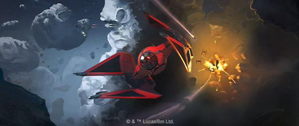
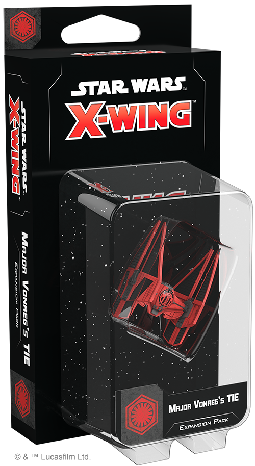
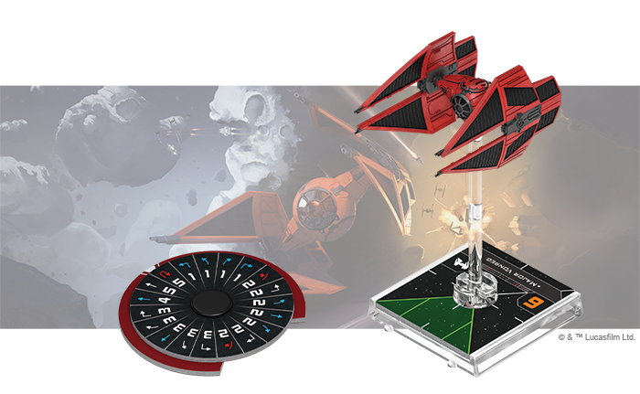
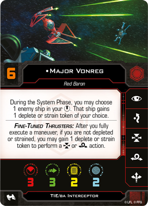
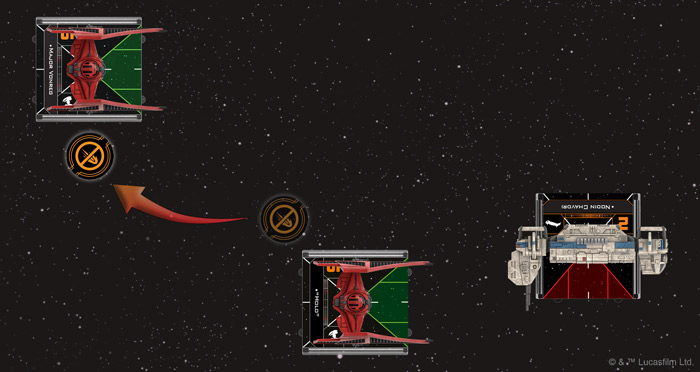
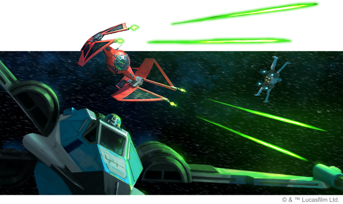

This article was originally published on [https://www.fantasyflightgames.com/en/news/2020/1/8/legend-reborn/](https://www.fantasyflightgames.com/en/news/2020/1/8/legend-reborn/)

&laquo; [Back to index](../index.md)

---

8 January 2020

A Legend Reborn
===============

Preview the Major Vonreg's TIE Expansion Pack for Star Wars: X-Wing

_"I can't believe the kid's still in one piece. This TIE is a real ace."_  
   –Poe Dameron, _Star Wars: Resistance_

Sometimes a single pilot becomes so closely associated with a ship, they come to define it. Such was the case with Soontir Fel, whose exploits in the TIE/in Interceptor during the Galactic Civil War became the stuff of legend. With the First Order taking up the mantle of the Empire, it is only appropriate that Major Baron Elrik Vonreg continue this tradition, putting his own stamp on an advanced version of Fel’s signature starfighter.

Vonreg’s vision guided the transformation of the Empire’s TIE/in Interceptor into the First Order’s TIE/ba Interceptor, a one-of-a-kind precise and lethal craft from Sienar-Jaemus Fleet Systems. Soon, you’ll have the opportunity to add one of these fearsome ships to your own First Order squadrons with the _[Major Vonreg’s TIE Expansion Pack](https://www.fantasyflightgames.com/en/products/x-wing-second-edition/products/major-vonregs-tie-expansion-pack/)_ for [_Star Wars_™: X-Wing](https://www.fantasyflightgames.com/en/products/x-wing-second-edition/)!

Within this expansion, you’ll find a beautifully painted TIE/ba Interceptor miniature accompanied by all the cards and tokens you need to incorporate it into your First Order squadrons. You'll find four ship cards—including three limited pilots—and six upgrade cards that give you the chance to make further improvements to your ship. Finally, two Quick Build cards offer convenient combinations of ship and upgrade cards that let you get your TIE/ba into the fight right away.

Join us today as we take a closer look at everything in the _Major Vonreg’s TIE Expansion Pack_!

The Legacy of the Empire
------------------------

During the days of the Empire, the TIE/in Interceptor was a marvel of starfighter engineering. Combining superior maneuverability with increased firepower from basic TIE designs, it’s no wonder that the Interceptor was the vessel of choice for the Empire’s elite aces. Incorporating shields and projectile launchers into its design, the First Order’s version improves this iconic ship in every way.   

The TIE/ba Interceptor’s many features make it a formidable ship, even when it’s flown by less skilled [First Order Provocateurs.](7b4d232790846cd0645cc86097a0353a.png)  The ship’s Fine-Tuned Thrusters alone give its pilot a great deal of tactical flexibility, allowing them to reduce their agility with a strain token or roll one fewer attack die with a new deplete token in order to perform a lock or barrel roll action after fully executing a maneuver.

 But, just like the TIE/in, the ship is perhaps most effective when it’s in the hands of aces like [Major Vonreg.](90b2943644c2d5d11cac543fa3e542ac.png)    This Red Baron weaponizes strain and deplete tokens, forcing a ship in his bullseye arc to gain one of these tokens during the System Phase. Unless that ship immediately performs a blue maneuver to remove these tokens, it must suffer the consequences until it defends or attacks!

Although not quite as skilled as Vonreg, [“Holo”](1f4d0a770ca5acd0b6333a4e28c49fb0.png) has just as much flexibility with tokens. This pilot must transfer one of their tokens to another friendly ship nearby at the start of the Engagement Phase, allowing them to shed a stress, strain, deplete, or even lock token to another member of the squadron at a key moment. Alternatively, they can also choose to bolster one of their wingmates with a critical focus or evade token when they need it most.

While [“Ember”](c8bca6ba0e9f5bb7819b2781a72d79f8.png) cannot generate or transfer tokens, they can control how a target uses them. More specifically, “Ember” prevents a defender from spending focus or calculate tokens while a damaged friendly ship is flying close, forcing opponents to break up their formations and potentially disrupting any synergy they gained from flying close together.

The TIE/ba Interceptor has many built-in advantages, of course, but that doesn’t mean the ship can’t be improved. The _Major Vonreg’s TIE Expansion Pack_ features a number of upgrade cards that can enhance this starfighter and other First Order ships. Some [Mag-Pulse Warheads,](48d1e5b5bdc351de7113d95208c2f070.png) for example, only enhance the natural ability of TIE/ba pilots to put enemies at a disadvantage.

  
_"Holo" transfers the disarm token they gained from their Deuterium Power Cells to Major Vonreg, allowing "Holo" to attack the Resistance Transport at range 1!_

At the same time, the TIE/ba is still a fragile ship, even with shields. Equipping it with some [Deuterium Power Cells](ce9033eed2474b72f734f51a316040b3.png) can help it stay in the fight for longer. The ability to recover shields is useful for any TIE/ba pilot, but “Holo” can take particular advantage of this upgrade by transferring away the disarm token and staying just as deadly as ever.

The First Order carries on the [Proud Tradition](44799d502350641323db2e4cc6bba525.png) making all subsequent focus actions more difficult.

Become an Ace
-------------

The First Order may have been relegated to the Unknown Regions, but with aces like Major Vonreg and "Holo" at the controls of the TIE/ba Interceptor, they're sure to reclaim the glory of the Empire.