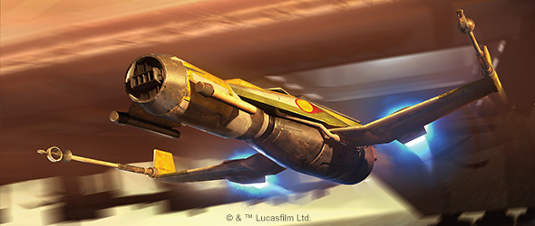
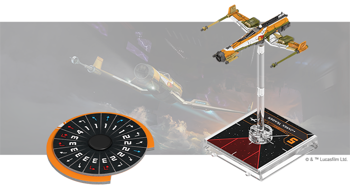
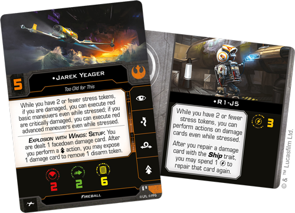
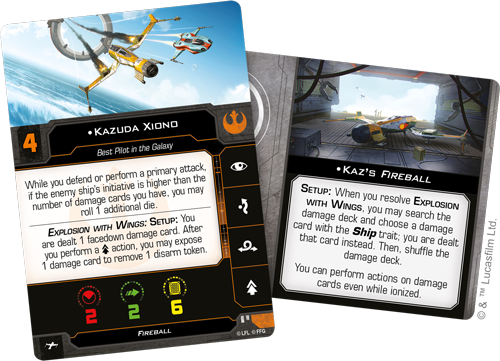
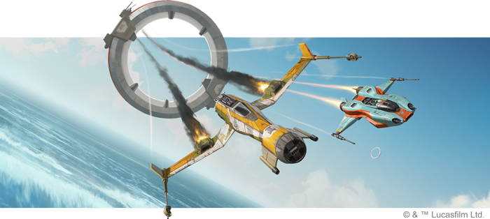

This article was originally published on [https://www.fantasyflightgames.com/en/news/2020/1/15/explosive-speed/](https://www.fantasyflightgames.com/en/news/2020/1/15/explosive-speed/)

&laquo; [Back to index](../index.md)

---

15 January 2020

Explosive Speed
===============

Preview the Fireball Expansion Pack for Star Wars: X-Wing

_“That thing’s a disaster.”_  
   –Kazuda Xiono, _Star Wars: Resistance_

Some starship pilots make a name for themselves in the heat of battle, showcasing their skills as they shoot down enemy fighters. Others take a different path entirely, beginning their careers as racers, working around the clock to keep their cobbled-together ships in the sky long enough to cross the finish line.

Whatever route they take, these pilots need nerves of steel if they’re to find success. A rare few —such as Kazuda Xiono—live in both worlds, building a reputation as both a racer and a starfighter pilot. Soon, you can help Xiono on this journey to become the best pilot in the galaxy with the [Fireball _Expansion Pack_](https://www.fantasyflightgames.com/en/products/x-wing-second-edition/products/fireball-expansion-pack/) for [_Star Wars_™: X-Wing](https://www.fantasyflightgames.com/en/products/x-wing-second-edition/)!

This expansion features a beautifully detailed, pre-painted _Fireball_ miniature that can bring its incredible speed to your Resistance squadrons. In addition to this miniature, you'll also find four ship cards representing the brave pilots willing to fly this explosion with wings. Finally, seven upgrade cards invite you to add your own improvements to the ship while two Quick Build cards offer useful pre-defined combinations of pilots and upgrades to get your ship into the battle.

Join us today as we take a closer look at what you’ll find in the Fireball _Expansion Pack_!

An Explosion With Wings
-----------------------

Designed for racing rather than combat, the _Fireball_ immediately sets itself apart from the other ships you'll find in a typical _X-Wing_ squadron. While it is armed with wingtip-mounted laser cannons and missile launchers, these weapons are secondary to the features that give this ship the speed and maneuverability it needs to win races. When they find themselves in a space battle, then, _Fireball_ pilots rely on the breakneck speed and tight turning granted by the SLAM action to give them an advantage against enemy fighters.

But harnessing such incredible speed comes with its own risks. The _Fireball_ is an old ship with a reputation for bursting into flames or exploding at the worst times and this affects how you fly from the very beginning of a game of _X-Wing_. No matter who’s in the cockpit, the _Fireball_ is dealt a facedown damage card during setup, and while this may seem like a serious disadvantage, the _Fireball_ can quickly turn it into a strength. Its pilot can choose to expose a damage card after taking the SLAM action to remove the disarm token that comes with this action, keeping its weapons systems online for an attack.

This ability makes the _Fireball_ a threat to nearly every ship in play, but it also requires pilots who can handle its blazing speed while also managing the many problems that arise. A veteran of the Galactic Civil War as well as an experienced racer, [Jarek Yeager](0a70a203d72a108dfb9247879cc8a6ab.png)  who can quickly repair any major issues that pop up with the _Fireball_ while Yeager is pushing the ship to its limits.

Yeager is certainly a highly skilled pilot, but that doesn't mean R1-J5 has to back him up forever. He can also take control of the ship [himself,](dc14f51a239a8476cfb3a2aa7299e775.png) to rocket himself forward.

Unlike Yeager or Bucket, other _Fireball_ pilots are less accustomed to the challenges that come with flying a racer. Trained as a starfighter pilot, it’s only natural that [Kazuda Xiono](f1b62b72422be075434109658953647e.png) would take a more combat-oriented approach. He starts with a significant advantage over all but the lowest initiative pilots, rolling an additional die while defending or performing a primary attack against other aces. This advantage slowly dissolves as the pressure mounts and the _Fireball_ takes damage, but even then Xiono remains effective against top enemy fighters.

Xiono can press this advantage even further with the help of an [Advanced SLAM](87dd67b3488cc847bfd15ddf98e8a6d5.png) that allows him to acquire locks and help his shots find their targets.

In addition to his skills as a pilot, Xiono is a novice mechanic who can put his own spin on the [_Fireball_ itself.](785ccfb7c7af823a4b764af95206b5d6.png)  for example, you’ll always have a card to expose after it repairs itself. This comes at the cost of ionization, but you can also use this time to repair your other damage cards to keep their negative effects from multiplying.

Feel the Rush
-------------

With its powerful engines and unpredictable nature, the _Fireball_ might be more at home on the race course than in battle. But any pilot with skill to tame it can bring down the galaxy’s deadliest aces.