This article was originally published on [https://www.fantasyflightgames.com/en/news/2020/1/31/available-now-january-24-1/](https://www.fantasyflightgames.com/en/news/2020/1/31/available-now-january-24-1/)

&laquo; [Back to index](../index.md)

---

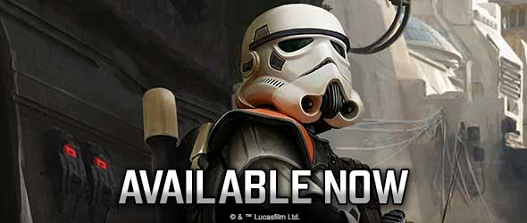

31 January 2020

Available Now – January 31
==========================

New Star Wars Products Are Available Now

_Take a look at the latest products from Fantasy Flight Games, now available at your local retailer!_

* * *

_[Luke Skywalker Operative Expansion](https://www.fantasyflightgames.com/en/products/star-wars-legion/products/luke-skywalker-operative-expansion/)_
----------------------------------------------------------------------------------------------------------------------------------------------------

_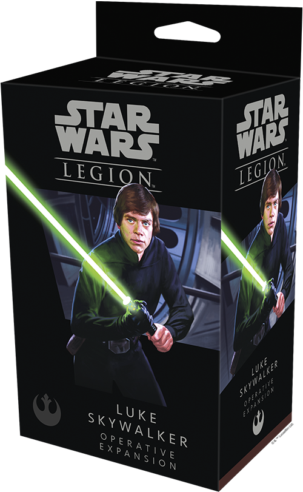_

One of the Rebellion's most enduring heroes, Luke Skywalker has sparked hope across the galaxy. As the first new Jedi Knight in a generation, he helped bring the Empire to its knees and began the process of restoring peace and justice to planets that had only known oppression. 

The _Luke Skywalker Operative Expansion_ for [_Star Wars_™: Legion](https://www.fantasyflightgames.com/en/products/star-wars-legion/) gives you the chance to bolster your Rebel armies with a powerful Jedi Knight. Here, you’ll find one unpainted, finely sculpted miniature depicting Luke Skywalker as he appeared in _Star Wars: Return of the Jedi_. Meanwhile, three command cards that can be used alongside the Luke Skywalker command cards from the _Star Wars_: Legion _Core Set_ give you the freedom to shape exactly how you make use of this powerful operative in battle. Finally, four upgrade cards invite you to further augment Luke Skywalker with additional Force powers and training.

* * *

_[Darth Vader Operative Expansion](https://www.fantasyflightgames.com/en/products/star-wars-legion/products/darth-vader-operative-expansion/)_
----------------------------------------------------------------------------------------------------------------------------------------------

_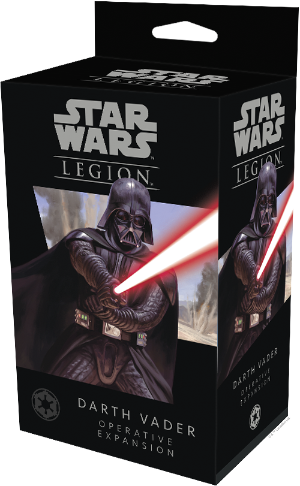_

Feared by friend and foe alike, Darth Vader is the living embodiment of the Empire’s might. Before he could become one of the most fearsome field commanders in the galaxy, however, he honed his skills hunting Jedi to the far corners of the galaxy. Now he is ready to carry out the Emperor’s bidding by decimating the Rebel Alliance wherever it can be found.

In the _Darth Vader Operative Expansion_ for _Star Wars_: Legion, you’ll find an unpainted, easily assembled Darth Vader miniature in a different pose from the one found in the _Star Wars_: Legion _Core Set_. This miniature is accompanied by three new Darth Vader command cards that can be used by both the operative and commander versions of the unit, letting you tailor your strategy to fit your needs. Rounding out this expansion are four upgrade cards that invite you to augment Darth Vader with even more Force powers or training.

_Pick up your copy of the_ Darth Vader Operative Expansion _(SWL57) at your local retailer today or online through our website [here](https://www.fantasyflightgames.com/en/products/star-wars-legion/products/darth-vader-operative-expansion/)!_

* * *

_[Imperial Bunker Battlefield Expansion](https://www.fantasyflightgames.com/en/products/star-wars-legion/products/imperial-bunker-battlefield-expansion/)_
----------------------------------------------------------------------------------------------------------------------------------------------------------

_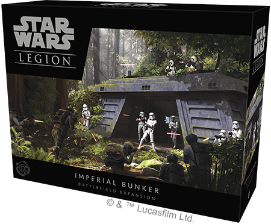_

As outposts and data centers, Imperial bunkers play a pivotal role in securing the Empire's reign over the galaxy. Found on Imperial-controlled planets such as Scarif and the forest moon of Endor, these bunkers keep safe some of the Empire's most vital military secrets and command centers. Whether protecting what lies within, or fighting to extract vital information, any battle fought over a bunker could stand as a turning point in the war. 

This Battlefield Expansion contains one unpainted, finely sculpted Imperial Bunker miniature and six modular computer terminal miniature miniatures that can enhance any _Star Wars_: Legion battlefield. Alternatively, six new battle cards make this miniature the centerpiece of an exciting, two-act scenario that sees both sides battling for the bunker. 

_Pick up your copy of the_ Imperial Bunker Battlefield Expansion _(SWL58) at your local retailer today or online through our website [here](https://www.fantasyflightgames.com/en/products/star-wars-legion/products/imperial-bunker-battlefield-expansion/)!_

* * *

_[Crashed Escape Pod Battlefield Expansion](https://www.fantasyflightgames.com/en/products/star-wars-legion/products/crashed-escape-pod-battlefield-expansion/)_
----------------------------------------------------------------------------------------------------------------------------------------------------------------

_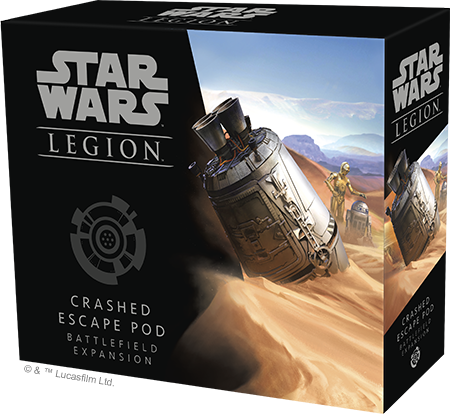_

R2-D2 and C-3PO set the entire _Star Wars_ saga into motion when they crash landed on Tatooine, and the _Crashed Escape Pod Battlefield Expansion_ invites you to play our the early stages of their desperate mission in your games of _Star Wars_: Legion.

This expansion contains one finely sculpted crashed escape pod miniature, one C-3PO miniature, and one R2-D2 miniature, along with new battle, unit, upgrade, and command cards. The crashed escape pod miniature can be used as a terrain piece to enhance your battlefield or fought over as part of a unique scenario using the battle cards. Meanwhile, the C-3PO and R2-D2 miniatures can be used as either scenario objectives or fielded as a Rebel Alliance or Galactic Republic unit.

_Pick up your copy of the_ Crashed Escape Pod Battlefield Expansion _(SWL43) at your local retailer today or online through our website [here](https://www.fantasyflightgames.com/en/products/star-wars-legion/products/crashed-escape-pod-battlefield-expansion/)!_

* * *

_[Phase I Clone Troopers Upgrade Expansion](https://www.fantasyflightgames.com/en/products/star-wars-legion/products/phase-i-clone-troopers-upgrade-expansion/)_
----------------------------------------------------------------------------------------------------------------------------------------------------------------

_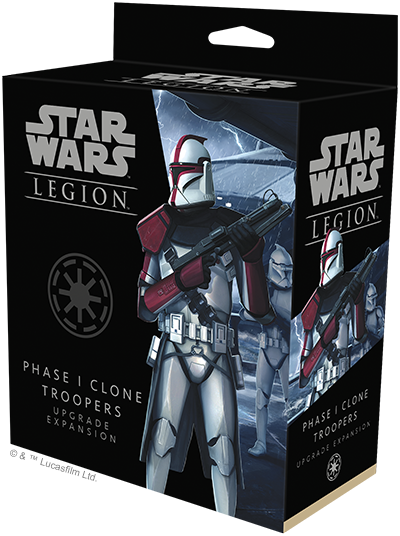_

The Galactic Republic’s Phase I Clone Troopers are always armed with state-of-the-art equipment. For most clone troopers, this means carrying the powerful and versatile DC-15A blaster rifle, but a select few Phase I Troopers are trained in the use of even more weapons, ensuring the Grand Army of the Republic is prepared for any situation.

The _Phase I Clone Troopers Upgrade Expansion_ for _Star Wars_: Legion contains four unpainted, finely sculpted soft plastic Phase I Clone Trooper miniatures, different from those found in the _Clone Wars Core Set_ or the _Phase I Clone Troopers Unit Expansion_, to enhance your existing Phase I Clone Trooper units or to form one corps unit, along with new personnel and heavy weapon upgrade options.

_Pick up your copy of the_ Phase I Clone Troopers Upgrade Expansion _(SWL55) at your local retailer today or online through our website [here](https://www.fantasyflightgames.com/en/products/star-wars-legion/products/phase-i-clone-troopers-upgrade-expansion/)!_

* * *

_[B1 Battle Droids Upgrade Expansion](https://www.fantasyflightgames.com/en/products/star-wars-legion/products/b1-battle-droids-upgrade-expansion/)_
----------------------------------------------------------------------------------------------------------------------------------------------------

_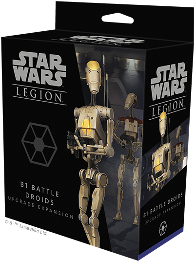_

The Separatist Alliance’s B1 Battle Droids are manufactured to attack in massive numbers and wear down enemy forces through raw attrition alone. But that does not mean they don't have other purposes to serve as the Separatists seek to overthrow the Galactic Republic. Other series of battle droids perform a variety of tasks for the Separatist military and a select few droids are outfitted with different weapons that give them unique capabilities.

The _B1 Battle Droids Upgrade Expansion_ for _Star Wars_: Legion contains four unpainted, finely sculpted B1 Battle Droids different from those found in the _Clone Wars Core Set_ or the _B1 Battle Droids Unit Expansion_. These miniatures arrive on frames, giving you freedom to customize their appearance. On the battlefield, these miniatures can become the basis for a new unit of B1 Battle Droids, or you can use the new heavy weapon and personnel upgrade cards options they bring to enhance your existing units.

_Pick up your copy of the_ B1 Battle Droids Upgrade Expansion _(SWL54) at your local retailer today or online through our website [here](https://www.fantasyflightgames.com/en/products/star-wars-legion/products/b1-battle-droids-upgrade-expansion/)!_

* * *

_[Rebel Troopers Upgrade Expansion](https://www.fantasyflightgames.com/en/products/star-wars-legion/products/rebel-troopers-upgrade-expansion/)_
------------------------------------------------------------------------------------------------------------------------------------------------

_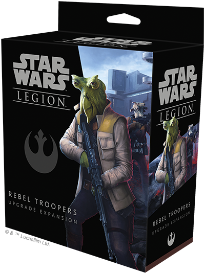_

The Rebellion is made up of beings from countless worlds, all standing united in opposition to the tyranny of the Empire. No matter what world they hail from, every Rebel trooper dedicates their life to fighting on the front lines for the cause of the Rebellion. Now, you can add even more diversity to your Rebel ranks with the new miniatures and upgrades found in the _Rebel Troopers Upgrade Expansion_.

This expansion for _Star Wars_: Legion contains four unpainted, finely sculpted soft plastic Rebel Trooper miniatures different from those found in the _Star Wars_: Legion _Core Set_ and the _Rebel Troopers Unit Expansion_, to enhance your existing Rebel Trooper units or to form one corps unit, along with new heavy weapon and personnel upgrade options.

_Pick up your copy of the_ Rebel Troopers Upgrade Expansion _(SWL53) at your local retailer today or online through our website [here](https://www.fantasyflightgames.com/en/products/star-wars-legion/products/rebel-troopers-upgrade-expansion/)!_

* * *

_[Imperial Stormtroopers Upgrade Expansion](https://www.fantasyflightgames.com/en/products/star-wars-legion/products/imperial-stormtroopers-upgrade-expansion/)_
----------------------------------------------------------------------------------------------------------------------------------------------------------------

_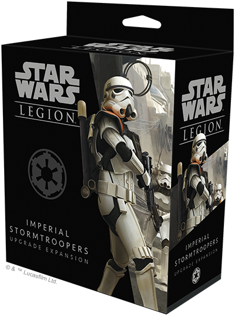_

A ubiquitous sight across the galaxy, white-armored stormtroopers strike fear into the hearts of all those who would oppose the Empire. Though their uniform armor and rigid tactics emphasize the crushing weight of Imperial might, Stormtroopers can be surprisingly flexible units that serve a multitude of roles in Imperial strike forces.

This expansion for _Star Wars_: Legion contains four unpainted and finely sculpted soft plastic Stormtrooper miniatures different from those found in the _Star Wars_: Legion _Core Set_ and the _Stormtroopers Unit Expansion_, inviting you to enhance your existing Stormtrooper units or to form a corps unit of their own. Alongside these new miniatures, you'll also find new heavy weapon and personnel upgrade options to outfit your Stormtroopers for any situation.

_Pick up your copy of the_ Imperial Stormtroopers Upgrade Expansion _(SWL52) at your local retailer today or online through our website [here](https://www.fantasyflightgames.com/en/products/star-wars-legion/products/imperial-stormtroopers-upgrade-expansion/)!_

* * *

_[Nadiri Starhawk Expansion Pack](https://www.fantasyflightgames.com/en/products/star-wars-armada/products/nadiri-starhawk-expansion-pack/)_ _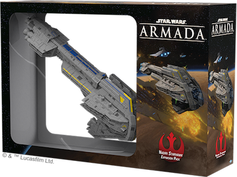_ 
--------------------------------------------------------------------------------------------------------------------------------------------------------------------------------------------------------------------------------------------------------------------------------

The _Starhawk_\-class Battleship was the first capital ship commissioned by the nascent New Republic Defense Fleet after the Battle of Endor. Assembled at the Nadiri Dockyards from the salvage of captured Star Destroyers, _Concord_ served as the flagship for Commodore Kyrsta Agate during the capture of the infamous Kuat Drive Yards, while _Amity_ and _Unity_ joined her in time for the climactic Battle of Jakku. There, all three Starhawks bore the brunt of the battle to destroy the remnants of the Galactic Empire.

The _Nadiri Starhawk Expansion Pack_ for [_Star Wars_™: Armada](https://www.fantasyflightgames.com/en/products/star-wars-armada/) provides your rebels with everything they need to add 1 Starhawk-class Battleship to your game, including 1 painted ship, 1 speed dial, 4 command dials, 2 ship cards, 15 upgrade cards, and a collection of assorted tokens.

_Pick up your copy of the_ Nadiri Starhawk Expansion Pack _(SWM32) at your local retailer today or online through our website [here](https://www.fantasyflightgames.com/en/products/star-wars-armada/products/nadiri-starhawk-expansion-pack/)!_

* * *

_[Onager-class Star Destroyer Expansion Pack](https://www.fantasyflightgames.com/en/products/star-wars-armada/products/onager-class-star-destroyer-expansion-pack/)_ _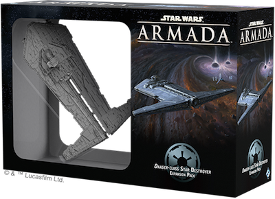_ 
--------------------------------------------------------------------------------------------------------------------------------------------------------------------------------------------------------------------------------------------------------------------------------------------------

The _Onager_\-class Star Destroyer is a specialized platform for some of the Empire’s most dangerous weaponry. The arrival of its ominous silhouette in orbit heralds a bombardment by massive particle cannons, or, more rarely, a devastating pulse from superheavy composite beam turbolasers. Its deployment in more sensitive Imperial operations can be neither confirmed nor denied.

The _Onager-class Star Destroyer Expansion Pack_ for _Star Wars_™: Armada provides your imperial officers with everything you need to add 1 Onager-class Star Destroyer to your game, including 1 painted ship, 1 speed dial, 3 command dials, 2 ship cards, 15 upgrade cards, and a collection of assorted tokens.

_Pick up your copy of the_ Onager-class Star Destroyer Expansion Pack _(SWM33) at your local retailer today or online through our website [here](https://www.fantasyflightgames.com/en/products/star-wars-armada/products/onager-class-star-destroyer-expansion-pack/)!_

* * *

_[Major Vonreg's TIE Expansion Pack](https://www.fantasyflightgames.com/en/products/x-wing-second-edition/products/major-vonregs-tie-expansion-pack/)_ _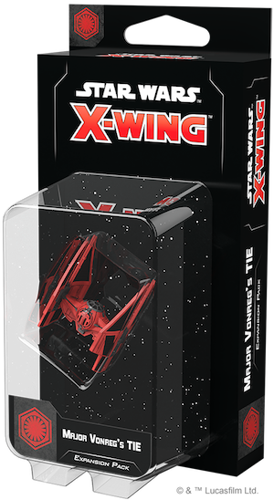_ 
-----------------------------------------------------------------------------------------------------------------------------------------------------------------------------------------------------------------------------------------------------------------------------------------

As the personal ship of the First Order elite ace Major Baron Elrik Vonreg, the Sienar-Jaemus Fleet Systems TIE/ba Baron Space Superiority Interceptor strikes fear in the hearts of even the most grizzled Resistance pilots. Major Vonreg personally guided the enhancement of proven designs, transforming the Empire's TIE/in Interceptor into the First Order's TIE/ba Interceptor, a one-of-a-kind precise and lethal craft.

Engineered with precision and lethality in mind, the TIE/ba interceptor has many ways to put pressure on your opponents. Whether you're using its prodigious speed, fine-tuned thrusters or missiles, a single skilled pilot can wreak havoc on squadrons unprepared to face them.

Within this expansion, you’ll find six pilots ready to fight for the First Order, as well as six upgrade cards to fine-tune your TIE/ba interceptor’s capabilities. Accompanying these are two Quick Build cards with pre-built combinations of pilots and upgrades to help you get flying right away.

_Pick up your copy of the_ Major Vonreg's TIE Expansion Pack _(SWZ62) at your local retailer today or online through our website [here](https://www.fantasyflightgames.com/en/products/x-wing-second-edition/products/major-vonregs-tie-expansion-pack/)!_

* * *

_[Fireball Expansion Pack](https://www.fantasyflightgames.com/en/products/x-wing-second-edition/products/fireball-expansion-pack/)_ _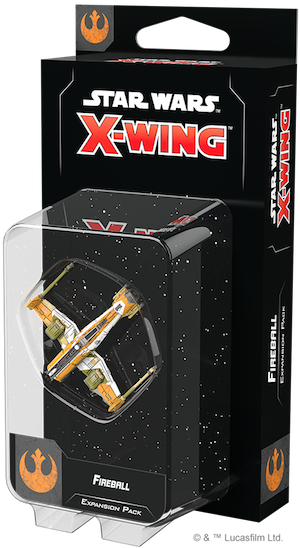_ 
----------------------------------------------------------------------------------------------------------------------------------------------------------------------------------------------------------------------------------------------------------------------

A labor of love to the crew of Jarek Yeager’s garage, the _Fireball_ is a highly combustible, scratch-built racing ship. Flown by undercover Resistance operative Kazuda Xiono, this explosion with wings is able to push the limit around the course before living up to its name. Lightly armed but lightning fast, the _Fireball_ can careen around the battlefield, gaining a  superior position on almost any enemy.

Already an explosively fast racing machine, the _Fireball_ is also highly customizable, giving you the chance to make your own modifications that fit your personal style.

This expansion features a beautifully detailed, pre-painted _Fireball_ miniature that can bring its incredible speed to your Resistance squadrons. In addition to this miniature, you'll also find four ship cards representing the brave pilots willing to fly this explosion with wings. Finally, seven upgrade cards invite you to add your own improvements to the ship while two Quick Build cards offer useful pre-defined combinations of pilots and upgrades to get your ship into the battle.

_Pick up your copy of the_ Fireball Expansion Pack _(SWZ63) at your local retailer today or online through our website [here](https://www.fantasyflightgames.com/en/products/x-wing-second-edition/products/fireball-expansion-pack/)!_

* * *

_[Hound's Tooth Expansion Pack](https://www.fantasyflightgames.com/en/products/x-wing-second-edition/products/x-wing-second-edition-hounds-tooth-expansion-pack/)_ __ 
-----------------------------------------------------------------------------------------------------------------------------------------------------------------------------------------------------------------------------------------------------------------------------------------------------

The reptilian bounty hunter Bossk is as tenacious as he is notorious, pursuing his targets doggedly in his customized YV-666 light freighter, the _Hound’s Tooth_, or launching his Z-95-AF4 Headhunter to engage other starfighters up-close and personal. Beside Bossk, the YV-666’s spacious triple-decker design makes it popular with bounty hunters of all stripes, who often retrofit an entire deck for prisoner transport.

Now, the infamous _Hound's Tooth_ can be a part of your Scum and Villainy squadrons, giving you a contingency plan if a battle turns in your opponent’s favor. Any pilot can escape via the _Nashtah Pup_, but Bossk himself can partner with whoever pilots the Hound’s Tooth to track down a target together.

The _Hound’s Tooth Expansion Pack_ contains everything you need to start your own bounty hunting career, including a YV-666 light freighter miniature and a Z-95-AF4 Headhunter miniature painted in the striking _Nashtah Pup_ scheme. Joining these miniatures are six ship cards—four for the YV-666 and two for the Z-95-AF4 Headhunter—and fourteen upgrade cards. Finally, three Quick Build Cards give you even more options for deploying your YV-666.

_Pick up your copy of the_ Hound's Tooth Expansion Pack _(SWZ58) at your local retailer today or online through our website [here!](https://www.fantasyflightgames.com/en/products/x-wing-second-edition/products/x-wing-second-edition-hounds-tooth-expansion-pack/)_

* * *

_[TIE/in Interceptor Expansion Pack](https://www.fantasyflightgames.com/en/products/x-wing-second-edition/products/x-wing-second-edition-tie-interceptor-expansion-pack/)_ __ 
-------------------------------------------------------------------------------------------------------------------------------------------------------------------------------------------------------------------------------------------------------------------------------------------------------------

With incredible engine output, a lightweight frame, and precise thrusters for close maneuvering, the TIE/in interceptor is a vessel for the most elite Imperial aces. Only those with nerves of steel can ride the knife’s edge to draw out this craft’s full potential. This includes the ship’s four wing-mounted laser cannons, a dramatic increase in firepower over its predecessors.

Not only is the TIE/in interceptor the craft of choice of the Empire’s elite Saber Squadron, this fighter group is led by the legendary Soontir Fel, one of the best starfighter pilots in the galaxy. Taking full advantage of the ship’s maneuverability, Fel is the bane of Rebel squadrons across the galaxy.

The _TIE/in Interceptor Expansion Pack_ gives you the chance to put Soontir Fel and three other pilots at the controls of this swift and deadly craft. Joining them are five upgrade cards that give these elite pilots even more advantages in the thick of a space battle. Finally, two Quick Build cards provide useful combinations of pilots and upgrades, allowing you to test all of the TIE/in interceptor’s capabilities.

_Pick up your copy of the_ TIE/in Interceptor Expansion Pack _(SWZ59) at your local retailer today or online through our website [here](https://www.fantasyflightgames.com/en/products/x-wing-second-edition/products/x-wing-second-edition-tie-interceptor-expansion-pack/)!_

* * *

_[TIE/D Defender Expansion Pack](https://www.fantasyflightgames.com/en/products/x-wing-second-edition/products/x-wing-second-edition-tied-defender-expansion-pack/)_ _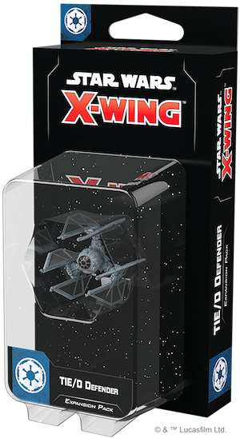_ 
-------------------------------------------------------------------------------------------------------------------------------------------------------------------------------------------------------------------------------------------------------------------------------------------------------

A fighter so powerful and advanced that Phoenix Squadron feared its mass production could make the Imperial Navy unbeatable, the TIE/D defender features powerful shields, speed and maneuverability, and a suite of potent weapons including missiles and cannons. In the right ace’s hands, the TIE/D defender can bring down nearly any target.

As a departure from the design of most Imperial starfighters, the Defender opens a wide range of possibilities for Imperial squadrons. Rather than rely on large numbers of small fighters, this ship gives the Empire an option that can match more powerful Rebel fighters. The TIE/D defender is also highly customizable, and adding a variety of systems and weapons can give it the edge in battle.

Within the TIE/D Defender Expansion Pack, you’ll find everything you need to bulk up your Imperial squadrons, including a TIE/D defender miniature, five ship cards, and four upgrade cards that invite you to outfit your ship with new systems, missiles, and cannons. Meanwhile, two Quick Build cards provide exciting combinations of pilots and upgrades, inviting you to see everything the ship can do.

_Pick up your copy of the_ TIE/D Defender Expansion Pack _(SWZ60) at your local retailer today or online through our website [here](https://www.fantasyflightgames.com/en/products/x-wing-second-edition/products/x-wing-second-edition-tied-defender-expansion-pack/)!_

* * *

_[RZ-1 A-Wing Expansion Pack](https://www.fantasyflightgames.com/en/products/x-wing-second-edition/products/x-wing-second-edition-rz-1-wing-expansion-pack/)_ __ 
------------------------------------------------------------------------------------------------------------------------------------------------------------------------------------------------------------------------------------------------------------------------------------------------

The favored craft of Rebel aces who value precision handling, the RZ-1 A-wing can fit through narrow gaps between obstacles or fly circles around enemy craft. What these nimble interceptors lack in durability, they more than make up for in speed and maneuverability.

The RZ-1 proved its worth by crippling Star Destroyers during the Battle of Endor, and it now adds its deadly speed to Rebel squadrons across the galaxy. Skilled pilots make the most of the RZ-1’s capabilities, turning the ship’s maneuverability into an offensive asset.

The RZ-1 A-Wing Expansion Pack includes everything you need to add one of these speedy ships to your Rebel Alliance squadrons. An RZ-1 A-wing miniature painted in the colors of Phoenix Squadron is accompanied by four ship cards representing the Rebel pilots willing to take on the challenge of flying this craft. You can improve these pilots’ capabilities in battle with five upgrade cards of your choosing, or you can take the recommendations of two Quick Build cards for even more ways to use your RZ-1 A-wing.

_Pick up your copy of the_ RZ-1 A-Wing Expansion Pack _(SWZ61) at your local retailer today or online through our website [here](https://www.fantasyflightgames.com/en/products/x-wing-second-edition/products/x-wing-second-edition-rz-1-wing-expansion-pack/)!_

* * *

_[Never Tell Me the Odds Obstacles Pack](https://www.fantasyflightgames.com/en/products/x-wing-second-edition/products/never-tell-me-odds-obstacles-pack/)_ _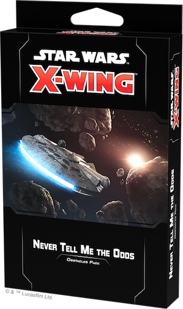_ 
-----------------------------------------------------------------------------------------------------------------------------------------------------------------------------------------------------------------------------------------------------------------------------------------

In the vast depths of space, one can find countless wonders—comets with icy trails, nebulas filled with ionizing gas, or even living creatures, like mynocks, hiding within wreckage.

The _Never Tell Me the Odds Obstacles Packs_ collects every [_Star Wars_™: X-Wing](https://www.fantasyflightgames.com/en/products/x-wing-second-edition/) obstacle in one convenient package. In addition to adding nine asteroids, three debris fields, and three gas clouds to your collection, this pack also contains six environment cards that reflect the strange and terrifying places a space battle could take place.

Each environment card changes the placement or rules around obstacles, adding even more variety to your games. Now you can take your battles to an asteroid shower or find yourself battling amongst the recent wreckage of a ship. Enter a new environment and prove your skill!

_Pick up your copy of the_ Never Tell Me the Odds Obstacles Pack _(SWZ64) at your local retailer today or online through our website [here](https://www.fantasyflightgames.com/en/products/x-wing-second-edition/products/x-wing-second-edition-rz-1-wing-expansion-pack/)!_

* * *

_[Fully Loaded Devices Pack](https://www.fantasyflightgames.com/en/products/x-wing-second-edition/products/fully-loaded-devices-pack/)_ _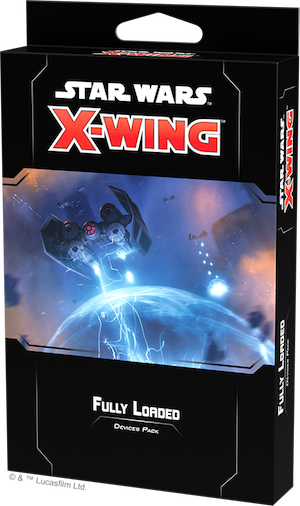_ 
-------------------------------------------------------------------------------------------------------------------------------------------------------------------------------------------------------------------------------------------------------------------------

Set the timer and brace for detonation! The _Fully Loaded Devices Pack_ collects numerous devices for _X-Wing_, giving you access to a vast arsenal of options for your squadrons. In addition to the upgrade cards and tokens for Proximity Mines, Conner Nets, Ion Bombs, and more, this devices pack contains six environment cards that use devices as part of setup.

With these cards, you can battle in deadly minefields, fly your shipsthrough star fields riddled with unexploded ordnance, or even maneuver to avoid continuous bombardments. From altering the way you set up your games to the way your battlefield evolves over the course of a game, these cards change the very fabric of your _X-Wing_ games.

Outfit your ships with deadly devices from across the galaxy and test your skills in a variety of environments with the _Fully Loaded Devices Pack_!  

_Pick up your copy of the_ Fully Loaded Devices Pack _(SWZ65) at your local retailer today or online through our website [here](https://www.fantasyflightgames.com/en/products/x-wing-second-edition/products/fully-loaded-devices-pack/)!_

* * *

_[Hotshots and Aces Reinforcements Pack](https://www.fantasyflightgames.com/en/products/x-wing-second-edition/products/hotshots-and-aces-reinforcements-pack/)_ _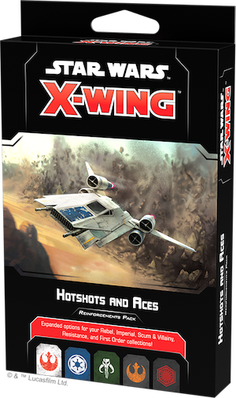_ 
--------------------------------------------------------------------------------------------------------------------------------------------------------------------------------------------------------------------------------------------------------------------------------------------------

A squadron is only as good as the pilots that make it up. From the Rebellion’s ragtag band of freedom fighters assembled from across the galaxy to TIE/fo pilots trained in space combat from childhood, every _X-Wing_ faction has pilots that put their own spin on piloting the galaxy’s most iconic starfighters.

Now, with the _Hotshots and Aces Reinforcements Pack_, you can enhance your squadron options and launch new pilots into battle. This pack contains a variety of new pilots for numerous ships in the Rebel, Imperial, Scum, Resistance, and First Order factions, you can now add iconic characters like Leia Organa, Captain Phasma, and K-2SO to your squads.

_Pick up your copy of the_ Hotshots and Aces Reinforcements Pack _(SWZ66) at your local retailer today or online through our website [here](https://www.fantasyflightgames.com/en/products/x-wing-second-edition/products/hotshots-and-aces-reinforcements-pack/)!_