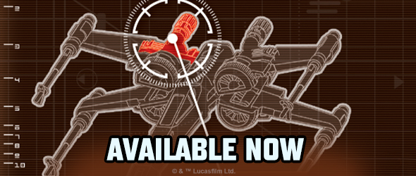
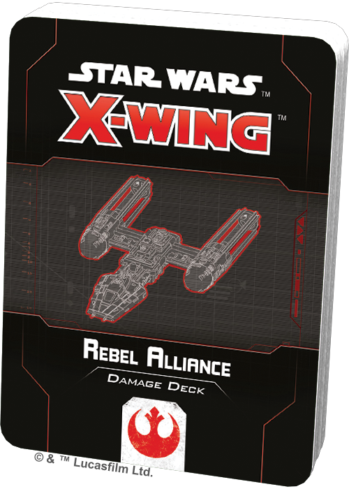
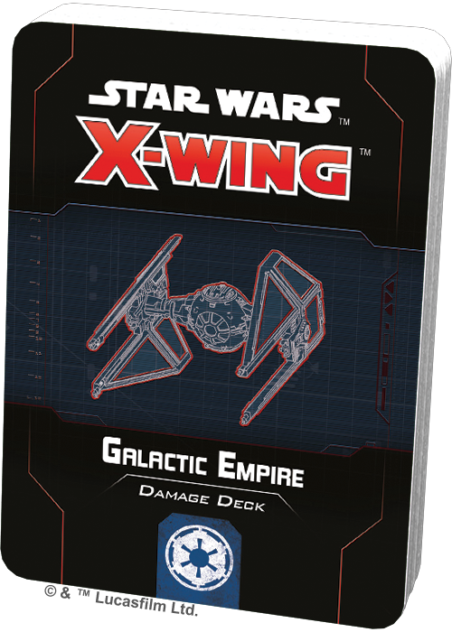
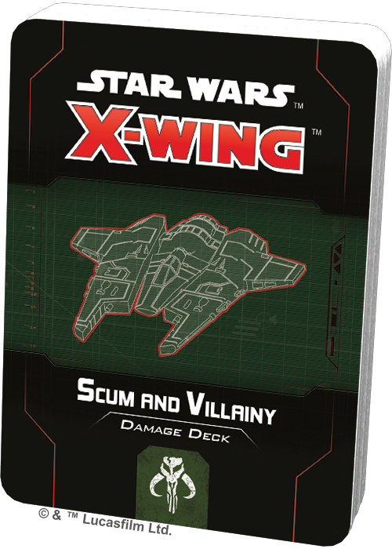
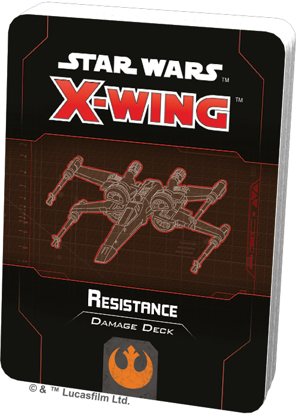
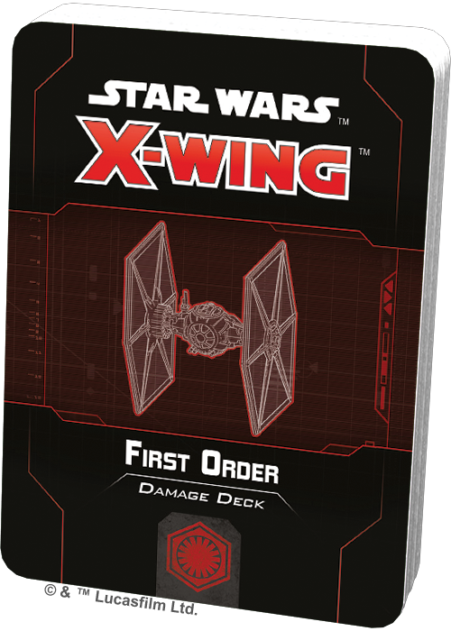
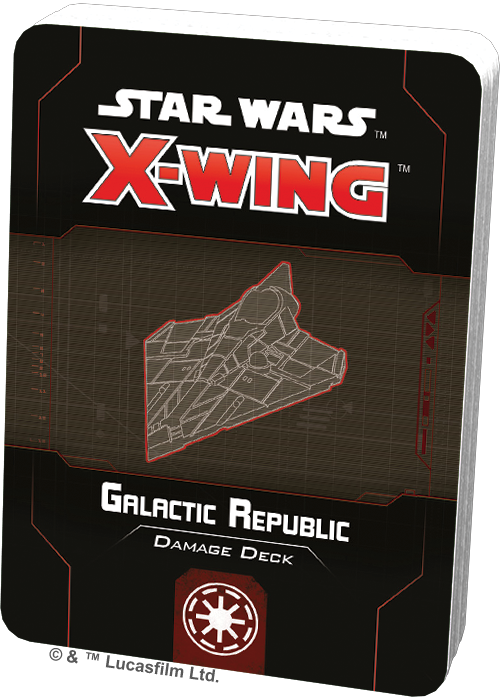

This article was originally published on [https://www.fantasyflightgames.com/en/news/2020/6/26/available-now-june-26/](https://www.fantasyflightgames.com/en/news/2020/6/26/available-now-june-26/)

&laquo; [Back to index](../index.md)

---

26 June 2020

Available Now – June 26
=======================

Star Wars: X-Wing Damage Decks Are Now Available

_Take a look at the latest products from Fantasy Flight Games, now available at your local retailer!_

* * *

_[Rebel Alliance Damage Deck](https://www.fantasyflightgames.com/en/products/x-wing-second-edition/products/rebel-alliance-damage-deck/)_ 
--------------------------------------------------------------------------------------------------------------------------------------------------------------------------------------------------------------------------------------------------------------------

Personalize your [_Star Wars_™: X-Wing](https://www.fantasyflightgames.com/en/products/x-wing-second-edition/) experience and display your loyalty with the _Rebel Alliance Damage Deck_! 

This deck contains a complete set of thirty-three illustrated damage cards featuring diagnostics of a BTL-A4 Y-wing so you know exactly where your ship is hit. With this deck at your command, everyone will know you fly for the Rebel Alliance, and you can easily track whatever damage you take on your road to victory.

* * *

_[Galactic Empire Damage Deck](https://www.fantasyflightgames.com/en/products/x-wing-second-edition/products/galactic-empire-damage-deck/)_ 
----------------------------------------------------------------------------------------------------------------------------------------------------------------------------------------------------------------------------------------------------------------------

Personalize your _Star Wars_: X-Wing experience and display your loyalty with the _Galactic Empire Damage Deck_! 

This deck contains a complete set of thirty-three illustrated damage cards featuring diagnostics of a TIE/in Interceptor so you know exactly where your ship is hit. With this deck at your command, everyone will know you fly for the Galactic Empire, and you can easily track whatever damage you take on your road to victory.

_Pick up your copy of the_ Galactic Empire Damage Deck _(SWZ73) at your local retailer today or [online through our website](https://www.fantasyflightgames.com/en/products/x-wing-second-edition/products/galactic-empire-damage-deck/) here!_

* * *

_[Scum and Villainy Damage Deck](https://www.fantasyflightgames.com/en/products/x-wing-second-edition/products/scum-and-villainy-damage-deck/)_ 
--------------------------------------------------------------------------------------------------------------------------------------------------------------------------------------------------------------------------------------------------------------------------

Personalize your _Star Wars_: X-Wing experience and display your loyalty with the _Scum and Villainy Damage Deck_! 

This deck contains a complete set of thirty-three illustrated damage cards featuring diagnostics of a Fang Fighter so you know exactly where your ship is hit. With this deck at your command, everyone will know you fly for the galaxy's Scum and Villainy, and you can easily track whatever damage you take on your road to victory.

_Pick up your copy of the_ Scum and Villainy Damage Deck _(SWZ74) at your local retailer today!_

* * *

_[Resistance Damage Deck](https://www.fantasyflightgames.com/en/products/x-wing-second-edition/products/resistance-damage-deck/)_ 
------------------------------------------------------------------------------------------------------------------------------------------------------------------------------------------------------------------------------------------------------------

Personalize your _Star Wars_: X-Wing experience and display your loyalty with the _Resistance Damage Deck_! 

This deck contains a complete set of thirty-three illustrated damage cards featuring diagnostics of a T-70 X-wing so you know exactly where your ship is hit and how bad the damage is. With this deck at your command, everyone will know you fly for the Resistance, and you can easily track whatever damage you take on your road to victory.

_Pick up your copy of the_ Resistance Damage Deck _(SWZ75) at your local retailer today!_

* * *

_[First Order Damage Deck](https://www.fantasyflightgames.com/en/products/x-wing-second-edition/products/first-order-damage-deck/)_ 
--------------------------------------------------------------------------------------------------------------------------------------------------------------------------------------------------------------------------------------------------------------

Personalize your _Star Wars_: X-Wing experience and display your loyalty with the _First Order Damage Deck_! 

This deck contains a complete set of thirty-three illustrated damage cards featuring diagnostics of a TIE/sf Fighter so you know exactly where your ship is hit and how bad the damage is. With this deck at your command, everyone will know you fly for the First Order, and you can easily track whatever damage you take on your road to victory.

_Pick up your copy of the_ First Order Damage Deck _(SWZ76) at your local retailer today!_

* * *

_[Galactic Republic Damage Deck](https://www.fantasyflightgames.com/en/products/x-wing-second-edition/products/galactic-republic-damage-deck/)_ 
--------------------------------------------------------------------------------------------------------------------------------------------------------------------------------------------------------------------------------------------------------------------------

Personalize your _Star Wars_: X-Wing experience and display your loyalty with the _Galactic Republic Damage Deck_! 

This deck contains a complete set of thirty-three illustrated damage cards featuring diagnostics of a Delta-7 _Aethersprite_ so you know exactly where your ship is hit. With this deck at your command, everyone will know you fly for the Galactic Republic, and you can easily track whatever damage you take on your road to victory.

_Pick up your copy of the_ Galactic Republic Damage Deck _(SWZ77) at your local retailer today!_

* * *

_[Separatist Alliance Damage Deck](https://www.fantasyflightgames.com/en/products/x-wing-second-edition/products/separatist-alliance-damage-deck/)_ 
------------------------------------------------------------------------------------------------------------------------------------------------------------------------------------------------------------------------------------------------------------------------------

Personalize your _Star Wars_: X-Wing experience and display your loyalty with the _Separatist Alliance Damage Deck_! 

This deck contains a complete set of thirty-three illustrated damage cards featuring diagnostics of a _Vulture_\-class Droid Fighter so you know exactly where your ship is hit. With this deck at your command, everyone will know you fly for the Separatist Alliance, and you can easily track whatever damage you take on your road to victory.

_Pick up your copy of the_ Separatist Alliance Damage Deck _(SWZ78) at your local retailer today!_