This article was originally published on [https://www.fantasyflightgames.com/en/news/2020/7/30/experience-the-saga/](https://www.fantasyflightgames.com/en/news/2020/7/30/experience-the-saga/)

&laquo; [Back to index](../index.md)

---

30 July 2020

Experience the Saga
===================

Announcing Six Expansions for Star Wars: X-Wing

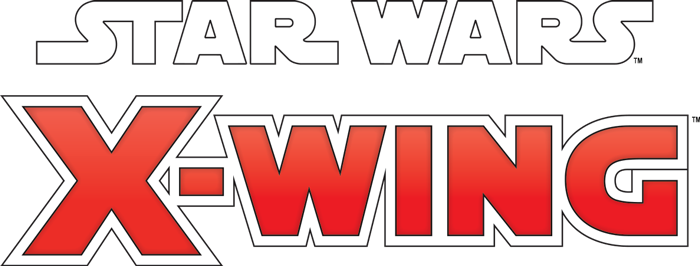

_"Some things are stronger than blood."_  
   –Luke Skywalker, _Star Wars_™: _The Rise of Skywalker_

From the battle above Naboo that would escalate into the Clone Wars to the battle of Starkiller base in the waning days of the New Republic, starfighters have played a defining role in the history of the _Star Wars_™ galaxy. Now, new fighters are on the way to redefine the tense dogfights that play out on your tabletop.

Fantasy Flight Games is happy to announce six new expansions for [_Star Wars_™: X-Wing](https://www.fantasyflightgames.com/en/products/x-wing-second-edition/):

*   _[TIE/rb Heavy Expansion Pack](https://www.fantasyflightgames.com/en/products/x-wing-second-edition/products/tierb-heavy-expansion-pack/)_
*   _[Heralds of Hope Squadron Pack](https://www.fantasyflightgames.com/en/products/x-wing-second-edition/products/heralds-hope-squadron-pack/)_
*   [_Eta-2_ Actis _Expansion Pack_](https://www.fantasyflightgames.com/en/products/x-wing-second-edition/products/eta-2-actis-expansion-pack/)
*   [Nimbus_\-class V-Wing Expansion Pack_](https://www.fantasyflightgames.com/en/products/x-wing-second-edition/products/nimbus-class-v-wing-expansion-pack/)
*   _[Droid Tri-Fighter Expansion Pack](https://www.fantasyflightgames.com/en/products/x-wing-second-edition/products/droid-tri-fighter-expansion-pack/)_
*   [_Jango Fett’s_ Slave I _Expansion Pack_](https://www.fantasyflightgames.com/en/products/x-wing-second-edition/products/jango-fetts-slave-i-expansion-pack/)

Featuring new ships from every era of the _Star Wars_ saga, this wave unlocks content for both established factions and those still building an identity. Multiple options for both the Galactic Republic and Separatist Alliance invite players to dive deeper into the Clone Wars while the Galactic Empire adds a new TIE variant directly from _Solo: A Star Wars Story_. Finally, the Resistance sees some of its core fighters revitalized with new pilots, upgrades, and paint schemes straight out of _Star Wars: The Rise of Skywalker_.

Read on for more information on what to expect in these expansions!

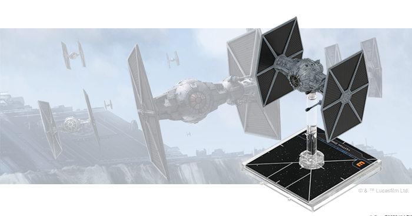

TIE/rb Heavy Expansion Pack
---------------------------

The TIE/rb Heavy is one of the largest TIE variants for the Galactic Empire and is often assigned to patrol routes where it is expected to fight without the support of a carrier or escorts. Thanks to its robust armor, swiveling laser cannons, and integrated MGK-300 series droid intelligence, this vessel lives up to its nickname: the “Brute.”

Despite its reduced maneuverability compared to traditional TIE models, the TIE/rb is one of the most flexible fighters available to the Imperial Navy. Its MGK-300 series droid intelligence can assist in many ways, either helping the pilot hone in on targets or taking over on some [more difficult maneuvers.](9a2d3eaf495ec9cda17e5339259b4758.png)

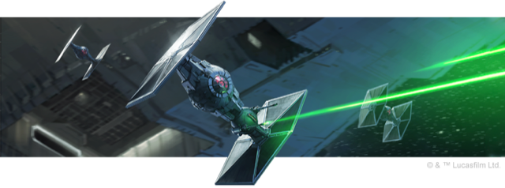

This expansion contains everything you need to add a TIE/rb Heavy to your Imperial squadrons, including a finely detailed TIE/rb miniature, a medium plastic base, and two medium ship tokens. Four ship cards let you pick the pilot to fly this monstrous fighter into battle, while 12 upgrade invite you to outfit it with additional weapons, modifications, and more.

We’ll take a look at everything included in this expansion in a future preview!

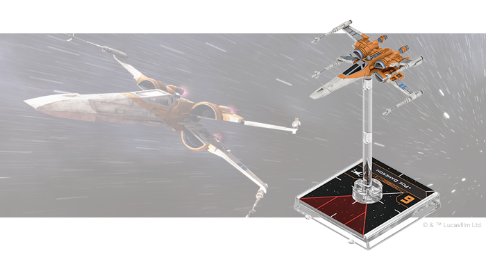

Heralds of Hope Squadron Pack
-----------------------------

The spark of hope has ignited! The Resistance rises to meet the First Order in one final confrontation to determine the fate of the galaxy. Taking flight in T-70 X-wing and RZ-2 A-wing starfighters, new pilots join the cause, fighting alongside Resistance heroes like Temmin “Snap” Wexley as they seek to break the First Order’s tyrannical hold on the galaxy.

This _Squadron Pack_ adds two T-70 X-wings and an RZ-2 A-wing to your X-Wing collection, each sporting a new paint scheme based on their appearance in _Star Wars: The Rise of Skywalker_. These ships are flown into battle by a slew of new pilots who are led into battle by an updated version of established Resistance ace and commander [Poe Dameron.](b804eb9151330ba99e51ff148e15dc92.png)

In addition to these new pilots, this expansion adds even more upgrades to your library, including the ability to supercharge your T-70 X-wings’ boost, barrel roll, and SLAM actions with an Overdrive Thruster. All told, you’ll find six RZ-2 A-wing ship cards, 10 T-70 X-wing ship cards, and 25 upgrade cards in this expansion, giving you more control over your Resistance squadrons than ever before.

We’ll take a look at everything included in this expansion in a future preview!

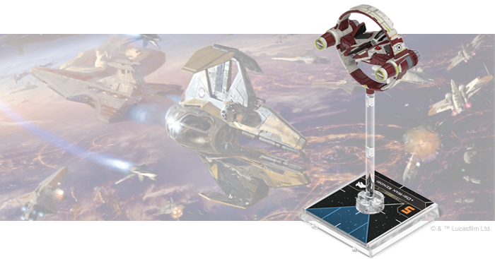

Eta-2 Actis Expansion Pack
--------------------------

As the Clone Wars takes its toll on the ranks of the Jedi Order, those that remain must assume even greater responsibilities in the Grand Army of the Republic. The Eta-2 _Actis_\-class Interceptor, developed by Kuat Systems Engineering, is stripped down so that battle hardened Jedi pilots can get the most out of its agile frame.

The ship’s intuitive controls make it easy for Jedi Generals to line up shots in their bullseye arc. Still, it’s sometimes better to practice [Patience](f9fee97c715fe2370f6e227d90146e75.png) and wait for a more opportune moment to strike. No matter how they approach the fight, Jedi can combine their Eta-2 with a _Syliure_\-class Hyperspace Ring for even greater control over the positioning of their ship in the early stages of a battle.

Within this expansion, you’ll find everything you need to add one Eta-2 _Actis_ ship and one _Syliure_\-class Hyperspace Ring to your X-Wing collection, including two beautifully pre-painted miniatures and two small plastic bases. Six Eta-2 _Actis_ ship cards and one _Syliure_\-class Hyperspace Ring ship card bring these ships to life, while six upgrade cards invite you to customize them with new Force abilities, an astromech, and more.

We’ll take a closer look at everything to do with this expansion in a future preview!

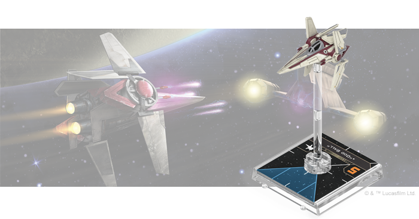

Nimbus-class V-Wing Expansion Pack
----------------------------------

The Kuat Systems Engineering Alpha-3 _Nimbus_\-class V-wing is the vessel of choice for the Galactic Republic’s clone and non-clone starfighter pilots alike. This nimble craft is fielded in various configurations for specialized tasks. The techniques pioneered to mass-produce its precision ion engines will later be crucial in the development of the TIE series by Sienar Fleet Systems.

Serving as a precursor to these iconic Imperial starfighters provides many benefits for the V-wing, including the ability to equip upgrades normally reserved for ships with the “TIE” designation. This allows bold pilots to perform an [Ion Limiter Override](f327e877e011d3a0b2a57612a0d372d6.png) and push the ship as far as it can go.

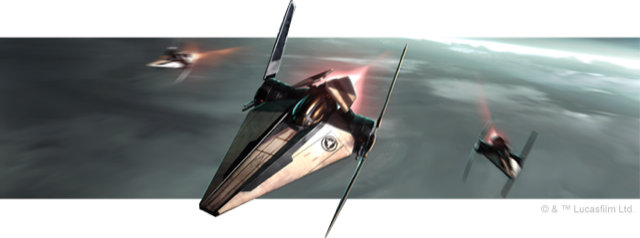

You’ll find everything you need to add one _Nimbus_\-class V-wing ship to your game, including a finely detailed, pre-painted miniature and six ship cards that give you the freedom to hand-pick the pilot that flies it into battle. Additionally, seven upgrade cards invite you to customize your ship with two distinct configurations, new astromechs, and more.

We’ll take a closer look at everything in this expansion in a future preview!

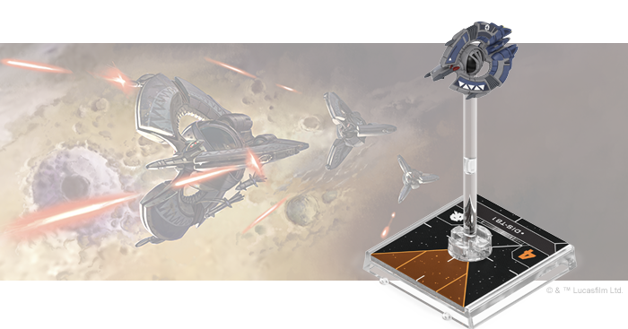

Droid Tri-Fighter Expansion Pack
--------------------------------

Designed by the Colicoid Creation Nest and manufactured by Phlac-Arphocc Automata Industries, the heuristic processers of Droid Tri-Fighters allow these deadly ships to analyze and adapt to enemy tactics in-flight. Deployed late in the Clone Wars, these aggressive starfighters, and the destructive buzz droids they carry, pose a serious threat to even veteran Jedi pilots.

Unhindered by the frailty of an organic pilot, Droid Tri-Fighters are capable of radical acceleration and acute maneuvering. Fitted with an [Interceptor Booster](de8af25100a59b438e956564f427c065.png) or fired from the missile tubes of Separatist capital ships, they can engage hostiles well beyond the range of conventionally deployed starfighters.

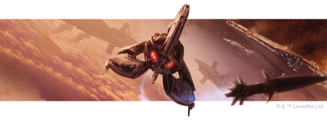

This expansion includes everything you need to add a Droid Tri-Fighter to your Separatist Alliance squadrons, beginning with a beautifully pre-painted miniature and six ship cards representing different forms of programming. These are accompanied by seven upgrade cards that give you the power to outfit your Droid Tri-Fighter with missiles, systems, and more.

We’ll take a look at everything included in this expansion in a future preview!

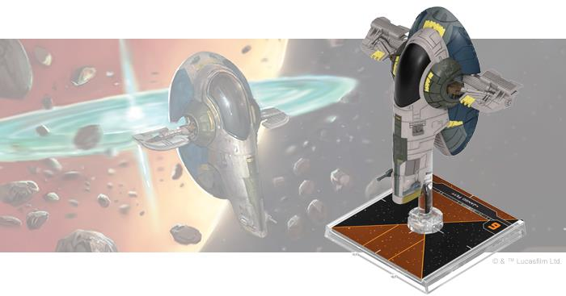

Jango Fett’s Slave I Expansion Pack
-----------------------------------

The _Firespray_\-class patrol craft is a favorite of bounty hunters like Jango Fett, who use its robust chassis as a platform to put their own personal stamp on the ship. Fett added a number of weapons to his ship, the _Slave I_, turning it into one of the most infamous—and feared—ships in the galaxy.

The _Firespray_’s flexibility also makes it appealing to pirates, who can outfit it with the weapons and tech to serve their illicit purposes. A clever and crafty pirate leader like [Hondo Ohnaka](331afa2214a269d0e9941d50a293be77.png) however, is often enough to send opposing squadrons into chaos with his tricks and deceptions.

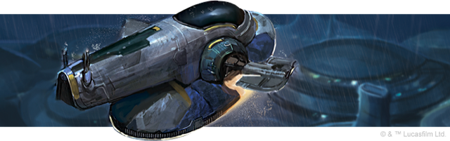

With this expansion, you’ll have everything you need to customize your own _Firespray_\-class patrol craft. The finely detailed miniature in this expansion is pre-painted in the colors Jango Fett used during the Clone Wars while four pilots let you make use of their special skills. Meanwhile, 13 upgrade cards let you outfit the ship to your precise specifications.

We’ll take a closer look at everything included in this expansion in a future preview!

Expand the Possibilities
------------------------

Iconic starfighters and the crack pilots who fly them converge in the unpredictable space battles of _Star Wars_: X-Wing. No matter what era or faction you choose, only the best pilots will prevail. Experience the thrill of starfighter combat with these expansions!