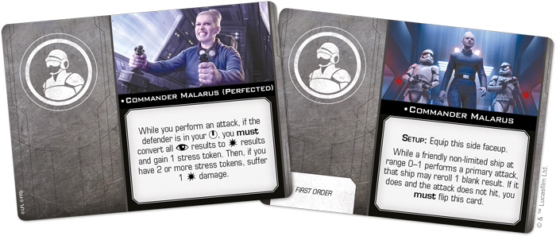

This article was originally published on [https://www.fantasyflightgames.com/en/news/2020/8/26/out-of-the-ashes/](https://www.fantasyflightgames.com/en/news/2020/8/26/out-of-the-ashes/)

&laquo; [Back to index](../index.md)

---

26 August 2020

Out of the Ashes
================

Preview the Xi-class Light Shuttle Expansion Pack for Star Wars: X-Wing

_“I’ve waited a long time to return the favor.”_  
   –Gideon Hask, _Star Wars Battlefront II_

The First Order’s agents are scattered across the _Star Wars_™ galaxy, lying in wait to reclaim the glory of the Empire. Whether they plot against the New Republic from the depths of the Unknown Regions or within the heart of the Core Worlds, the _Xi-_class Light Shuttle is often a key part of their sinister plans.

Ideal command platforms for clandestine operations and raiding parties alike, _Xi_\-class shuttles enhance the effectiveness of the First Order’s more nimble fighters and allow some of its most devious agents to impose their will on starfighter battles. Soon, you can play out your own schemes with the _[Xi-class Light Shuttle Expansion Pack](https://www.fantasyflightgames.com/en/products/x-wing-second-edition/products/xi-class-light-shuttle-expansion-pack/)_ for [_Star Wars_™: X-Wing](https://www.fantasyflightgames.com/en/products/x-wing-second-edition/)!

This expansion gives you everything you need to add a _Xi_\-class Light Shuttle to your First Order squadrons, beginning with a finely detailed, pre-painted miniature. Meanwhile, four ship cards invite you to dispatch one of the First Order's elite operatives into battle and 14 upgrade cards invite you to fully customize your _Xi_\-class Light Shuttle with new crew members, tech, and more. Finally, two quick build cards give you the chance to use helpful, pre-built combinations of pilots and upgrades.

Read of for a full look at the Xi_\-class Light Shuttle Expansion Pack_!

A New Order
-----------

The First Order is but a shadow of the former Empire. Its starfighters may resemble their Imperial predecessors, but they enter combat in a galaxy where the balance of power has shifted. To effectively combat the Resistance and reclaim its former glory, then, First Order squadrons must adapt to this shift, and nowhere is this willingness to adapt more clear than the _Xi_\-class Light Shuttle.  

Effective at both boosting friendly fighters and disrupting the enemy, the _Xi_\-class Light Shuttle also gives some of the First Order’s most ruthless operatives a platform to unleash havoc on opposing forces. A vindictive leader like [Commander Malarus,](swz69_malarus_card.png)  and honing in on her target no matter the cost.

At the same time, the mere presence of an officer like [Commander Pyre](swz69_pyre_card.png) can intimidate an enemy pilot, causing them to gain two stress tokens as soon as his squadron appears. But his benefits don't end there. Pyre also gives his ship a valuable defensive bonus, allowing it to reroll a defense die if the attacker is stressed.

Other First Order operatives like [Agent Terex](swz69_terex_card.png) he either gains a calculate or jam token during the System Phase that can then be transferred to another ship as an action. 

But this isn’t the only way for Terex to exert his influence on the ships around him. Unafraid to use illicit technologies to give him a boost in battle, if [he takes](swz69_a1_ship_terex.png)

Not to be outdone, like Terex, [Commander Malarus](swz69_a1_ship_malarus.png) helps turn swarms of light fighters into a dominant force. He can easily become the cornerstone of any First Order formation, giving his squadmates the chance to finish off a damaged defender with an additional attack die.

Even if the _Xi_\-class Light Shuttle is piloted by a lowly [First Order Courier,](swz69_a1_ship_courier.png) to protect its hidden enclaves and these devices can help you be more prepared to engage with the enemy. 

Return to Glory
---------------

It is time for the First Order to rise and restore the Empire to what it once was. Deploy a _Xi_\-class Light Shuttle and wipe away the Republic! 

