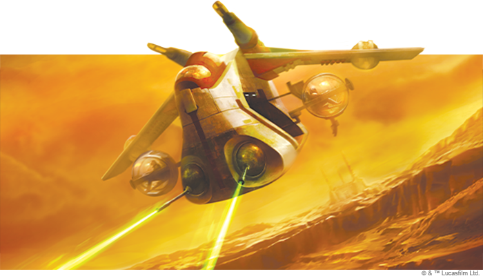

This article was originally published on [https://www.fantasyflightgames.com/en/news/2020/9/2/concentrate-your-fire/](https://www.fantasyflightgames.com/en/news/2020/9/2/concentrate-your-fire/)

&laquo; [Back to index](../index.md)

---

2 September 2020

Concentrate Your Fire
=====================

Preview the LAAT/i Gunship Expansion Pack for Star Wars: X-Wing

_"Around the survivors, a perimeter create."_  
   –Yoda, _Star Wars: Attack of the Clones_

As the Separatist threat grows, the Galactic Republic’s clone troopers are needed on war torn planets across the _Star Wars_™ galaxy. Whether they’re dropping into the middle of a chaotic battle or deploying for an aquatic operation, these troops rely on the LAAT/i Gunship to get them wherever they’re going.

More than a troop transport, the LAAT/i often pulls double duty, supporting fighter squadrons as they battle in space and the skies above planets. Soon, you can bolster your own Republic squadrons with the _[LAAT/i Gunship Expansion Pack](https://www.fantasyflightgames.com/en/products/x-wing-second-edition/products/laati-gunship-expansion-pack/)_ for [_Star Wars_™: X-Wing](https://www.fantasyflightgames.com/en/products/x-wing-second-edition/)!

Featuring a beautifully detailed, pre-painted LAAT/i Gunship miniature, this expansion contains everything you need to send it into battle alongside your other Republic ships, including four distinct clone pilots. Able to carry a variety of troops and weapons, you can also customize your LAAT/i with fourteen upgrade cards while two Quick Build cards offer preset combinations of pilots and upgrades so you can see everything the ship can do.

Read on for a closer look inside the _LAAT/i Gunship Expansion Pack_!

Assault Transport
-----------------

With battles raging across land, air, and space, the LAAT/i Gunship serves as an important link between Republic starfighter squadrons and the Grand Army’s troops on the ground. Rather than hinder it, the ship’s multi-purpose design—including its sturdy hull and ample space for additional troops—only enhances its ability to adapt to the rigors of ship-to-ship combat.

Central to this design philosophy is the idea that the LAAT/i Gunship is but one part of a larger squadron, and the ship has many ways to support those around it. The most obvious of these is the LAAT’s ability to converge its fire with that of a friendly ship, giving the friendly pilot a chance to reroll two attack dice against a ship in the LAAT/i's turret arc. Alternatively, if the pilot is a  [Deadeye Shot,](swz70_a1_deadeye-shot_upgrade.png)  your LAAT/i can deal a crippling blow to an enemy fighter. 

No matter which path you choose, the pressure the LAAT/i puts on opposing fighters makes pilots like those from the [212th Battalion](swz70_a1_battalion-pilot_ship.png) for example, fits in perfectly with ships like the Naboo Royal N-1 Starfighter that prefer to enter battle at full throttle, giving them the chance to reposition during the End Phase and prepare their next move. 

While undoubtedly an effective way to get the upper hand on your opponent, the benefits of this ability do come at the cost of a strain token for each ship that takes advantage of it. Fortunately, [“Hound”](swz70_a1_hound_ship.png) who ensures the friendly ships around him get a chance to engage even after they’ve been destroyed.

As much as they contribute to your squadrons, the LAAT/i Gunship’s pilots only scratch the surface of what the ship can do. With plenty of room for crew members and gunners alike, a variety of clones can bring their skills to the ship. A strong leader like [Clone Captain Rex](swz70_a1_cpt-rex_upgrade.png)  to limit the enemy's return fire.

Even with their incredible skills, there’s only so much individual clones can do to boost their ships. For even more options, you can always attach an entire company of clone troopers to your LAAT/i Gunship. Though they may fill both a gunner and a crew slot, [Ghost Company](swz70_a1_ghost-company_upgrade.png) meanwhile, always takes care of its own, giving a friendly ship the chance to acquire a lock after it defends.

While mainly seen as a troop transport, the LAAT/i gunship is also an effective command ship for the Republic’s Jedi Generals, who can use a variety of Force abilities to keep it safe from harm. With [Kit Fisto](swz70_a1_kit-fisto_upgrade.png) meanwhile, gives ships a variety of ways to stay fully functional in the midst of battle, helping them reduce damage, repair their faceup damage cards, or remove deplete or strain tokens.  

When they’re not bolstering a squad’s defenses, the Jedi often direct the flow of combat. [Aayla Secura](swz70_a1_aayla_upgrade.png) as a mentor. The first crew upgrade to provide its ship with two Force tokens, Yoda supports all other Jedi by giving them the opportunity to recover their own Force tokens after they fully execute a purple maneuver or perform a purple action.

Into the Breach
---------------

Land, sea, or air, wherever the Republic's troops are needed, the LAAT/i Gunship is ready to carry them into battle. Bring the versatility of this reliable workhorse to your sqaudrons and take the fight to the Separatists when the _LAAT/i Gunship Expansion Pack_ is released on September 25!

