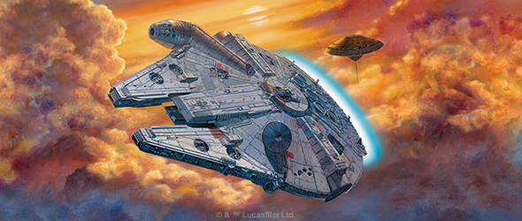
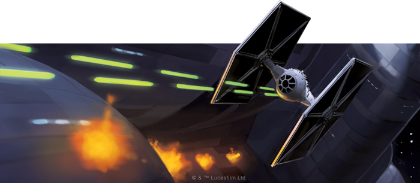
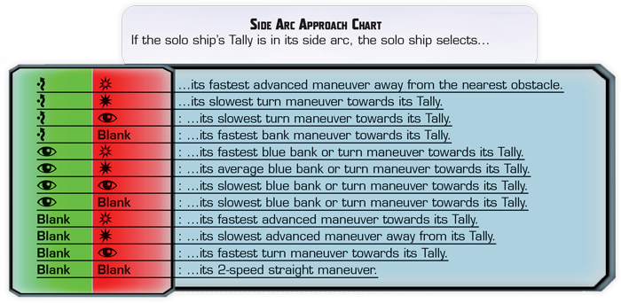
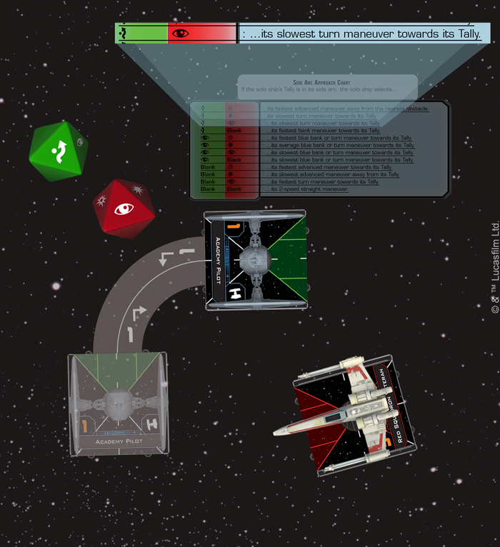

This article was originally published on https://www.fantasyflightgames.com/en/news/2020/9/4/flying-solo-1/

&laquo; [Back to index](../index.md)

---

4 September 2020

Flying Solo
===========

Announcing an Open Alpha for Star Wars: X-Wing Solo Rules

_“Right now, I feel I could take on the whole Empire myself.”_  
   –Dak Ralter, _Star Wars: The Empire Strikes Back_

The starfighter battles of [_Star Wars_™: X-Wing](https://www.fantasyflightgames.com/en/products/x-wing-second-edition/) can range from small skirmishes between a few ships to epic battles involving multiple squadrons and capital ships. In all these battles, at least two players come together to play out these tense engagements with iconic ships from across the _Star Wars_™ saga.

Now, we’re working on an entirely new way to play out the space battles of the _Star Wars_ galaxy, and we need your help! Fantasy Flight Games is happy to announce an open alpha for X-Wing Solo Play!

This new game mode gives you the chance to test your skills against a dynamic and unpredictable automated opponent whose behavior is dictated by simple rules using components found in the _[X-Wing Core Set](https://www.fantasyflightgames.com/en/products/x-wing-second-edition/products/x-wing-second-edition/)_. As these rules are still being developed, we need your help to test them. Throughout the development process, we’ll ask for your feedback using Google Forms.

Read on for more information on how you can play _X-Wing_ solo!

Incoming Hostiles
-----------------

At its core, _X-Wing_ captures the tense moment-to-moment decisions starfighter pilots must make in the midst of a dogfight. The Solo Flight System attempts to maintain this feeling with rules for you to fly against ships that do not have a human controlling them: it generates maneuvers for them to select, reveal, and execute; guides their choice of actions and attacks; and informs their use of special abilities and upgrade effects.

Everything begins with the Solo ships—those controlled by the flight system—choosing a Tally, an object or ship they have spotted and are concentrating on. When they activate, a solo ship will select and reveal a maneuver on its dial from a chart based on its Tally’s location in one of its arcs and the results of an approach roll of one defense die and one attack die.

In addition to its approach, this die roll also determines a solo ship’s attitude for the upcoming engagement. Ships can have an offensive, balanced, or defensive attitude and, ultimately, this attitude will be used establish what actions and abilities a ship uses. For example, if no enemy ship is in its firing arc, a ship taking an offensive attitude will use its action to perform a boost, barrel roll, or rotate action that puts an enemy ship in its firing arc.

While the Solo rules can be used to play standard games of _X-Wing_, we recommend that you begin with an introductory scenario to get yourself acclimated to the rules. In this scenario, players take control of two sturdy ships such as T-65 X-Wings—one piloted by the highest initiative non-limited pilot and the other with the lowest initiative non-limited pilot—and begin play on one edge of a standard 3’x3’ play area.

  
_The T-65 X-Wing is in its side arc, so the TIE/ln selects its slowest turn maneuver toward that ship._

Initially opposing you are are two patrolling ships such as TIE/ln Fighters placed at one of two randomly determined hyperspace markers. As the rounds progress, these patrol ships are aided by additional patrol ships and, eventually, more powerful reinforcement ships. If you can survive these waves and destroy the enemy ships, you win!

Fire Support
------------

Most ships should be able to use these rules to function completely without player input. But we know that complicated situations can arise, usually due to a special ability or upgrade effect. Guidelines are included in these rules should these situations arise in your games, but we also want to hear from you. After your first game, you can contact us using this [Google Form](https://docs.google.com/forms/d/1udK_-D1Tf0yDsFlthzADE_LjpqDL_g-1zGziqKshaPE/edit) to provide your feedback. We look forward to hearing from you!

To get started, download the X-Wing Solo Play rules [here](https://images-cdn.fantasyflightgames.com/filer_public/2d/6d/2d6d1669-5a0d-4a05-b022-5cf09c937655/x-wing-solorules_openalpha-compressed_v2.pdf)! As always, full game rules and other support materials can be found on our [_Star Wars_: X-Wing page](https://www.fantasyflightgames.com/en/products/x-wing-second-edition/). Good luck and have fun flying solo!

