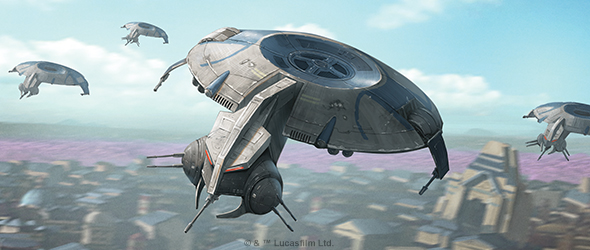
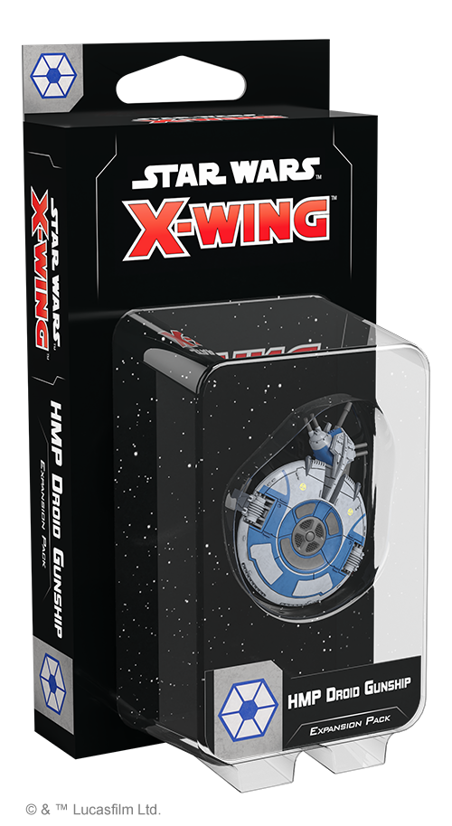
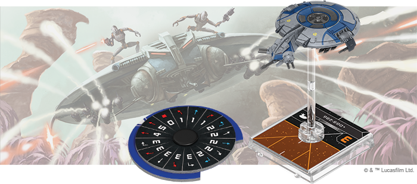
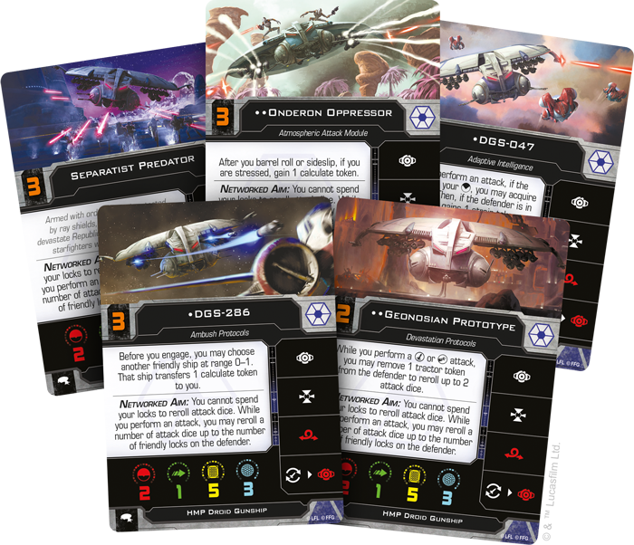
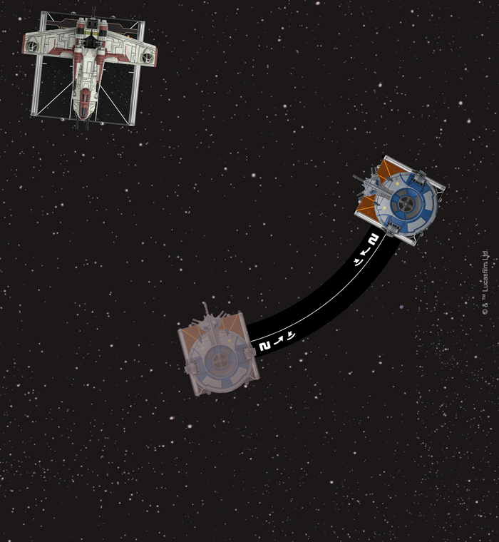
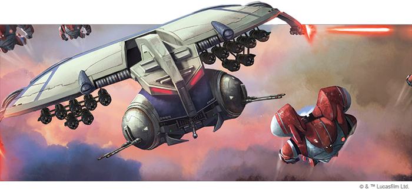

This article was originally published on [https://www.fantasyflightgames.com/en/news/2020/9/9/rule-skies/](https://www.fantasyflightgames.com/en/news/2020/9/9/rule-skies/)

&laquo; [Back to index](../index.md)

---

9 September 2020

Rule the Skies
==============

Preview the HMP Droid Gunship Expansion Pack for Star Wars: X-Wing

_“Leave no survivors.”_  
   –General Kalani, _Star Wars: The Clone Wars_

From swarms of droid starfighters buzzing overhead to the thunderous footsteps of legions of battle droids, the Separatist Alliance can easily intimidate those who would stand against it. Of all the terrifying technology at the Separatist’s disposal, perhaps none invokes fear quite as effectively as the HMP Droid Gunship.

The ship’s menacing silhouette, ominously humming repuslorlifts, and eyes glowing with malevolence are enough to make even those unfamiliar with these deadly droids aware of the doom to come. Soon, you can intimidate your opponents with the _[HMP Droid Gunship Expansion Pack](https://www.fantasyflightgames.com/en/products/x-wing-second-edition/products/hmp-droid-gunship-expansion-pack/)_ for [_Star Wars_™: X-Wing](https://www.fantasyflightgames.com/en/products/x-wing-second-edition/)!

This expansion gives you everything you need to add your own HMP Droid Gunship to your Separatist squadrons. In addition to a finely detailed, pre-painted HMP Droid Gunship miniature, you’ll also find plenty of ways to customize the ship to fit your strategies. Six ship cards invite you to outfit your HMP Droid Gunship with its own unique droid intelligence, while eight upgrade cards give you the opportunity to kit it out with additional weapons, add a new tactical relay, or even modify how it maneuvers with its own configuration. Finally, three quick build cards provide predetermined combinations of ships and upgrades that let you explore everything the HMP Droid Gunship can do.

Read on for a closer look at the _HMP Droid Gunship Expansion Pack_!

Heavy Missile Platform
----------------------

A late-war development for the Confederacy of Independent Systems, the HMP Droid Gunship marks a new direction for Separatist starfighters. While still capable of being deployed in overwhelming numbers like their predecessors, these relentless droids also feature a number of improvements that make them some of the most versatile—and dangerous—small fighters in the Separatist arsenal.  

Each HMP Droid Gunship is built around a predatory droid intelligence that will take advantage of every opportunity provided by its unique specifications, including armament that lets it cover wide swathes of space. Bristling with seven laser cannons, nothing in its full front arc can escape the withering fire of an HMP Droid Gunship. Better yet, like other Separatist starfighters, HMP Droid Gunships can network with friendly ships to improve their odds of success. Rather than sharing calculate tokens, however, they use friendly target locks to form a networked aim, gaining the ability to reroll a number of attack dice up to the number of friendly locks on the defender.

This ability makes even a swarm of basic [Baktoid Drones](swz71_card_baktoid.png) plays to their greatest strength by helping them acquire the locks they need to ensure their shots hit.

Despite their many offensive advantages, HMP Droid Gunships are greatly hindered by their inability to avoid incoming fire. An agility value of one makes them reliant on their shields to stay in the fight, but they do have other options to avoid damage while increasing their time on target. Though they may be less agile than other Separatist starfighters, their optional  [Repulsorlift Stabilizers](swz71_upgrade_stabilizer-inactive.png) to become even more unpredictable. Doing so allows the HMP Droid Gunship to perform a sideslip, a new advanced maneuver using a turn or bank template to move laterally.

  
_The HMP Droid Gunship performs a sideslip, strafing around the side of the LAAT/i Gunship!_

To execute a sideslip, the maneuver template is placed along the side of the ship so that the center line is aligned with the center hashmark of the ship’s base and that the other end of the template is in the ship’s front full arc. The ship is then picked up and placed at the other end of the template with the center hashmark on the opposite side of the ship aligned with center line of the template.

The ability to sideslip gives the HMP Droid Gunship an unprecedented amount of time to pepper a target with fire, harrassing it from round to round. Although its primary laser cannons and their full front arc are ideal for this, it can also use thise time to unleash a wide variety of weaponry. Strafing a target with some [Multi-Missile Pods,](swz71_upgrade_multi-missile-pod.png) who can reap even more rewards after launching an attack with its Multi-Missile Pods.

Additionally, rather than launching salvoes of missiles at range 1–2, an HMP Droid Gunship could first soften a target from long range with a set of [Synced Laser Cannons](swz71_upgrade_synced-cannons.png)  can improve its chances to hit with either a cannon or missile attack by simply removing a tractor token from the defender to reroll up to two attack dice.

Finally, when they aren’t strafing targets with heavy fire, their thick hulls and ray shields make HMP Droid Gunships an ideal platform for delivering payloads and some [Concussion Bombs](swz71_upgrade_concussion-bomb.png) can be an effective way to cripple an entire enemy squadron. When this device detonates, each ship and remote at range 0–1 is dealt a facedown damage card. Then, each ship at range 0–1 must expose a damage card unless it gains a strain token. When deployed in sufficient numbers, these bombs can both soften targets and set them up for a devastating strike from a ruthless swarm of HMP Droid Gunships.

Fire Away
---------

Combining extreme versatility with the swarming tactics of earlier models, the HMP Droid Gunship is the pinnacle of Separatist starfighter technology. Deploy yours and decimate your opponents when this expansion releases on September 25! 

