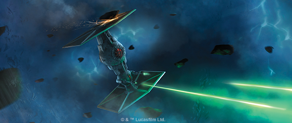
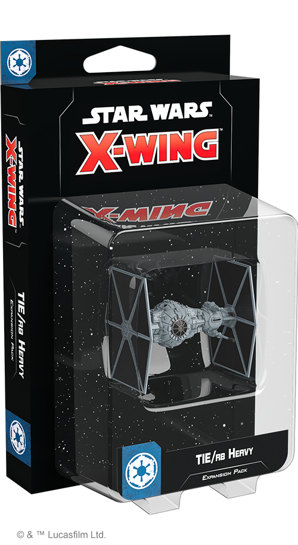
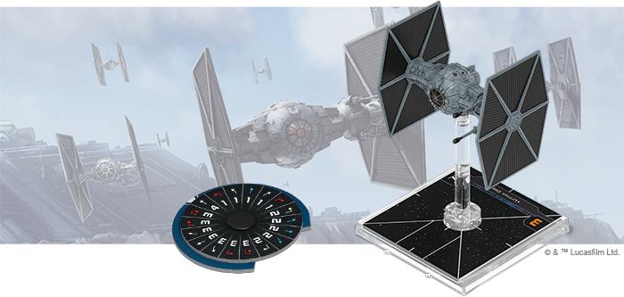
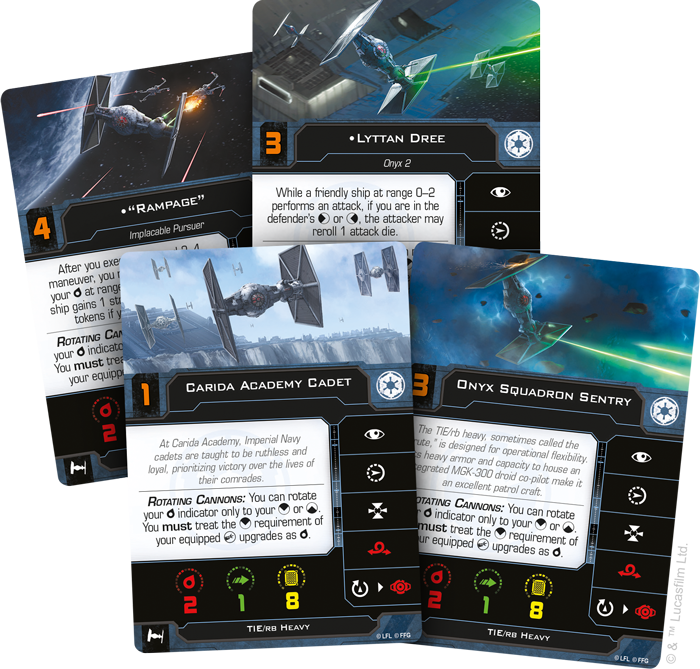
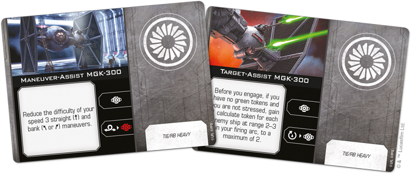

This article was originally published on [https://www.fantasyflightgames.com/en/news/2020/9/16/fury-of-the-empire/](https://www.fantasyflightgames.com/en/news/2020/9/16/fury-of-the-empire/)

&laquo; [Back to index](../index.md)

---

16 September 2020

Fury of the Empire
==================

Preview the TIE/rb Heavy Expansion Pack for Star Wars: X-Wing

_“How about that? Is that real trouble?”_  
   –Qi’ra, _Solo: A Star Wars_™ _Story_

The success of the Empire’s TIE line of starfighters is built upon the speed and maneuverability these ships bring to combat in open space. When it comes to patrolling dangerous sectors such as the Akkadese Maelstrom surrounding Kessel, however, something more rugged, like the TIE/rb heavy, is necessary to ensure the Empire's domination. 

Despite sharing a similar appearance to the Empire’s iconic starfighters, this ship, sometimes known as the “Brute,” distinguishes itself with its heavy armor and capacity to house an integrated MGK-300 droid co-pilot. Soon, you’ll be able to bolster the operational flexibility of your Imperial Squadrons with the _[TIE/rb Heavy Expansion Pack](https://www.fantasyflightgames.com/en/products/x-wing-second-edition/products/tierb-heavy-expansion-pack/)_ for [_Star Wars™_: X-Wing](https://www.fantasyflightgames.com/en/products/x-wing-second-edition/)!

Within this expansion, you’ll find all the components you need to add one of these intimidating ships to your squadrons, beginning with a beautifully detailed, pre-painted TIE/rb heavy miniature featuring canons that rotate to cover both the ship's front and rear arcs. Additionally, four ship cards provide pilots of all skill levels to fly your TIE/rb against any opponent while 12 upgrade cards invite you to outfit it with additional weapons, two distinct MGK-300 configurations, and more. Finally, a medium plastic base, two medium ship tokens, and a dial help you navigate in battle.

Read on for a full look at everything included in the _TIE/rb Heavy Expansion Pack_!

Big Trouble
-----------

Designed to operate independently and without the support of carriers, the TIE/rb’s flexibility makes it a valuable asset to Imperial squadrons across the galaxy. Not only does the ship’s heavy armor stand up to blaster fire and the harshest environments alike, its swiveling blaster cannons make it easy for the TIE/rb to both pursue craft through dangerous environments and shake hostiles from its tail.

With such an intimidating ship at their command, TIE/rb pilots are particularly ruthless, going to great lengths to make things difficult for opposing fighters. A pilot like [“Rampage,”](f5a4e0b52d30c1759b06065b3d5c979a.png) meanwhile, also uses the TIE/rb’s imposing bulk to bully opponents, approaching them from the sides to boost attacks made by friendly ships at range 0–2 with a reroll.

But even without special abilities, TIE/rb pilots are some of the boldest in the Imperial Navy. For many, this begins with their training at [Carida Academy,](845aab260b33bb668652790c7d7ba68b.png) who will chase a target no matter the danger to their lives or ships.

Whichever TIE/rb pilot you choose for your squadron, they call can be assisted by an MGK-300 droid co-pilot that can be customized to each mission. For example, all speed 3 straight and bank maneuvers become a bit easier with a [Maneuver-Assist MGK-300](770bb86e90d83cff7b71d4a9cc60fec2.png) installed, giving the pilot additional options for shedding stress while also maintaining speed. Better still, this droid intelligence also unlocks the calculate action for the TIE/rb, even after performing a barrel roll to get into position.

Alternatively, a [Target-Assist MGK-300](de01d28b010ca7805f22b8f25d8fb7ed.png)  that can rob a target of its range bonus while also ensuring the TIE/rb can modify its dice during the upcoming engagement.

The addition of a droid intelligence coupled with the ship's rotating blaster cannons improves the TIE/rb's performance and makes it especially dangerous with an array of weaponry. An [Ion Cannon](2de2beab9cc2fe369383f8f885547e9a.png) to deter any who dare get too close.

While the TIE/rb may not be as nimble as is counterparts in the TIE line, it is still capable of precise flying in the heat of battle. In fact, talented pilots can pull off an [Ion Limiter Override](f758786f72c6b9f9b3dc493862a2f1e9.png) to avoid unnecessary damage in particularly rugged environments.

Ruthless Intimidation
---------------------

To dominate every corner of the galaxy, the Empire needs a starfighter that can effectively fight in any environment without backup. Expand your Imperial squadrons and impose your will on the battlefield with the TIE/rb heavy!

