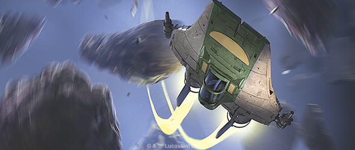
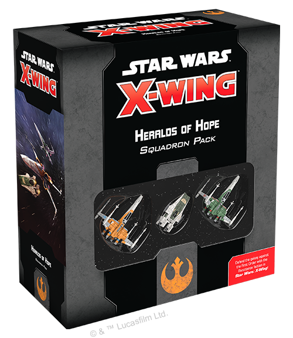
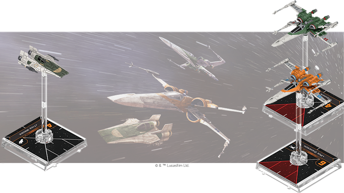
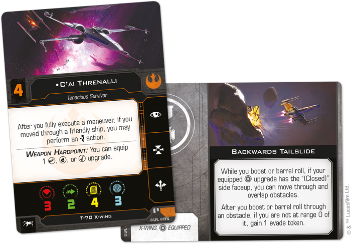
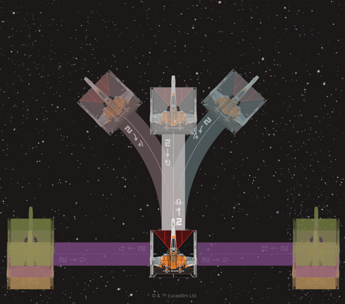
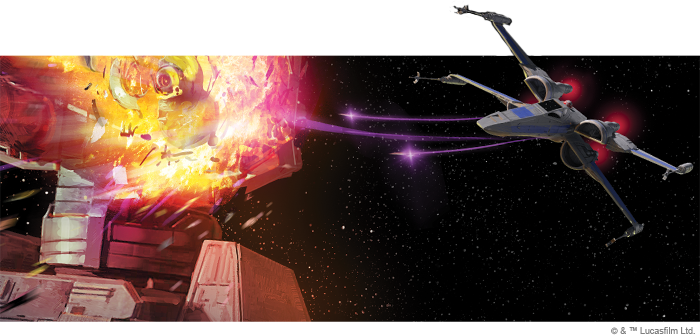
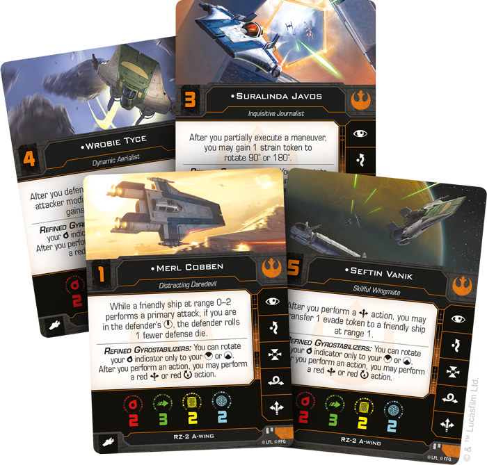

This article was originally published on [https://www.fantasyflightgames.com/en/news/2020/9/23/fight-to-the-finish/](https://www.fantasyflightgames.com/en/news/2020/9/23/fight-to-the-finish/)

&laquo; [Back to index](../index.md)

---

23 September 2020

Fight to the Finish
===================

Preview the Heralds of Hope Squadron Pack for Star Wars: X-Wing

_“I can’t walk out on this war. Not ‘til it’s over.”_  
   –Poe Dameron, _Star Wars_™: _The Rise of Skywalker_

The First Order reigns. Without the Republic to protect the galaxy, the Resistance is all that stands against the rising tyranny. Determined not to let hope fade, new heroes rally to the cause, joining iconic Resistance leaders in a final stand to determine the fate of the galaxy.

_Star Wars_™: _The Rise of Skywalker_ brought the Skywalker Saga to a dramatic close with a massive battle above Exegol, and soon you can enter the tense dogfights of [_Star Wars_™: X-Wing](https://www.fantasyflightgames.com/en/products/x-wing-second-edition/) in the starfighters seen in this epic finale with the _[Heralds of Hope Squadron Pack](https://www.fantasyflightgames.com/en/products/x-wing-second-edition/products/heralds-hope-squadron-pack/)_!

Featuring two T-70 X-wing miniatures and an RZ-2 A-wing miniature with bold new paint schemes based on their appearance in _The Rise of Skywalker_, this _Squadron Pack_ is the perfect entry point for new players beginning to build their Resistance squadrons and veteran _X-Wing_ players alike. Alongside the miniatures, you’ll also find plenty of new ways to customize your squadrons, including six RZ-2 A-wing ship cards and 10 T-70 X-wing ship cards that bring new pilots into your ranks as well as 25 upgrade cards that offer new talents, faction-exclusive astromechs, and more!

Join us today as we take a full look at everything included in the _Heralds of Hope Squadron Pack_!

Rookies and Veterans
--------------------

The X-wing is one of the most iconic starfighters in the entire _Star Wars_ saga and remains a powerful symbol of hope in the Resistance’s fight against the First Order. With the Republic decimated by Starkiller base, the Resistance needs every pilot it can find to keep this hope alive in these advanced starfighters.

Answering the call are T-70 pilots of all skill levels who epitomize the best of the Resistance. Inexperienced as she may be, [Nimi Chireen](08a6550f675dcacd48fb9058c9c60c88.png)  always keeps her hope alive, especially when locked in combat with a pilot who has a higher initiative than her own. She can change a blank result to a focus result while attacking these pilots, even with the weapon installed in her X-wing’s weapon hardpoint, making her a powerful option in the fight against enemy aces.

Alternatively, the T-70 X-wing may not be as elusive as the RZ-2 A-wing, but [C’ai Threnalli](cbd150f75fa6e4e0b376e8e5194bc165.png) Doing so will grant them an extra evade token, but only so long as they clear the obstacle they boost or barrel roll through.

New recruits always perform better with a veteran to guide them and _Heralds of Hope_ also brings updated versions of two legendary Resistance heroes who can bolster their wingmates. Having [Temmin Wexley](4a546652f2832db6b90d04ccb2d95c37.png) just in time to engage while also giving them a calculate token.

Similarly, once merely a trigger-happy flyboy, [Poe Dameron](bea0c8f5d2f5bf04adb9a8cbe720ca2e.png) that forces it to use a template of one speed higher when performing a red boost, barrel roll, or SLAM action.

  
_An Overdrive Thruster allows a T-70 X-wing pilot to boost or barrel roll an incredible distance._

The pilots aren’t the only members of the Resistance new to _X-Wing_, though. The faction also sees an influx of new astromechs in this expansion, none more significant than [R2-D2.](9949fb66c01f2db046e2369740c8a368.png) Present throughout the entire _Star Wars_ saga, this trusty droid reinvents himself again for the fight against the First Order. Here, he helps pilots remove their red tokens at the cost of a shield during the End Phase. Rather than simply leave a ship defenseless, however, can immediately spend two more charges to recover his last shield and gain a deplete token, giving you plenty of ways to manage tokens and shields depending on the situation. 

R2-D2 isn't the only loyal astromech to join the Resistance, either. He is accompanied by Wexley's faithful  [R6-D8,](975ed8dc9826c5f0730a8cfb6ad30417.png)  This option for the T-70's weapon hardpoint is useful for its bonus attack, of course, but also gives the ship another useful option at range 1 if the target manages to slip out of arc.

Making the Grade
----------------

As the battle with the First Order reaches a climax, the T-70 X-wing isn't the only starfighter the Resistance uses in this desperate struggle. The RZ-2 A-wing is the choice of aces and rookies alike, who utilize the ship’s extreme speed and maneuverability for a variety of purposes. An ace like [Seftin Vanik,](2eeacb401d9cc30c45ee6920ff7b691d.png) for example, is another highly skilled pilot who makes the ideal wingman. Not only does he have the maneuverability to protect friendly ships at any angle, he can also transfer an evade token to them in truly dire circumstances.

Other pilots prefer to use the ship's maneuverability in creative ways.  [Merl Cobben,](7b6aec644250f132f53cc6d8c7796b87.png)

Clearly, the speed and handling of the RZ-2 enable its pilots to fly as aggressively as they like and perhaps none are more aggressive than [Wrobie Tyce,](cd949c3b9939e3fa5c5c5ffb28236fc8.png) to intimidate an enemy pilot and force them to gain a strain token. Even if she winds up in the enemy's firing arc, they must choose between modifying their dice or taking a deplete token during any subsequent attack made against her.

Finish the Fight
----------------

New recruits are ready to join the best the Resistance has to offer in the fight for freedom across the galaxy. Can you unite them into a squadron capable of defeating the First Order? Ignite the spark and unite the Resistance!    

_Join the Resistance with the_ Heralds of Hope Squadron Pack _(SWZ68), arriving at your local retailer on October 30. Pre-order your copy at your local retailer or online through our website—with free shipping in the continental United States—[here](https://store.us.asmodee.com/preorders/create/SWZ68/)!_