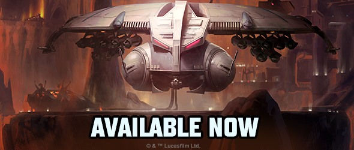
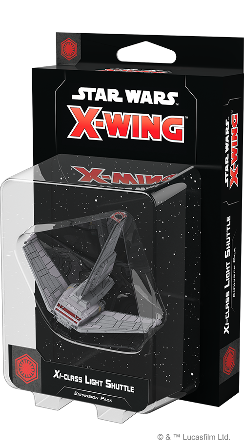

This article was originally published on [https://www.fantasyflightgames.com/en/news/2020/9/25/available-now-september-25/](https://www.fantasyflightgames.com/en/news/2020/9/25/available-now-september-25/)

&laquo; [Back to index](../index.md)

---

25 September 2020

Available Now: September 25
===========================

New Star Wars: X-Wing Products are Now Available

_Take a look at the latest products from Fantasy Flight Games, now available at your local retailer!_

* * *

_[Xi-class Light Shuttle Expansion Pack](https://www.fantasyflightgames.com/en/products/x-wing-second-edition/products/xi-class-light-shuttle-expansion-pack/)_ __ 
---------------------------------------------------------------------------------------------------------------------------------------------------------------------------------------------------------------------------------------------------------------------------------------------

The First Order's agents are scattered across the galaxy, from enclaves in the Unknown Regions to pockets of sympathizers within the New Republic. The _Xi_\-class light shuttle is swift and lightly armed, suited to conveying First Order VIPs quickly but surreptitiously from base to base. It can also serve as a command craft, directing forces in raids before the attackers slip away into the depths of space once again. 

Within this expansion, you’ll find a beautifully detailed _Xi_\-class Light Shuttle miniature along with everything you need to launch it on your own secret mission, including a medium plastic base and two medium ship tokens. Four ship cards let you dispatch some of the First Order’s most elite agents to do your bidding while 14 upgrade cards let you assign additional crew members to the ship and outfit it with new technology, including a Sensor Buoy Suite that helps you establish a defensive perimeter at the very beginning of the game.

* * *

_[LAAT/i Gunship Expansion Pack](https://www.fantasyflightgames.com/en/products/x-wing-second-edition/products/laati-gunship-expansion-pack/)_ __ 
----------------------------------------------------------------------------------------------------------------------------------------------------------------------------------------------------------------------------------------------------------------------------

A durable, reliable workhorse capable of serving in a wide array of environments, the LAAT/i gunship is renowned for getting the job done. Whether making precision drops of clone troopers on contested worlds, supporting Republic formations with interlaced fire in atmospheric battles, or engaging starfighters in the depths of space, the LAAT/i can be outfitted for nearly any role or battlefield the Galactic Republic needs it to take on.

The _LAAT/i Gunship Expansion Pack_ contains everything you need to add one of these sturdy ships to your Galactic Republic squadrons, including a finely detailed LAAT/i Gunship miniature along with four ship cards that let you hand pick the clone that pilots your LAAT/i gunship into battle. Additionally, 14 upgrade cards give you access to an array of Jedi Generals to direct the fight as well as clone troopers who act as gunners and crew members. Finally, two quick build cards offer oredetermined combinations of pilots and upgrades to get your ship directly into the fight.

_Pick up your own copy of the_ LAAT/i Gunship Expansion Pack _(SWZ70) at your local retailer or online [through our website](https://www.fantasyflightgames.com/en/products/x-wing-second-edition/products/laati-gunship-expansion-pack/) here!_

* * *

_[HMP Droid Gunship Expansion Pack](https://www.fantasyflightgames.com/en/products/x-wing-second-edition/products/hmp-droid-gunship-expansion-pack/)_ __ 
-----------------------------------------------------------------------------------------------------------------------------------------------------------------------------------------------------------------------------------------------------------------------------------

A menacing silhouette slides overhead, repulsorlifts humming ominously and eyes glowing with malevolence. The HMP gunship's presence invokes fear thanks to predatory droid intelligence and an unpredictable capacity to strafe targets with devastating missile pods, bombs, and a wide-sweeping array of laser cannons.

The _HMP Droid Gunship Expansion Pack_ unlocks new possibilities for your Separatist Alliance squadrons with a beautifully detailed HMP Droid Gunship miniature and six ship cards featuring their own programming and protocols for battle. Your droid gunship can be further modified to your exact specifications with eight upgrade cards that give you access to new missiles, a new tactical relay, and even a new configurations that unlocks a new way of maneuvering your ship. Alternatively, you can follow the recommendations of three quick build cards to get your gunship into battle as quickly as possible.

_Pick up your own copy of the_ HMP Gunship Expansion Pack _(SWZ71) at your local retailer or online [through our website](https://www.fantasyflightgames.com/en/products/x-wing-second-edition/products/hmp-droid-gunship-expansion-pack/) here!_

