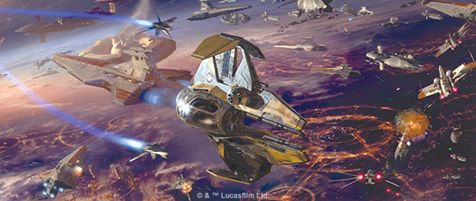
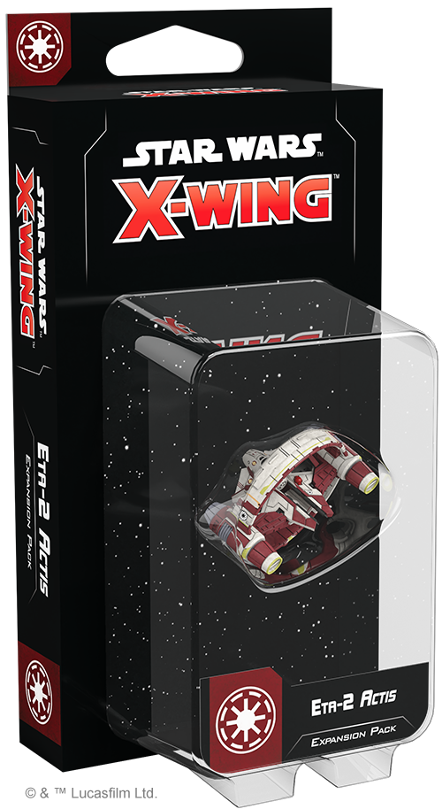
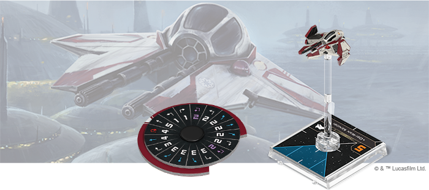
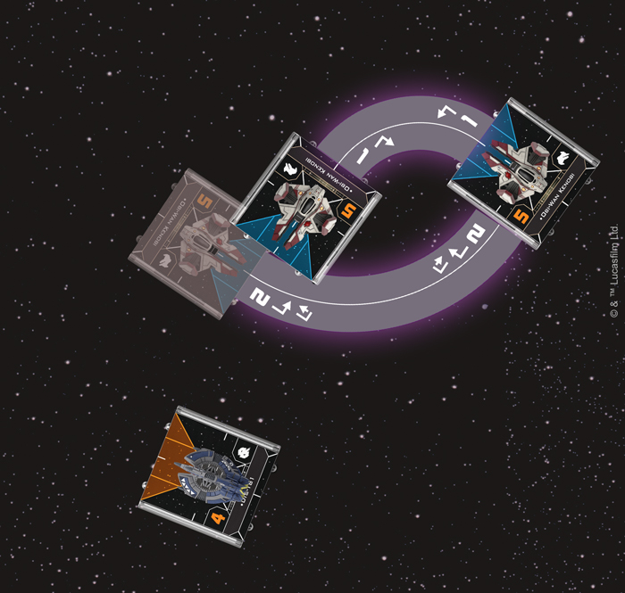
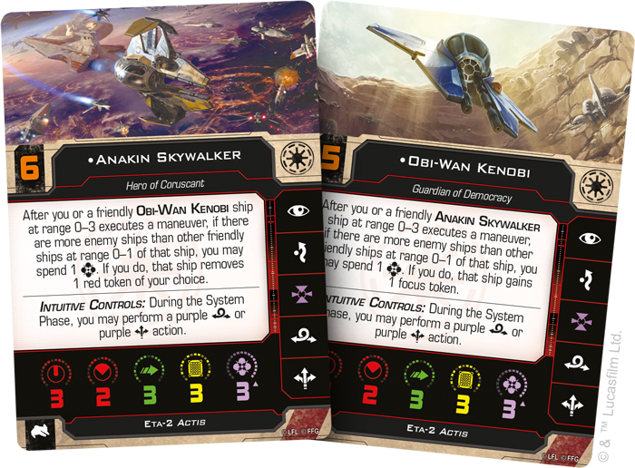
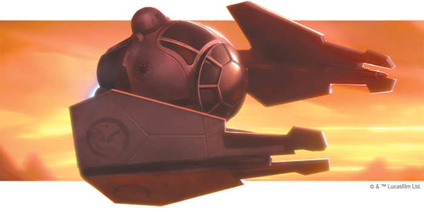

This article was originally published on https://www.fantasyflightgames.com/en/news/2020/10/7/push-the-limit/

&laquo; [Back to index](../index.md)

---

7 October 2020

Push the Limit
==============

Preview the Eta-2 Actis Expansion Pack for Star Wars: X-Wing

_"Oh, this is going to be easy."_  
   –Obi-Wan Kenobi, _Star Wars_™_: Revenge of the Sith_

With the Force as their ally, Jedi Knights can perform unbelievable feats in space combat, pushing any starfighter to the limit of its capabilities. To be the most effective, however, they need a ship that responds to their otherworldly reflexes and honed instincts.

Featuring intuitive controls and blazing speed, the Eta-2 _Actis_ Interceptor is a perfect ship for Jedi pilots and a worthy successor to the venerated Delta-7 _Aethersprite_. Soon, some of the most legendary Jedi in the galaxy can launch into the space battles of [_Star Wars_™: X-Wing](https://www.fantasyflightgames.com/en/products/x-wing-second-edition/) with the [_Eta-2_ Actis _Expansion Pack_](https://www.fantasyflightgames.com/en/products/x-wing-second-edition/products/eta-2-actis-expansion-pack/)!

Within this expansion, you’ll find two miniatures: an Eta-2 _Actis_ as well as a _Syliure_\-class Hyperspace Ring that an Eta-2 _Actis_, Delta-7 _Aethersprite_, or _Nimbus_\-class V-Wing can dock with. The Eta-2 _Actis_ miniature can be flown into battle by a variety of Jedi Knights represented on six ship cards, while six upgrade cards give you even more ways to customize your ships and pilots, including new Force powers, astromechs, and more.

Read on for a full look at everything included in the _Eta-2_ Actis _Expansion Pack_!

Where the Fun Begins
--------------------

Like the Delta-7 _Aethersprite_ before it, the Eta-2 provides extra performance to those who use the Force and this expansion gives you even more ways for you to use your Jedi's Force charges to gain an advantage. Not only do the ship’s Intuitive Controls give pilots a chance to reposition with a purple boost or purple barrel roll during the System Phase, the Eta-2 also introduce's a new type of maneuver that can only be executed by Force users. These purple maneuvers require the pilot to spend a Force charge, but allow Eta-2 pilots to pull off a tight speed-2 Tallon Roll in the thick of combat.

Although spending a Force charge may seem like a high cost, purple maneuvers aren’t without other benefits. Chiefly, they do not incur stress, leaving you free to perform an action after executing them. This gives you the chance to reposition and line up a shot on a target in your bullseye arc, especially if you’re willing to take [Extreme Maneuvers](swz79_extreme-maneuvers.png) to do so.

  
_Obi-Wan Kenobi spends a Force charge to perform a speed-2 Tallon Roll. Then, he spends another Force charge to use Extreme Maneuvers and use turn template during his boost to line up the Droid Tri-Fighter in his bullseye arc!_

No matter if they’re leading a [wing of clone troopers](swz79_jedi-commander2.png) These two fought alongside one another throughout the Clone Wars, forging a bond that makes them stronger when they fly together in the same squadron.

For his part, Anakin Skywalker brings his fearless approach to flying to the Eta-2 and can spend a Force charge to remove a red token from himself or Obi-Wan if they are outnumbered by enemy ships at range 0–1 after executing a maneuver. This ability has many benefits regardless of the token removed, but it’s even more powerful when Anakin is working in concert with Obi-Wan, who can grant ships in a similar situation a focus token. Anakin Skywalker also shares a strong bond with his astromech  [R2-D2,](swz79_r2d2.png)  who provides any Republic pilot with a great deal of versatility. Not only can R2 repair a ship's damage or restore its shields, he can also keep it out of harm's way by removing any devices at range 0–1.

Other Jedi may lack the tight synergy shared by Anakin and Obi-Wan, but this just means they have ways to help every member of their squadron. A confident pilot like [Aayla Secura,](swz79_aayla-secura.png) to recover a Force charge that can then convert this focus to an evade result.

Some Jedi, like [Shaak Ti,](swz79_shaak-ti.png) are always strong in the Force, even in the midst of combat.

In addition to the pilots themselves, this expansion pack includes even more ways to make several of your Republic starfighters even more versatile. Rather than rely on larger carrier vessels, ships the Eta-2 _Actis_, Delta-7 _Aethersprite_, and _Nimbus_\-class V-wing make use of special hyperdrive rings to convey them on missions across the galaxy. These [Syliure-31 Hyperdrives](swz79_syliure-31_hyperdrive.png)  also have some use in combat, giving pilots a greater degree of freedom to choose where they begin play.

Beyond this, a ship equipped with one of these also possesses new ways to maneuver. The [TransGalMeg Control Link](swz79_transgalmeg-control-link.png) assigns the ring the dial and initiative of the ship docked with it while also transforming the way it moves. The link may severely limit the speed at which a ship travels, but it also gives it the ability to stop and rotate, helping it make sensitive adjustments before lauching into an engagement.

Team Up
-------

The Jedi lead Republic forces into battle across the galaxy and now they have a starfighter more in tune with their abilities than ever before. Join forces and defend the Republic when this expansion releases on November 27!

