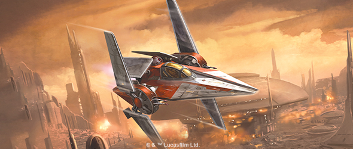
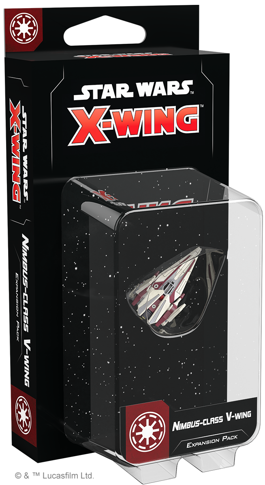
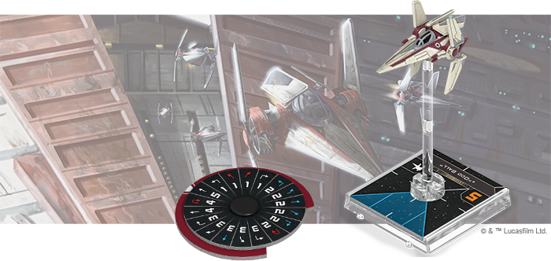
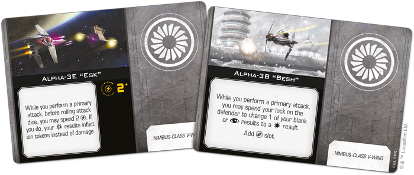
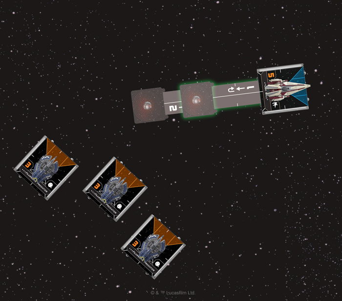
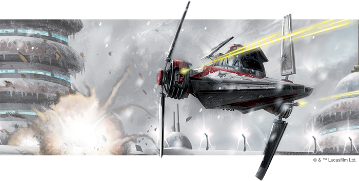

This article was originally published on [https://www.fantasyflightgames.com/en/news/2020/10/15/stay-sharp/](https://www.fantasyflightgames.com/en/news/2020/10/15/stay-sharp/)

&laquo; [Back to index](../index.md)

---

15 October 2020

Stay Sharp
==========

Preview the Nimbus-class V-Wing Expansion Pack for Star Wars: X-Wing

_“We need to launch a full forward assault!”_  
   –Wilhuff Tarkin, _Star Wars™: The Clone Wars_

The Galactic Republic deploys a dizzying array of starfighters to protect itself from the Separatist threat, from heavy ARC-170s and BTL-B Y-wings to light and nimble Delta-7 _Aethersprites_ and Naboo Royal N-1 Starfighters. In the waning days of the Clone Wars, aspects of many of these designs were synthesized into a single starfighter: The _Nimbus_ \-class V-wing.

Sporting impressive speed, the V-wing is ideally suited for many missions critical to securing the future of the Republic, including protecting Supreme Chancellor Palpatine’s personal shuttle. Soon, you can add one of these nimble fighters to your Republic squadrons with the [Nimbus-class V-Wing Expansion Pack](https://www.fantasyflightgames.com/en/products/x-wing-second-edition/products/nimbus-class-v-wing-expansion-pack/) for [_Star Wars_™: X-Wing](https://www.fantasyflightgames.com/en/products/x-wing-second-edition/)!

This expansion adds a beautifully detailed, pre-painted _Nimbus_\-class V-Wing to your _X-Wing_ collection, along with all the components you need to prepare it for battle. First, six ship cards invite you to choose from the Republic’s best clone and non-clone pilots. In addition to selecting a pilot, seven upgrade cards give you the freedom to customize your V-wing with distinct configurations, astromechs, and more.

Join us today as we take a look at everything in the Nimbus_\-class V-Wing Expansion Pack_!

Form Up
-------

Despite its great speed, the _Nimbus_\-class V-wing is much more than a mere interceptor. Instead, this speed is but one tool pilots have at their disposal to use the V-wing in a variety of ways. At its simplest, pilots like the Republic’s [Loyalist Volunteers](swz80_ship_volunteer.png) can use the inexpensive chassis to overwhelm opponents with superior numbers.

But the V-wing is also highly customizable, and two configurations allow it to be modified to play even more specific roles in combat. The [Alpha-3B “Besh”](swz80_upgrade_alpha-3b.png) version of the starfighter increases the ship’s offensive potential, allowing it to spend a lock to change a focus result to a hit result. More than that, though, this configuration also adds the payload upgrade slot, turning the V-wing into a light and fast bomber.

Carrying a payload adds new dimensions to the V-wing’s speed, allowing it to move in for swift bombing runs that leave an array of deadly devices in the enemy’s path. Of all the options, though, leaving a trail of [Thermal Detonators](swz80_upgrade_thermal-detonators.png) could have the greatest impact. With these equipped, the V-wing can drop a total of two Thermal Detonators using different templates, each of which will force a ship at range 0–1 to roll an attack die and gain a strain token for every focus result or suffer a hit or critical hit for every matching result upon detonation.

Alternatively, the V-wing also makes an exceptional pursuit craft, especially if it is in its [Alpha-3E “Esk”](swz80_upgrade_alpha-3e.png) makes it a bit easier by giving you three opportunities to upgrade a hit result to a critical hit.

  
_"Odd Ball" drops two Thermal Detonators in the path of the oncoming Droid Tri-Fighters!_

Beyond its configurations, the V-wing is made even more flexible by the fact that, as a precursor to the Empire’s iconic TIE line of starfighters, it can ignore the “TIE” ship restriction on upgrade cards. This gives pilots even more options, such as performing an [Ion Limiter Override](swz80_upgrade_ion-limiter-override.png) who can use the barrel roll as a chance to line up a target in his bullseye arc.

Similarly, a pilot can take advantage of the ship’s [Precision Ion Engines](swz80_upgrade_precison-ion-engines.png) to help them navigate. These droids give them a larger margin of error when moving close to obstacles, making it possible for them to overlap or move through and overlap them while a barrel rolling or boosting.

With so many tools at their disposal, skilled V-wing pilots can threaten enemy squadrons working in a variety of ways. A crack clone pilot like [“Contrail,”](swz80_ship_contrail.png) acquire the lock he needs to prevent a ship from applying range bonuses.

Complete the Mission
--------------------

As clone and non-clone pilots step forward to defend the Republic, they unite in the _Nimbus_\-class V-wing. Launch your own missions and unite the galaxy!

