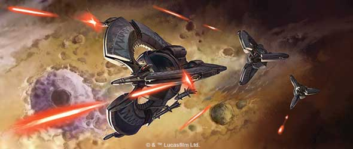
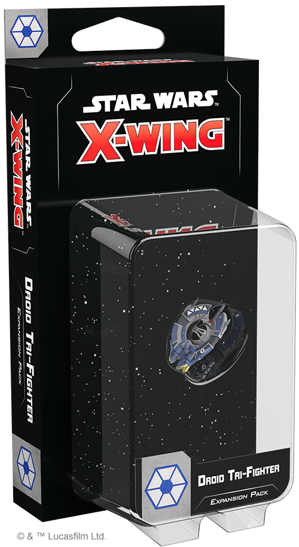
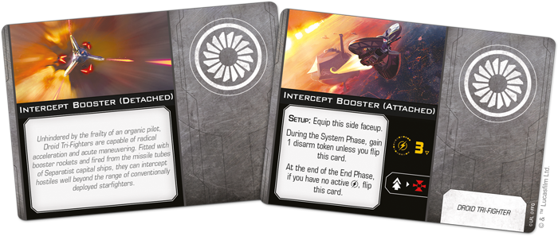
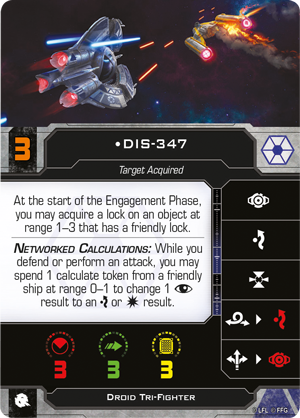

This article was originally published on [https://www.fantasyflightgames.com/en/news/2020/10/21/total-destruction/](https://www.fantasyflightgames.com/en/news/2020/10/21/total-destruction/)

&laquo; [Back to index](../index.md)

---

21 October 2020

Total Destruction
=================

Preview the Droid Tri-Fighter Expansion Pack for Star Wars: X-Wing

_“They’re all over me!”_  
   –Clone pilot, _Star Wars™: Revenge of the Sith_

The Separatist Alliance’s droid starfighters are programmed to accomplish a single goal: total annihilation of their targets. Uncompromised by morals and unburdened by frail organic pilots, these fighters ruthlessly pursue this goal with little regard for their own self-preservation.

Of all Separatist starfighters, the Droid Tri-Fighter is perhaps the pinnacle of this design philosophy. Introduced late in the Clone Wars, these ships quickly became some of the toughest adversaries Republic pilots would face. Soon, you can begin forming your own swarm of these relentless fighters with the _[Droid Tri-Fighter Expansion Pack](https://www.fantasyflightgames.com/en/products/x-wing-second-edition/products/droid-tri-fighter-expansion-pack/)_ for [_Star Wars_™: X-Wing](https://www.fantasyflightgames.com/en/products/x-wing-second-edition/)!

This expansion contains everything you need to integrate one of these brutally efficient ships into your Separatist squadrons, starting with a beautifully painted Droid Tri-Fighter miniature. A remarkably versatile starfighter, the Droid Tri-Fighter can be programmed to follow a variety of protocols and six ship cards give you the freedom to choose which strategy your ship pursues. Additionally, seven upgrade cards let you choose the right tools for your Droid Tri-Fighter’s tasks, including missiles, systems, a new configuration, and more.

Join us today as we take a full look at the _Droid Tri-Fighter Expansion Pack_!

Predatory Programming
---------------------

Droid Tri-Fighters represent the next step in the evolution of Separatist starfighter strategy. Ideal for flying in networked swarms, these aggressive fighters also feature advanced droid brains and heavy armament that make them equally dangerous on their own.

Like other droid starfighters, the aggressiveness of Droid Tri-Fighters is tempered by their own fragility, but they have plenty of tools to overcome their three hull, including superior agility and a maneuver dial that makes them a menace in tight dogfights. Performing a quick speed-1 Tallon Roll gives them plenty of opportunities stay on target while both mid-and long-range Koiogran Turns allow them to quickly reengage or remain unpredictably elusive at just the right moments.

This unpredictability is only heightened by the Separatist strategy of launching them from the missile tubes of capital ships or fitting them with [Intercept Boosters](a65176edc3a84ac8ee9a4876acc60242.png) them and opening fire.

Once they’re engaged, Separatist fighter squadrons often make use of unorthodox weapons and equipment and Droid Tri Fighters are no exception. Whether you deploy some  [Separatist Interceptors](3c9e004249f1ede2f14021f4b8753c6a.png)   that give each friendly ship at range 1–3 of the defender a lock on the defender upon impact.

These tools can also be used in conjunction with the specific programming of unique Droid Tri-Fighters. [DIS-347,](83454f959fc3421e87beb2c94895d58f.png)

The [Phlac-Arphocc Prototype,](a46a96c1b7bd4ea6247b3166004adf41.png) it can further hinder a target at range 1–2 with a strain token.

While these ships are more than capable of operating on their own, some work best in groups. A pack of [Fearsome Predators](577d881c116b7f7276ceca1bca6993ce.png) condition after forces are placed and making them particularly vulnerable. These targets must spend at least one green token while defending against a Fearsome Predator–regardless of receiving a benefit or not–or else be forced to gain a strain token.

Similarly, with the chance to spend two calculate tokens from nearby ships between its own ability and the Networked Calculations ship ability, [DIS-T81](a91210f323fe1f6c815fdb22b5528198.png) This overrides their Networked Calculations protocols, replacing it with the ability to treat white calculate actions as red to gain an additional calculate token instead. Rather than modify a single ship, this upgrade is standardized across all ships of the same type in a squadron, requiring all ships of that type to be equipped with a copy. Whether used on a group of Droid Tri-Fighters or to make some _Hyena_\-class Droid Bombers operate on their own, this upgrade unlocks deadly new ways for the Separatist Alliance to utililze their starfighters.

Initiate Attack 
----------------

The Droid Tri-Fighter may have been deployed late in the Clone Wars, but it still makes a dangerous addition to your squadrons. Upgrade to the latest tech with the _Droid Tri-Fighter Expansion Pack_!

_Destroy your opponents with the_ Droid Tri-Fighter Expansion Pack _(SWZ81), arriving at your local retailer on November 27. Pre-order your copy at your local retailer or online through our website—with free shipping in the continental United States–[here](https://store.us.asmodee.com/preorders/create/SWZ81/)!_

