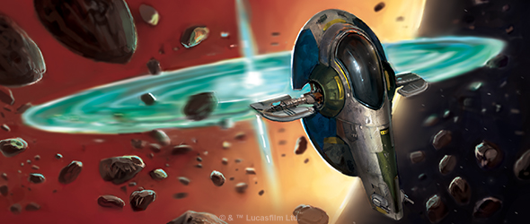
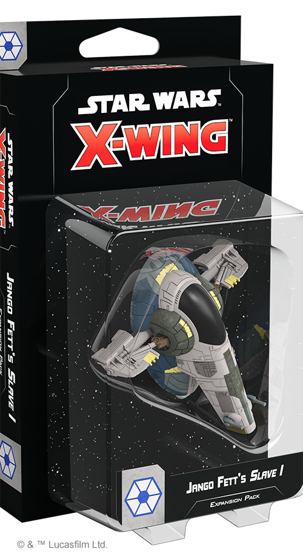
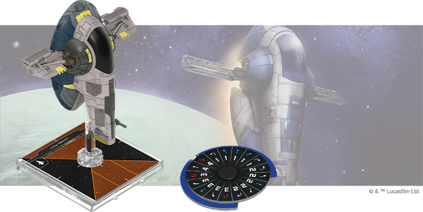
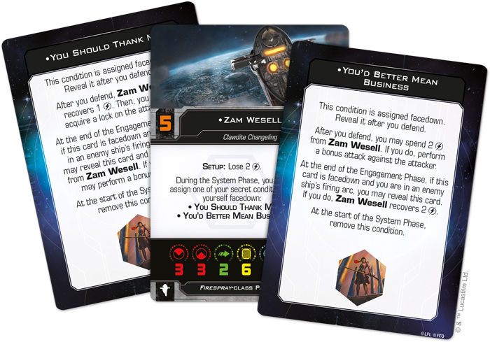
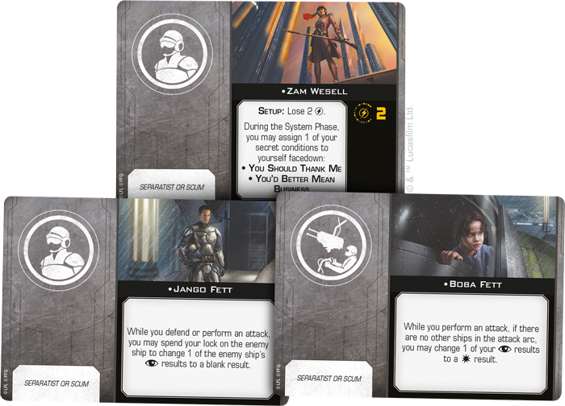
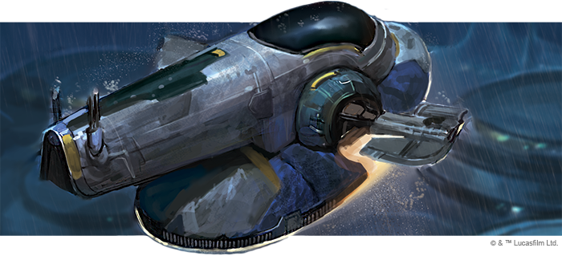

This article was originally published on [https://www.fantasyflightgames.com/en/news/2020/10/29/build-your-legend/](https://www.fantasyflightgames.com/en/news/2020/10/29/build-your-legend/)

&laquo; [Back to index](../index.md)

---

29 October 2020

Build Your Legend
=================

Preview the Jango Fett's Slave I Expansion Pack for Star Wars™: X-Wing

_“I’m just a simple man trying to make my way in the universe.”_  
   –Jango Fett, _Star Wars_™_: Attack of the Clones_

Galactic conflict may bring uncertainty, but also the chance to turn a profit. As systems flock to leave the Republic, then, those cunning and unscrupulous enough to seize them see new opportunities to make their way in the galaxy. None have used this to their advantage more than Jango Fett. Already renowned as the greatest bounty hunter in the galaxy, Fett now sells his services to the Separatist Alliance, aiding them in their mission to topple the Galactic Republic.

Part of Jango Fett’s fearsome reputation can be attributed to his ship, the menacing _Slave I_. Fett personally outfitted this vessel with an array of deadly weaponry and soon you can put your own spin on this iconic ship with the [Jango Fett’s Slave I Expansion Pack](https://www.fantasyflightgames.com/en/products/x-wing-second-edition/products/jango-fetts-slave-i-expansion-pack/) for [_Star Wars_™: X-Wing](https://www.fantasyflightgames.com/en/products/x-wing-second-edition/)!

The _Slave I_ is one of the most recognizable ships in the entire _Star Wars_ saga and this expansion adds this classic _Firespray_\-class Patrol Craft to your collection painted in the striking blue and gray color scheme Jango Fett used at the beginning of the Clone Wars. Fett wasn’t the only bounty hunter to favor the craft, of course, and four ship cards give you access to a range of pilots to include in your Separatist squadrons.

Finally, the _Firespray_ is known as a particularly customizable platform and this expansion also includes 13 upgrades cards for you to outfit your own for battle, including new crew cards that can be equipped by both Separatist and Scum ships.

Read on for a full look at the _Jango Fett’s_ Slave I _Expansion Pack_!

Take the Job
------------

A bounty hunter is only as good as their ship. These vessels serve many functions, from tracking targets to engaging in all-out combat and the _Slave I_ gives Jango Fett all the tools he needs to hunt his marks and, if they won’t come quietly, bring them down on the spot. As flexible as it is formidable, it’s easy to see why this is one of the most feared ships in the galaxy.

With these goals in mind, bounty hunters often take a different approach to combat than pilots of standard military craft. They rely on cunning as much as speed and firepower and though his ship may not be as maneuverable as lighter fighters, [Jango Fett](swz82_a1_jango-fett.png) himself still has the skill to disrupt an opponent’s fancy flying. Whether he’s defending or performing a primary attack, he can change one of the enemy ship’s dice from a focus to a blank result so long as the difficulty of his revealed maneuver is less than that of the enemy ship’s.

Jango Fett makes it bit harder for opponents to escape his grasp, so it should be no surprise that his unaltered clone Boba has similar piloting skill. The young [Boba Fett](swz82_a1_boba-fett.png) may be inexperienced and not share his father’s initiative, but still knows how to survive an intense space battle. He prefers to work on his own and, if there are no other friendly ships at range 0–2 while he defends, he can change one of his blank results to a focus result, giving him a better chance to escape a dangerous encounter unscathed.

Still other bounty hunters make use of even more subterfuge than this pair. The Clawdite [Zam Wesell](swz82_a1_zam-wessel.png)  is hard to predict as she assigns herself one of two condition cards during every System Phase. Unlike other conditions, however, the ones you find here are secret and are assigned facedown to keep Wesell’s opponents off guard.

These cards enter Wesell into a tense game of bluffs and coercion with her foes, forcing them to carefully consider who they target.  If she chooses [You Should Thank Me](swz82_a1_thank-me.png) condition. So long as she can carefully manage her charges, Zam Wesell remains an enigmatic and menacing opponent.

Not every pilot seeking to capitalize on the conflict is as skilled as these pilots, of course. Fortunately, any [Separatist Racketeer](swz82_a1_separatist-racketeer.png) , for example, retains his ability to disrupt a ship’s focus even when he joins another pilot’s crew. In this case, he gives them the option of spending a lock they have on the enemy ship for the same effect as his pilot ability.

The same goes for [Zam Wesell](swz82_a1_upgrade_zam-wessel.png) takes things to an even further extreme. Known for playing both sides to his advantage, he gives you the chance to choose two ships friendly to each other at range 1–3 and coordinate one while jamming the other. Whether the chosen ships are yours or not is up to you, but clever pilots will find a way to put themselves in a superior position.

While they mostly look out for themselves, bounty hunters like Jango Fett recognize the benefits of teaming up with other like-minded individuals, especially those that can act as a gunner. In fact, the _[Slave I](swz82_a1_upgrade_slave1.png) to join forces. Not only can Boba Fett change a focus result to a hit if there are no other ships in the attack arc, the _Slave I_ title allows you to boost this result to a critical hit so long as you’re attacking from the defender’s full rear arc.

As useful as Boba Fett may be, having someone trained in the use of special weapons can provide their own advantages. Specifically, a [Weapons Systems Officer](swz82_a1_upgrade_weapon-systems.png) that jam an object after you acquire a lock on it or it acquires a lock on you, stripping it off helpful green tokens for the ensuing attack.

Seize the Opportunity
---------------------

As the Separatist crisis grows, so too will the chances to capitalize from it. Outfit your ship and set out to build your own legend when this expansion releases on November 27!

