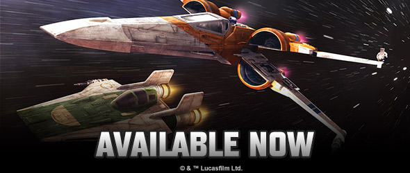
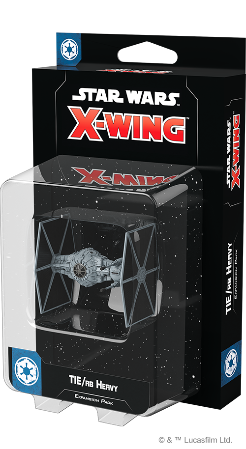

This article was originally published on [https://www.fantasyflightgames.com/en/news/2020/10/30/available-now-october-30/](https://www.fantasyflightgames.com/en/news/2020/10/30/available-now-october-30/)

&laquo; [Back to index](../index.md)

---

30 October 2020

Available Now: October 30
=========================

New X-Wing Ships Are Now Available

_Take a look at the latest products from Fantasy Flight Games, now available at your local retailer!_

* * *

_[Heralds of Hope Squadron Pack](https://www.fantasyflightgames.com/en/products/x-wing-second-edition/products/heralds-hope-squadron-pack/)_
--------------------------------------------------------------------------------------------------------------------------------------------

__

The spark of hope has ignited! Now, the Resistance rises to meet the First Order, seeking to break its tyrannical hold over the galaxy!

This _Squadron Pack_ for [_Star Wars_™: X-Wing Second Edition](https://www.fantasyflightgames.com/en/products/x-wing-second-edition/) includes iconic heroes such as Poe Dameron and Temmin "Snap" Wexley, featuring new abilities based on their appearance in _Star Wars: The Rise of Skywalker_. These brave pilots launch into battle in two T-70 X-wing starfighters featuring updated paint schemes and they are joined by even more new Resistance pilots flying an RZ-2 A-wing with an updated paint scheme.

All told, you'll find 10 T-70 X-wing ship cards and 6 RZ-2 A-wing ship cards in this expansion, giving you even more pilots to choose from. Additionally, 25 upgrade cards invite you to further customize your Resistance squadrons, while five Quick Build cards help you get these pilots and upgrades into the fight as fast as possible with convenient preset selections.

* * *

__

_[TIE/rb Heavy Expansion Pack](https://www.fantasyflightgames.com/en/products/x-wing-second-edition/products/tierb-heavy-expansion-pack/)_
------------------------------------------------------------------------------------------------------------------------------------------

The TIE/rb Heavy is one of the largest TIE variants produced for the Galactic Empire and is often assigned to patrol routes where it is expected to fight without the support of a carrier or escorts. Thanks to its robust armor, swiveling laser cannons, and integrated MGK-300-series droid intelligence, this vessel lives up to its nickname: the "Brute."

The _TIE/rb Heavy Expansion Pack_ includes everything you need to add one of these imposing ships to your Galactic Empire squadrons, beginning with a beautifully detailed, pre-painted miniature and a medium plastic base. Four ship cards give you the freedom to choose your pilot, while 12 upgrade cards invite you to customize your ship to fir your needs. Finally, two Quick Build cards offer helpful combinations of pilots and upgrades to get you into the fight right away. 

_Pick up your own copy of the_ TIE/rb Heavy Expansion Pack _(SWZ67) at your local retailer or [online through our website](https://www.fantasyflightgames.com/en/products/x-wing-second-edition/products/tierb-heavy-expansion-pack/) here!_

