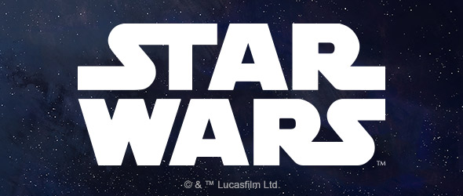

This article was originally published on https://www.fantasyflightgames.com/en/news/2020/11/16/an-important-star-wars-announcement/

&laquo; [Back to index](../index.md)

---

16 November 2020

An Important Star Wars Announcement
===================================

News About the Future of Our Star Wars Miniatures Games

_For the full press release, [click here](https://images-cdn.fantasyflightgames.com/filer_public/88/a8/88a84e8f-4e3b-40f1-b4d5-78a7153a2906/ana_pr_amg-starwars.pdf) ._

Atomic Mass Games Takes Its First Steps Into The Star Wars™ Miniatures Games Galaxy
-----------------------------------------------------------------------------------

_Development of_ Star Wars_: X-Wing,_ Star Wars_: Armada, and_ Star Wars_: Legion Moving from Fantasy Flight Games to Asmodee’s Miniatures Games-Focused Studio_

**SEATTLE, WA, November 16, 2020** – In a strategic reorganization of its _Star Wars_ miniatures titles, Asmodee is announcing today that oversight of its three _Star Wars_ miniatures titles will be moving to their dedicated miniatures games studio, Atomic Mass Games.

Development of all future miniatures games will be handled by Atomic Mass as well. The move to a specialty studio positions Asmodee’s miniatures titles for even greater success in the future.

“Atomic Mass is committed to bringing people together through fun games, and _Star Wars_ has been bringing people together through the power of myth and story for over 40 years,” Steve Horvath, Head of US Publishing, said. “Combining their talent with the strength of our current _Star Wars_ miniatures games and the limitless possibilities of a galaxy far, far away is going to lead to incredible new experiences for tabletop gamers and Star Wars fans to enjoy.”

Simone Elliott, who has shepherded Fantasy Flight’s relationship with Lucasfilm Licensing since 2015, will lead Atomic Mass Games during this time of expansion as Head of Studio. Will Shick assumes primary creative oversight as Head of Product Development. Joining them will be key members of the teams involved in the creation and evolution of Fantasy Flight’s current _Star Wars_ miniatures games, [_Star Wars_™: X-Wing](https://www.fantasyflightgames.com/en/products/x-wing-second-edition/), [_Star Wars_™: Legion](https://www.fantasyflightgames.com/en/products/star-wars-legion/), and [_Star Wars_™: Armada](https://www.fantasyflightgames.com/en/products/star-wars-armada/).

### _About Atomic Mass Games_

_Composed of veterans from the tabletop miniatures games industry, Atomic Mass Games is committed to delivering immersive lifestyle hobby games that combine industry leading tabletop miniatures and fast, fun, kinetic game rules to create lifelong collectors and players._

### _About Asmodee USA_

_Asmodee USA is a sales, marketing, and distribution arm of the global Asmodee Group, a leading international company dedicated to bringing great games and amazing stories to all corners of the world. Asmodee USA represents the strongest portfolio of board games in the industry, including such favorite titles as_ CATAN®_,_ Ticket to Ride_,_ Spot It!_,_ Pandemic_,_ Just One_,_ Dixit_,_ Dead of Winter_, and many more._

### _About Asmodee Group_

_Asmodee Group is a leading international games publisher and distributor committed to telling amazing stories through great games with over 34 million games sold in more than 50 countries. Through our portfolio of iconic game titles, including_ CATAN®_,_ Ticket to Ride_,_ Pandemic_,_ Dobble/Spot it!_,_ Arkham Horror_,_ Splendor_,_ KeyForge_, and_ Star Wars_: X-Wing, we create a dynamic transmedia experience for players across a variety of digital and physical platforms. Asmodee also creates inspiring and innovative products in partnership with leading entertainment and technology companies. Asmodee operates in Europe, North America, South America and Asia and is headquartered in Guyancourt, France. Learn more at corporate.asmodee.com._

