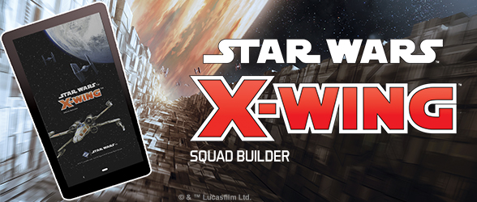
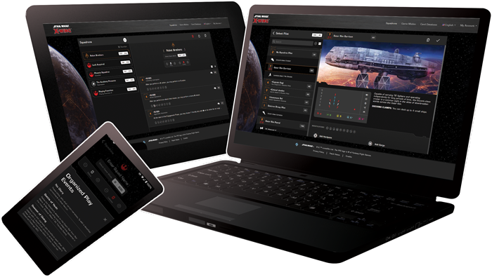
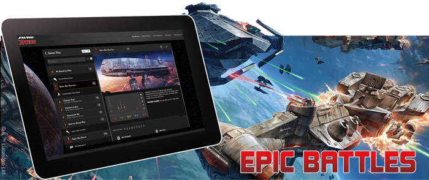
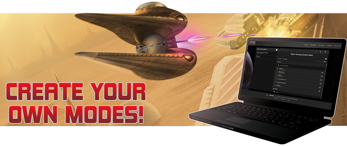
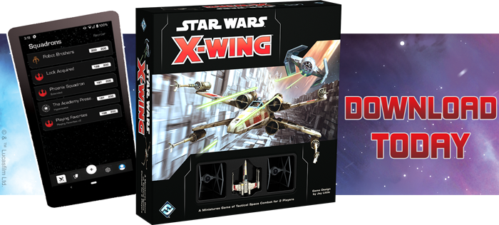

This article was originally published on https://www.fantasyflightgames.com/en/news/2020/11/24/updated-programming/

&laquo; [Back to index](../index.md)

---

24 November 2020

Updated Programming
===================

Announcing a brand-new X-Wing Squad Builder app! 

_“I am here to put you back on schedule”_  
   –Darth Vader, _Star Wars™: Return of the Jedi_ 

Today we are happy to reveal a new and improved X-Wing Squad Builder app! Now featuring support for Epic Play, an offline mode for squad-building on-the-go, a collection manager, and an expanded and improved Custom Variant creator, we are excited to show off our new app! 

  

Available on Android, iOS, and the web, the new X-Wing Squad Builder is now ready for you to try. Feel free to check it out now, or read on for a breakdown of what new features to expect. 

First up is Epic Play support. Long-requested, the new builder can handle any size squad, and the many Epic-only ships and upgrades available in products like the [Tantive IV Expansion Pack](https://www.fantasyflightgames.com/en/products/x-wing-second-edition/products/x-wing-second-edition-tantive-iv-expansion-pack/) or the [Huge Ship Conversion Kit](https://www.fantasyflightgames.com/en/products/x-wing-second-edition/products/huge-ship-conversion-kit/). 

  

Next we are happy to announce that we have added the oft-requested Offline Mode for the mobile apps. You are now able to tinker with your list without an active internet connection, and your changes will sync up when a connection is reestablished. Of course, you’ll still want to connect occasionally to get points changes or update the app with new releases like the upcoming [ETA-2 Actis Expansion Pack](https://www.fantasyflightgames.com/en/products/x-wing-second-edition/products/eta-2-actis-expansion-pack/)! 

The addition of a Collection Manager will allow you to both track what X-Wing expansions are missing from your fleet, but can also warn you when you attempt to add a card you do not own to your squad. With the ever-increasing variety of pilot and upgrade cards in X-Wing, this handy feature is a welcome addition. 

  

Finally, in addition to the new features listed above, we’ve made sweeping usability and quality-of-life improvements throughout the app. The custom variant creator works better than ever before, and we are excited to see what creative modes our community comes up with. While you’re thinking about the variant you want to create, check out [“The Early Clone Wars,”](https://squadbuilder.fantasyflightgames.com/custom-formats/import/a78bcfe9-a291-4f4e-aa0d-ba31cf208396) a custom variant created by the marketing team! 

We want you to try our new-and-improved squad builder. We are confident that you’ll be impressed by its polish and functionality. Use the images below to find your platform of choice and get building. We’ll see you on the starfield! 

  

