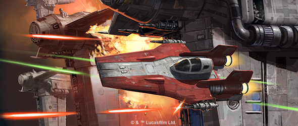

This article was originally published on https://www.fantasyflightgames.com/en/news/2020/11/24/x-wing-points-update/

&laquo; [Back to index](../index.md)

---

24 November 2020

X-Wing Points Update
====================

_Star Wars_™: X-Wing Points Have Been Adjusted

X-Wing 2021 Season 1 Points Update and Hyperspace Rotation
----------------------------------------------------------

Updated X-Wing points lists are now available in the Support section of our [_Star Wars_™: X-Wing](https://www.fantasyflightgames.com/en/products/x-wing-second-edition/) product page! We have been planning for some time to move the January update to November, despite the events that originally precipitated this change not occurring this year due to the Covid-19 pandemic, we have decided to proceed with that update in November instead of waiting until January. There will not be an additional scheduled points update in January.

So, as this update marks the beginning of the 2021 X-Wing year, what has been changed and why?

Points Changes
--------------

With the highly dominant _Nantex_\-class Starfighter already increased in price in the October unscheduled update, the metagame is already more uncertain and dynamic than it might usually be during one of the twice-yearly scheduled updates. As such, from the perspective of points changes, this update is fairly mild in effect, meant to help empower some iconic but underperforming ships and slightly reduce the effectiveness of some staple ships and upgrades.

Both the T-65 and T-70 X-wing have received a slight drop in points, as has the TIE/ln fighter. Similarly, a number of iconic Republic vessels have received small points reductions—including every instance of “Odd Ball.”

Points increases are fewer and further between this time around, but a few especially potent ships have been brought up slightly, such as the high-initiative RZ-2 A-wings, Commander Malarus (_Xi_\-class Shuttle), and the Kashyyyk Defender. None of these increases are meant to push these ships out of competitive play entirely, but to add some extra hard choices to list-building when using them.

In addition to points changes, a few upgrade slots have been changed. After lacking it for the life of the game so far, the Fang Fighter is getting the Modification slot (except for Fenn Rau). And Boba Fett is notorious for many things, including his tendency to operate alone—as such, he is losing his Crew slot, in exchange for an additional Modification slot of his own.

Hyperspace Changes
------------------

The Hyperspace changes for the first season of 2021 are even more exciting to write about, as they represent a very exciting shake-up. We’ve talked about wanting to do interesting things with Hyperspace in the past, and this seasonal Hyperspace roster will be a small step in that direction.

Restrictions breed creativity, and Hyperspace for the first portion of 2021 will be set around a specific restriction: all ships available in 2nd Edition products will be legal, but some ships will have only their generic pilots while other ships will have only their limited pilots. This means that staple pilots will often be unavailable, and players will have to find new ways to structure their lists.

Upgrades will be pulled from a curated list designed to give each faction a thematic but limited set of options. Ships from products released during this Hyperspace season will either have all of their limited or all of their generic pilots become Hyperspace legal (with possible exceptions for special inclusions like the Hyperspace Ring), as well as most of their upgrades.

With these changes and exciting new ships like the Droid Tri-Fighter, Eta-2 _Actis_, and others coming in the future, we’re very excited to see where the metagame will go as X-Wing moves into 2021!

