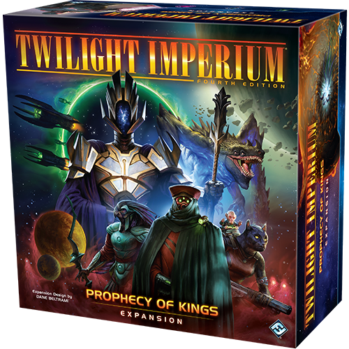
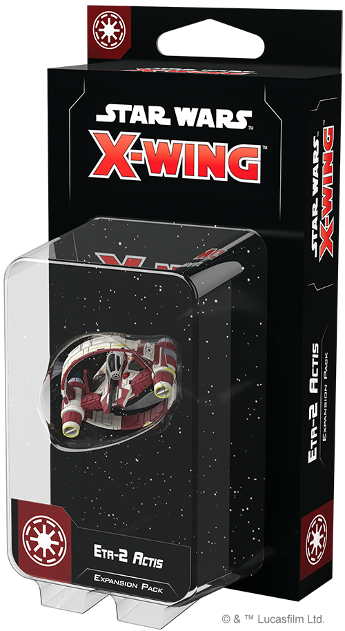
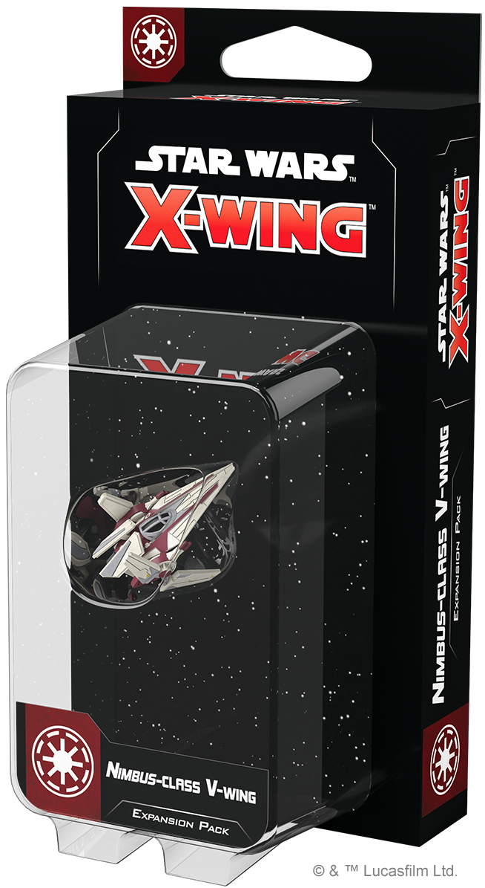
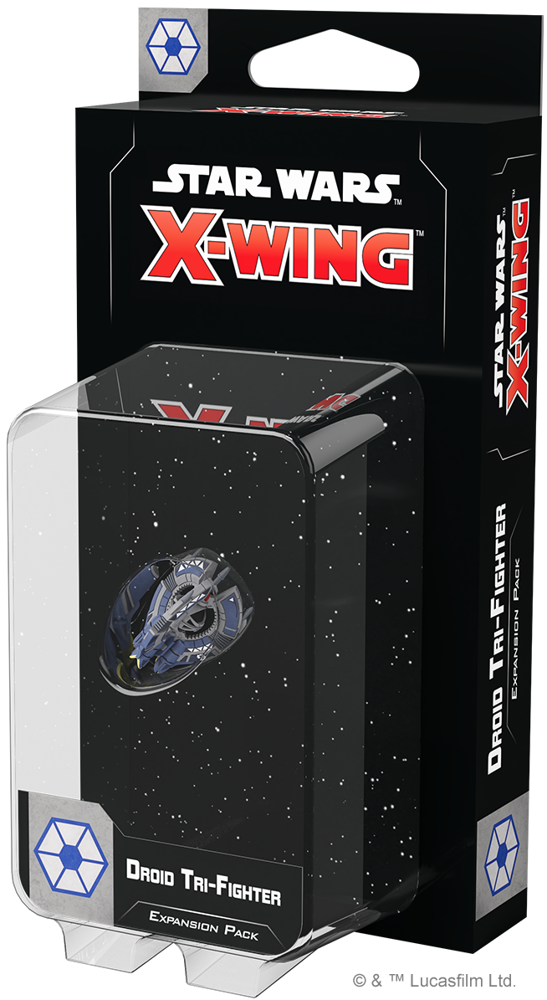
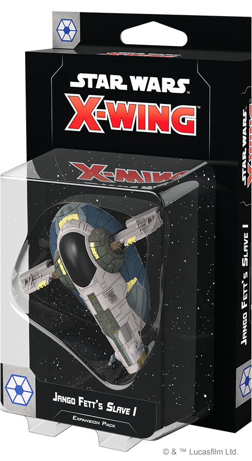

This article was originally published on [https://www.fantasyflightgames.com/en/news/2020/11/27/available-now-november-27/](https://www.fantasyflightgames.com/en/news/2020/11/27/available-now-november-27/)

&laquo; [Back to index](../index.md)

---

27 November 2020

Available Now: November 27
==========================

New Twilight Imperium and _Star Wars_™: X-Wing Products are Now Available

_Take a look at the latest products from Fantasy Flight Games, now available at your local retailer!_

* * *

_[Prophecy of Kings](https://www.fantasyflightgames.com/en/products/twilight-imperium-fourth-edition/products/prophecy-kings/)_ __ 
---------------------------------------------------------------------------------------------------------------------------------------------------------------------------------------------------------------------------------------------------------------

The massive _Prophecy of Kings_ expansion is packed to bursting with new content that you can add to your games of _[Twilight Imperium](https://www.fantasyflightgames.com/en/products/twilight-imperium-fourth-edition/)_. The galaxy has grown far larger, as seven never-before-seen factions enter the game, each boasting their own unique strengths and weaknesses, from the gene-altering powers of the Mahact, to the watchful guard of the Argent Flight, to the mysterious and ancient Empyrean. And new factions aren’t the only way the galaxy grows bigger! Forty new system and hyperlane tiles add new planets and obstacles to the map, and with two new colors of player components included in the box, you can play _Twilight Imperium_ with up to eight players.

But that’s only a fraction of what you’ll find in this expansion! Adding even more flavor to your chosen species, a wealth of unique leader cards arrive to support every faction in the game, giving you powers to unlock during the game. Lumbering mechs stomp onto the battlefield as powerful new ground forces with unique special abilities for every faction. As you venture into the unknown regions of space, brand-new exploration decks seed new planets and the void of space with new discoveries, including fragments you can combine to create awe-inspiring relics. With new action cards, agenda cards, objectives, technologies, promissory notes, legendary planets, and more, _Prophecy of Kings_ is a must-have expansion for any fan of _Twilight Imperium_!

* * *

_[Eta-2 Actis Expansion Pack](https://www.fantasyflightgames.com/en/products/x-wing-second-edition/products/eta-2-actis-expansion-pack/)_ __ 
-----------------------------------------------------------------------------------------------------------------------------------------------------------------------------------------------------------------------------------------------------------------------

As the Clone Wars takes its toll on the ranks of the Jedi Order, those that remain must assume even greater responsibilities in the Grand Army of the Republic. The Eta-2 _Actis_\-class Interceptor, developed by Kuat Systems Engineering, is stripped down so that battle hardened Jedi pilots can get the most out of its agile frame.

This expansion puts one of these agile ships as well as a _Syliure_\-class Hyperspace Ring in your hands. Featuring intuitive controls and blazing speed, this ship is the perfect way for its Jedi pilots to use their unique abilities in the midst of space combat. Six ship cards allow you to choose from some of the galaxy's most notable Jedi Knights to fly it into battle.

Meanwhile, six upgrade cards invite you to customize the ship with a new astromech, additional Force abilities and more. Finally, the hyperspace ring completely changes how the ship is placed and can also be used with your Delta-7 _Aethersprite_ and _Nimbus_\-class V-wing starfighters! 

_Pick up your own copy of the_ Eta-2 Actis Expansion Pack _(SWZ79) at your local retailer or online [through our website](https://www.fantasyflightgames.com/en/products/x-wing-second-edition/products/eta-2-actis-expansion-pack/) here!_

* * *

[Nimbus-class V-Wing Expansion Pack](https://www.fantasyflightgames.com/en/products/x-wing-second-edition/products/nimbus-class-v-wing-expansion-pack/) 
----------------------------------------------------------------------------------------------------------------------------------------------------------------------------------------------------------------------------------------------------------------------------------

The Kuat Systems Engineering Alpha-3 _Nimbus_\-class V-wing is the vessel of choice for the Galactic Republic’s clone and non-clone starfighter pilots alike. This nimble craft is fielded in various configurations for specialized tasks. The techniques pioneered to mass-produce its precision ion engines will later be crucial in the development of the TIE series by Sienar Fleet Systems.

Sporting impressive speed, the V-wing is ideally suited for many missions critical to the future of the Republic, including protecting Supreme Chancellor Palpatine's personal shuttle. The Nimbus-_class V-Wing Expansion Pack_ contains everything you need to incorporate one of these versatile starfighers into your Galactic Republic squadrons, including a beautifully pre-painted miniature and six ship cards that allow you to hand pick your pilot from elite clones and aspiring Republic officers like Wilhuff Tarkin. Meanwhile, seven upgrade cards give you the freedom to customize your ship with new astromechs, two different configurations that completely reshape how the ship plays, and more!

_Pick up your own copy of the_ Nimbus-class V-Wing Expansion Pack _(SWZ80) at your local retailer or online [through our website](https://www.fantasyflightgames.com/en/products/x-wing-second-edition/products/nimbus-class-v-wing-expansion-pack/) here!_

* * *

_[Droid Tri-Fighter Expansion Pack](https://www.fantasyflightgames.com/en/products/x-wing-second-edition/products/droid-tri-fighter-expansion-pack/)_ __ 
-----------------------------------------------------------------------------------------------------------------------------------------------------------------------------------------------------------------------------------------------------------------------------------

Designed by the Colicoid Creation Nest and manufactured by Phlac-Arphocc Automata Industries, the heuristic processers of Droid Tri-Fighters allow these deadly ships to analyze and adapt to enemy tactics in-flight. Deployed late in the Clone Wars, these aggressive starfighters, and the destructive buzz droids they carry, pose a serious threat to even veteran Jedi pilots.

Droid Tri-Fighters represent the next step in Separatist starfighter strategy and within this expansion you'll find everything you need to add one of these aggressive droids to your Separatist squadrons, beginning with a beautifully detailed, pre-painted Droid Tri-Fighter miniature.

This miniature is accompanied by six ship cards inviting you to choose a specific set of programming for it. Your droid can be further customized with seven upgrade cards that give you the freedom to reprogram it to be more independent in battle, outfit it with an intercept booster that rockets it into the fray, and more! 

_Pick up your own copy of the_ Droid Tri-Fighter Expansion Pack _(SWZ81) at your local retailer or online [through our website](https://www.fantasyflightgames.com/en/products/x-wing-second-edition/products/droid-tri-fighter-expansion-pack/) here!_

* * *

_[Jango Fett's Slave I Expansion Pack](https://www.fantasyflightgames.com/en/products/x-wing-second-edition/products/jango-fetts-slave-i-expansion-pack/)_ __ 
----------------------------------------------------------------------------------------------------------------------------------------------------------------------------------------------------------------------------------------------------------------------------------------

A bounty hunter is only as good as their ship. Originally produced for law enforcement purposes by Kuat Systems Engineering, the _Firespray_\-class patrol craft is also a favorite of bounty hunters like Jango Fett, who use its robust chassis to add their own weaponry and modifications. Fett's reputation as one of the best bounty hunters in the galaxy is partially thanks to the fearsome _Slave I_, which he uses to hunt his marks and, if they won't come quietly, bring them down on the spot.  

This expansion pack invites you to put your personal touch on your own _Firespray_\-class patrol craft painted in the colors of Jango Fett's _Slave I_. In addition to the miniature, you'll also find four ship cards in this expansion, including the infamous Jango Fett himself. These bounty hunters, mercenaries, and rogues are accompanied by 13 upgrade cards that let you customize your ship to fit your strategy, including several that can be used in both Separatist and Scum squadrons.

_Pick up your own copy of the_ Jango Fett's Slave I Expansion Pack _(SWZ82) at your local retailer or online [through our website](https://www.fantasyflightgames.com/en/products/x-wing-second-edition/products/jango-fetts-slave-i-expansion-pack/) here!_