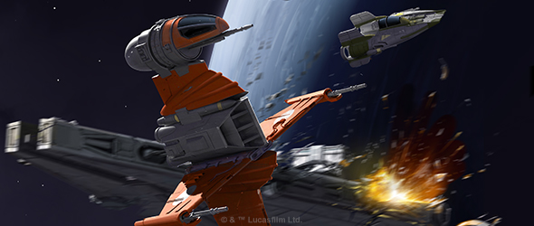
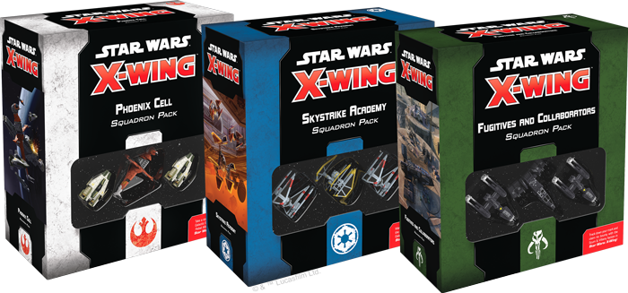
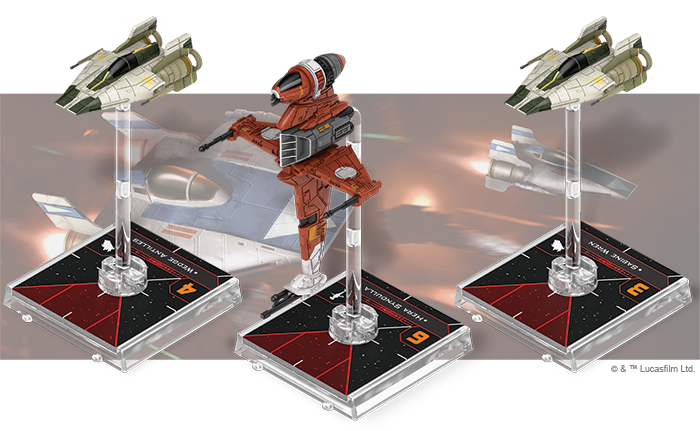
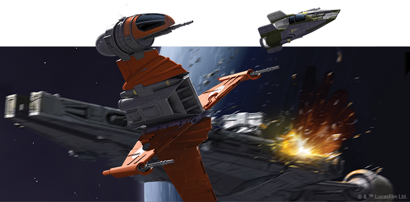
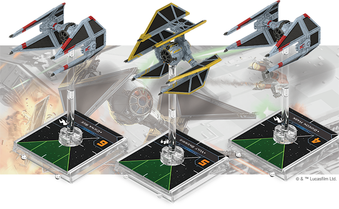
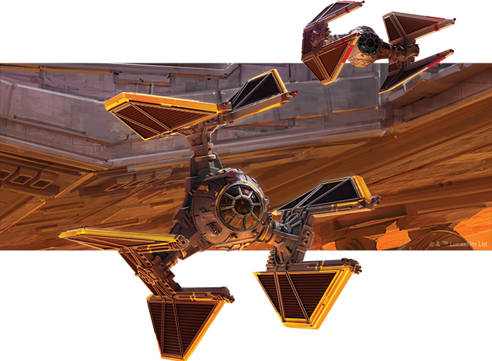
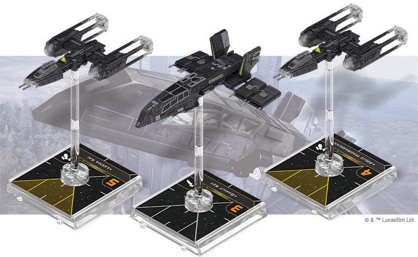
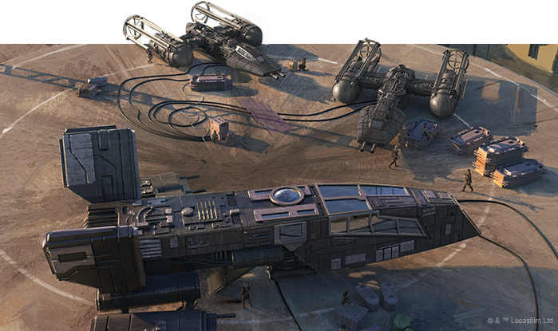

This article was originally published on [https://www.fantasyflightgames.com/en/news/2021/2/15/reinforcements-of-renown/](https://www.fantasyflightgames.com/en/news/2021/2/15/reinforcements-of-renown/)

&laquo; [Back to index](../index.md)

---

15 February 2021

Reinforcements of Renown
========================

Announcing three new Squadron Packs for _Star Wars_™_:_ X-Wing

_"Commander, we heard you’re looking for some good pilots.”_  
   –Wedge Antilles, _Star Wars_™: _Rebels_

From the tense battles above Lothal, to patrolling trade routes in the Outer Rim, starfighters have played a defining role in the history of the _Star Wars_™ galaxy. Now, new squadron packs are on the way to redefine the tense starfighter battles that play out on your tabletop and help tell a story while they do it.

*   [Phoenix Cell Squadron Pack](https://www.fantasyflightgames.com/en/products/x-wing-second-edition/products/phoenix-cell-squadron-pack/)
*   [Skystrike Academy Squadron Pack](https://www.fantasyflightgames.com/en/products/x-wing-second-edition/products/skystrike-academy-squadron-pack/)
*   [Fugitives and Collaborators Squadron Pack](https://www.fantasyflightgames.com/en/products/x-wing-second-edition/products/fugitives-and-collaborators-squadron-pack/)

Featuring exciting options for some of the most iconic ships of the Star Wars saga, these Squadron Packs for the Rebel Alliance, Galactic Empire and Scum and Villainy factions offer new, thematic pilots and upgrades for both standard and Epic play! Each Squadron Pack is the perfect starting point for collecting a faction and is packed with new pilots and upgrades designed to work together to form the tactical core of a squadron. In addition to unique new paint schemes for these ships, each of these releases feature a strong theme to help tell a narrative on the tabletop. As featured in _Star Wars: Rebels_, _The Phoenix Cell Squadron Pack_ contains the celebrated Rebel heroes of Phoenix Squadron, while the _Skystrike Academy Squadron Pack_ features the expert Imperial pilots seen on the other side of the conflict. For the Scum and Villainy faction, the _Fugitives and Collaborators Squadron Pack_ introduces interesting new options, new pilots, and a few surprises. Read on for more information on what to expect in these expansions!

Phoenix Cell Squadron Pack
--------------------------

Under the leadership of Commander Jun Sato, Phoenix Squadron is an elite group of pilots who often assist the _Ghost_ team on their missions. At the helm of Phoenix Squadron is Phoenix Leader, [Hera Syndulla](cfd223e20ffde6ba53f990ad863848cf.png) . This interesting new upgrade opens up new tactics with your RZ-1 A-wings and presents opportunities to keep your attack dice rolling while performing daring fly-by maneuvers.

Phoenix Squadron is often forced to be resourceful to get the better of the Imperials, and the B-wing included in this expansion is no exception. Painted in the distinct color scheme of the B6 Blade Wing Prototype, this miniature represents the experimental craft created as part of the Shantipole Project. The design of the prototype was so effective that it would later serve as the blueprint for the ubiquitous A/SF-01 B-wing. The experimental weaponry of the [B6 Blade Wing Prototype](17a0c60877631cbbcd8cf055ef5eb66c.png) sets it apart from its progeny by combining the power of four lasers together into a single, potent beam. While this upgrade is intended for Epic play, the expansion also includes a version of the title designed for standard play we will show off along with much more in a future preview.

This expansion contains everything you need to add a finely detailed B-wing miniature in the striking B6 Blade Wing Prototype color scheme, and a pair of A-wings in the alternate markings of Phoenix Squadron to your Rebel Alliance collection. Three small plastic bases, three dials and several ship tokens round out the components. 4 A/SF-01 B-wing and 10 RZ-1 A-wing ship cards let you pick the pilots to fly these infamous starfighters into battle, while 34 upgrade cards invite you to outfit these ships with additional weapons, modifications, commands, and more.

Skystrike Academy Squadron Pack
-------------------------------

The hardened recruits of Skystrike Academy are the elite test pilots of the Galactic Empire. These promising individuals undergo ruthless training, testing some of the Empire’s most potent and experimental starfighters. At the head of Skystrike Academy is Commander [Vult Skerris](7454a2a0642831b795082078548828f5.png) , a notorious pilot known for his skill and cunning. His pilot ability allows you to delay his action until after all ships have moved, giving you perfect information to select the most effective action before engaging.

As leader of Admiral Thrawn’s TIE Defender initiative, Vult Skerris is entrusted with the testing and development of the experimental [TIE/D Defender Elite](3db44faac85fe1a5e16c7d1adbacf30c.png) to further test the limits of both their pilot’s abilities and the craft itself. Regardless of the implementation, the testing of new technology by the Skystrike Academy presents a very real threat that the Rebel Alliance cannot leave unanswered.

This Squadron Pack adds two TIE/in Interceptors and a TIE/D Defender to your X-Wing collection, each sporting a new Skystrike Academy paint scheme based on their appearance in _Star Wars: Rebels_. Three small plastic bases, three dials and several small ship tokens are also included. In the expansion you will find 5 TIE/D Defender ship cards, 10 TIE/in ship cards and 35 upgrade cards that give you many tactical options to help assert the superiority of the Galactic Empire.

We’ll take a look at everything included in this expansion in a future preview!

Fugitives and Collaborators Squadron Pack
-----------------------------------------

As the Rebel Alliance and Galactic Empire vie for position in a sweeping war across the stars, the opportunists, criminals, and smugglers of the galaxy operate effectively from the shadows, playing sides against one another to increase their profit. [Cutthroat](02654076360a76f764cb5a5596215d95.png) perilously close to asteroids to shield their approach. As this is a tactic first made famous by Y-wing pilots of the Rebel Alliance you will be pleased to know this upgrade is also included in the _[Phoenix Cell Squadron Pack](https://www.fantasyflightgames.com/en/products/x-wing-second-edition/products/phoenix-cell-squadron-pack/)._

Not all of the unaffiliated have such an unscrupulous outlook, and some are simply trying to find a place in a tumultuous time of war. Such is the case of  [Kanan Jarrus](116fa1b0ac308441201eb3f07229846c.png) , a Jedi padawan seeking refuge after the events of Order 66. This depiction of Kanan represents his time in hiding before his introduction to Hera Syndulla and becoming a crew member of the _Ghost_. Being on the run, Kanan uses the Force to predict and distract the enemy, increasing the survivability of himself and his wing mates. It should be noted this version of Kanan introduces a new light-side Force user to the limited options available in the Scum and Villainy faction, opening up a number of new tactics and synergies.

Within this expansion, you’ll find everything you need to add one HWK-290 ship and two BTL-A4 Y-wings to your X-Wing collection, including three beautifully pre-painted miniatures, bases, tokens and dials. Four new HWK-290 Light Freighter ship cards and 9 BTL-A4 Y-wing ship cards accompany 38 upgrade cards and 4 secret condition cards to bring you plenty of options when assembling the crew for your next job.

We’ll take a closer look the exciting new options for standard and Epic play that this expansion offers in the near future!

Expand the Possibilities
------------------------

Iconic starfighters and the crack pilots who fly them converge in the unpredictable space battles of _Star Wars_: X-Wing. No matter what faction you choose, only the best pilots will prevail. Experience the thrill of starfighter combat with these new squadron packs!