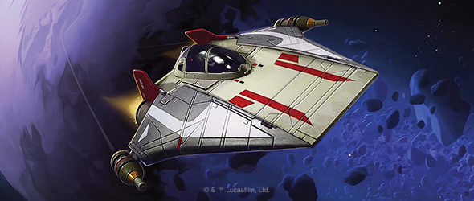
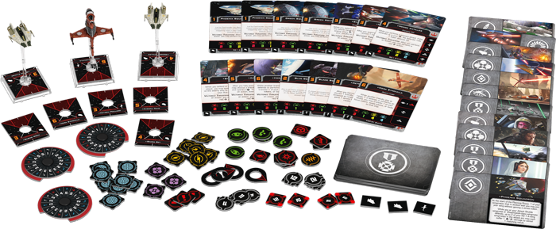
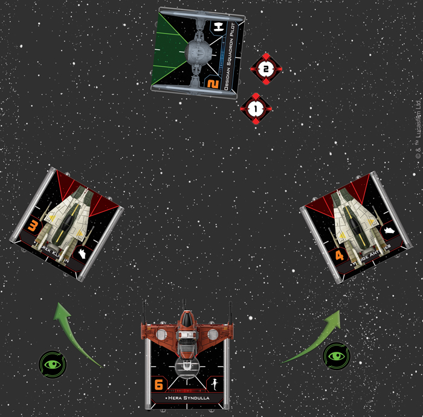
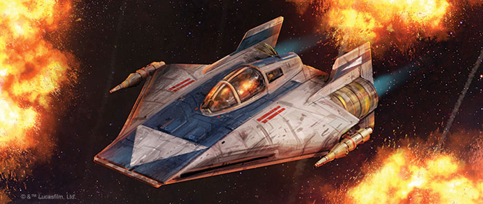
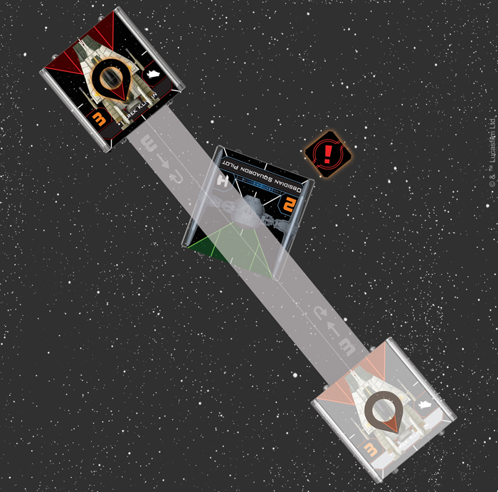
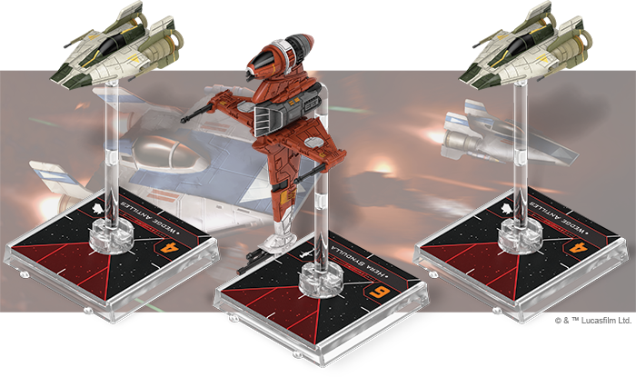
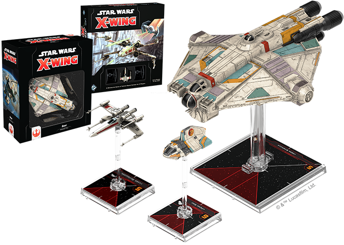

This article was originally published on [https://www.fantasyflightgames.com/en/news/2021/2/24/from-out-of-the-flames/](https://www.fantasyflightgames.com/en/news/2021/2/24/from-out-of-the-flames/)

&laquo; [Back to index](../index.md)

---

24 February 2021

From Out of the Flames
======================

Preview the Phoenix Cell Squadron Pack for _Star Wars_™ X-Wing

“_Stay on course, Ghost. I’ll knock that cruiser out of your way._”  
– Hera Syndulla, _Star Wars_™: Rebels

The Rebel squadron known as Phoenix Cell is renowned for good reason. Founded by Hera Syndulla and with members as legendary as Wedge Antilles and Sabine Wren, this unit has been key to countless Rebel victories. Some of its members were raised by resistors; others left the Imperial Academy to fight the Empire’s tyranny. Regardless of the circumstances of their birth or background, its pilots choose to resist the Galactic Empire together.

_The Phoenix Cell Squadron Pack_ brings this foundational Rebel squad to the table in _Star Wars_™: X-Wing, including a pair of nimble RZ-1 A-wings and a potent A/SF-01 B-wing starfighter. It also adds iconic aces like Hera Syndulla, Wedge Antilles, Sabine Wren, Ahsoka Tano, and Shara Bey to your squadron, alongside useful faction upgrades like Hopeful and the gunner version of Sabine Wren. It can serve as launch bay into the world of _Star Wars_: X-Wing or supplement even a veteran player’s Rebel collection with its memorable new pilots and upgrades.

_The Phoenix Cell squadron pack comes with three ship miniatures, 14 ship cards, and 36 upgrade cards._

Phoenix Leader’s Legacy
-----------------------

Hera Syndulla is one of the Rebel Alliance’s first and most versatile aces, and this squadron pack includes not one but two more ships for her to fly: the swift [RZ-1 A-wing](a6df87758b4f55e61aca2fb25e0f6de7.png) and other top aces. Her ability also highlights a different side of her: this version of Hera emphasizes her skills as a leader and instructor.

Two of Hera’s most famous proteges also appear in this pack: [Wedge Antilles](d3ef60abaa9375f912b1295c3b5c44e0.png) . And even though this reflects Wedge as a fledgling pilot for the Rebellion, before he became known for surviving two trench runs, enemies would be unwise to underestimate this trio of aces. Hera’s ability allows her to set allies up with tokens, which can trigger Hobbie’s ability to shed a red token or give Wedge a deadly double-modified attack—against which the hapless foe rolls one fewer defense die!

_Hera, Wedge, and Hobbie in formation. Because Hera’s ability triggers while a friendly ship attacks, she can wait to see Wedge’s attack roll (and lock reroll) before transferring the token. If Wedge doesn’t end up needing the help, she can assist Hobbie by transferring the focus token to him instead._

Hera also gives a substantial boost to [Shara Bey](c0d85880e6be8547ff79aa6956d5044d.png) , a hero of Endor appearing in her iconic A-wing for the first time. With Hera granting her a focus token to convert a result, Shara Bey’s A-wing can comfortably grab a lock to throw better-than-three-dice attacks.

And yet despite Hera’s prowess as a leader and an aerial duelist, she has at least one rival for the position of the most potent ace to fly with Phoenix Cell. [Ahsoka Tano](50837ea53fca2fc2be4b162188a33db9.png) may also have a support-oriented ability, but with three Force charges and an A-wing’s maneuverability at her disposal, she can keep up with the greatest aces of the Clone Wars.

Looking Back, Looking Forward
-----------------------------

The A-wing chassis itself also receives an exciting new option in the _Phoenix Cell Squadron Pack_. Like its successor the RZ-2, some variants of the RZ-1 are capable of rotating their guns to rear. The [Vectored Cannons](63298676b683f35c95f40d52a35ed406.png) , allowing an RZ-1 to cruise through a foe with cannons reversed, drop a strain token on it, and then blast it with reduced defenses.

_Hobbie sets up a Starbird Slash on an unsuspecting TIE fighter. With Vectored Cannons, he can now unload on his strained foe._

The standard version of the [B6 Blade Wing Prototype](c43991bc2001ccceedfc0711d30002ee.png) can help her keep up her firepower while still having locks to hand off to allies.

The can-do attitude that leads pilots to jury-rig their ships for flexible new tactics is the sort of creativity and risk-taking on which the Rebel Alliance survives.

The [Hopeful](d809652e471d1a5bb7cc3f3099764115.png) upgrade also embodies the spirit of the Rebel Alliance, helping ships to stay in the fight and stay alive even when facing terrible losses. It is also the first of a cycle of three upgrades in this style: one for the Rebel Alliance, one for the Galactic Empire, and one for Scum and Villainy. Here are designer Brooks Flugaur-Leavitt’s comments on designing Hopeful and its counterparts:

_From the beginning of development, I approached these squadron packs as an opportunity to reinforce the narrative and mechanical themes of_ X-Wing_'s original factions. More than just new content, my goal was to create abilities that evoked emotions associated with Star Wars, while also immersing players in the game as a shared story, not just a challenge of skill._

_When designing the new faction talents, I struck upon Hopeful and its game mechanic first.  Hope in the darkness is a recurring theme for the Rebel Alliance, and the stories of Rogue One and the Original Trilogy lent themselves readily to a mechanic that triggered after another friendly ship was destroyed. This established the theme and core mechanic for the three cards, the Imperial version becoming "Disciplined" and the Scum version "Cutthroat" (both to be featured in future previews), each reflecting how members of that faction are expected to confront adversity and loss._

_These cards underscore an important moment in the story of a game of_ X-Wing_, highlighting the reaction of our pilots to the loss of their comrade. Mechanically, they take that setback and build from it, turning the loss of a ship into a new opportunity for the player to affect the course of the game, rather than it being a reason to give up. By emphasizing the moment while also giving a chance to recover when things go poorly, I hope these cards encourage you to lean into the dramatic action in your games and enjoy the stories that result!_

__

Critical Missions
-----------------

Many of Phoenix Cell’s most famous engagements would likely be played as scenarios using the rules from the Epic Battles expansion, and so it should come as not surprise that this squadron pack includes several new cards for use in Epic Battles. The powerful B6 Blade Wing Prototype upgrade also comes in a [second form](17a0c60877631cbbcd8cf055ef5eb66c.png) command card, which allows you to create a mixed wing with the Ghost and supporting smaller ships. This unique formation offers the Ghost and accompanying _Sheathipede_\-class Shuttle or Attack Shuttle some added protection contributed by their selfless RZ-1 A-wing wingmates.

More New Recruits for the Rebel Alliance
----------------------------------------

_[The Phoenix Cell Squadron Pack](https://www.fantasyflightgames.com/en/products/x-wing-second-edition/products/phoenix-cell-squadron-pack/)_ has a number of exciting pilots and upgrades for beloved starfighters like the A-wing and B-wing, and gives the Rebel faction a number of long-awaited, fan-favorite characters. However, even if you haven’t yet joined the Rebellion (or begun collecting _X-Wing_ at all), it is a great place to start. The squadron pack gives you three ships with a variety of pilots on which to base your first squadrons. From here, either of the following products would be excellent follow-ons to expand your Rebel collection:

Purchasing a _[Star Wars: X-Wing Core Set](https://drafts.fantasyflightgames.com/en/products/x-wing-second-edition/products/x-wing-second-edition/)_ would give you a T-65 X-wing, with famous pilots like Luke Skywalker and Jek Porkins and a slew of useful upgrades including Proton Torpedoes, additional talent upgrades, Force Power upgrades for Ahsoka, and more. It would also include everything you need to play X-Wing, including maneuver templates, a damage deck, dice, and obstacles, helping you get into the game quickly.

Alternately, if you wanted to expand your options for thematic _Star Wars: Rebels_ lists while substantially increasing the variety in the squads you can build, the _[Ghost and Phantom II Expansion Pack](https://drafts.fantasyflightgames.com/en/products/x-wing-second-edition/products/x-wing-second-edition-ghost-expansion-pack/)_ would give you access to Hera’s famous VCX-100 freighter and the Sheathipede-class shuttle that Spectre Cell flies alongside it. In addition to giving you access to characters like Kanan Jarrus, Ezra Bridger, and, of course, the infamous “Chopper”, this would give you the flexibility to construct numerous different types of squadrons. You could use the Ghost’s firepower and durability to demolish targets you hem in with darting attacks from your A-wings, or you could use the _Phantom II_ as a command platform to set up powerful blasts from a B-wing with nimble A-wing aces like Ahsoka and Wedge to finish the job.

Phoenix Cell Squadron Pack _at your local retailer on March 26. You can pre-order your copies of these expansions at your local retailer or online [through our website](https://store.us.asmodee.com/preorders/create/SWL81/)—with free shipping in the continental United States!_