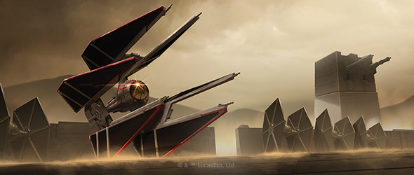
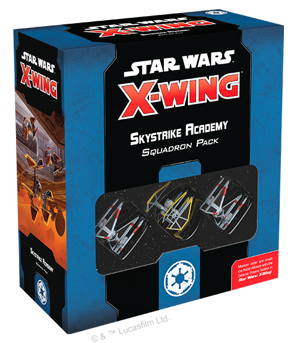
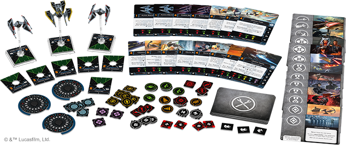
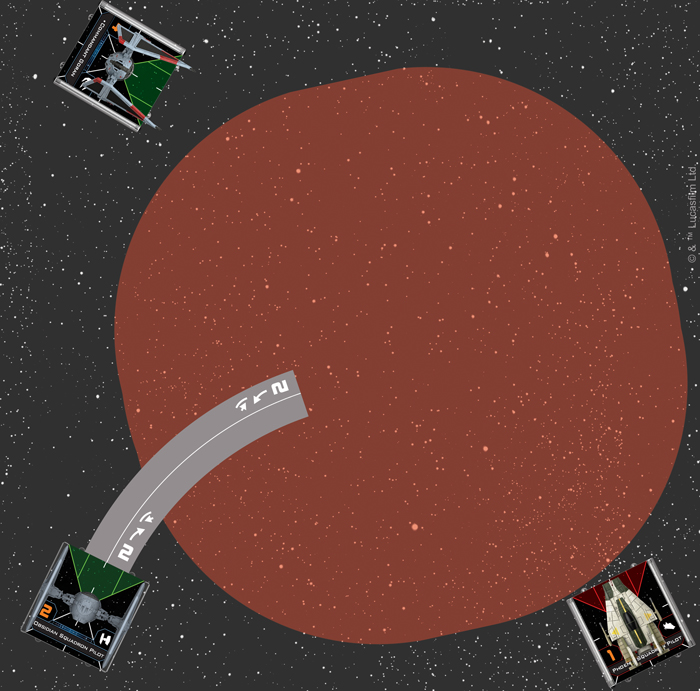
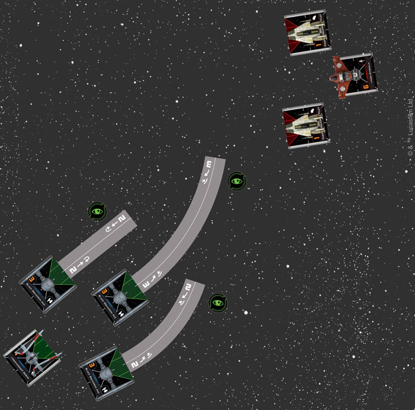
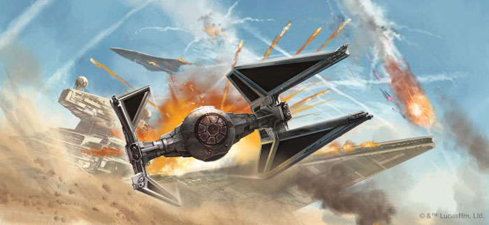
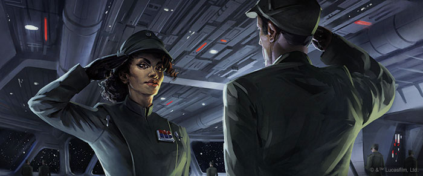
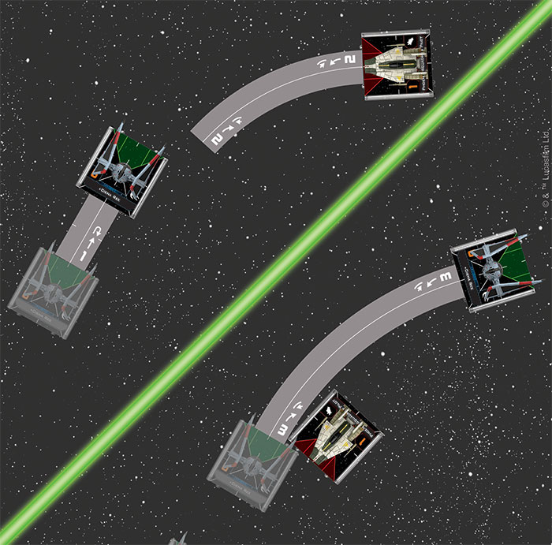
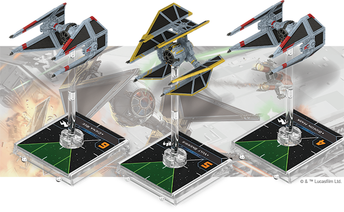
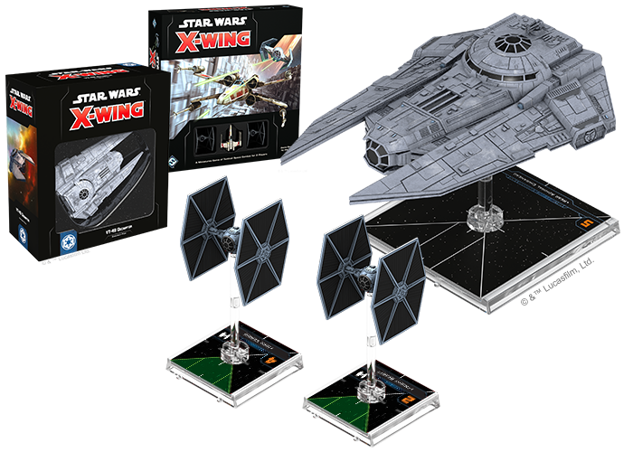

This article was originally published on [https://www.fantasyflightgames.com/en/news/2021/2/25/strike-without-mercy/](https://www.fantasyflightgames.com/en/news/2021/2/25/strike-without-mercy/)

&laquo; [Back to index](../index.md)

---

25 February 2021

Strike Without Mercy
====================

Preview the Skystrike Academy Squadron Pack for _Star Wars_™: X-Wing  
  
 

“_My cadets are unmatched, both in their skill and loyalty._”  
– Commandant Goran, _Star Wars™ Rebels_

The Galactic Empire is a regime sustained by cruelty and callous disregard for life, including the lives of its own pilots. At training facilities like Skystrike Academy, Imperial cadets are taught to put the mission above the lives of their comrades. In such a cutthroat environment, the treacherous thrive – those willing to prioritize their own survival while extolling the virtue of other people’s sacrifices.

The _[Skystrike Academy Squadron Pack](https://www.fantasyflightgames.com/en/products/x-wing-second-edition/products/skystrike-academy-squadron-pack/)_ brings Imperial brutality to the table in _Star Wars™: X-Wing_, including a pair of swift TIE/in Interceptors and a devastating TIE/d Defender. It also adds iconic aces like Vult Skerris, Commandant Gorran, and Ciena Ree to your hangar alongside powerful Imperial faction upgrades like Disciplined and Skystrike Academy Class. Whether it is the start of your X-Wing collection or a fresh wave of recruits for your Imperial forces, the _Skystrike Academy Squadron Pack_ gives you access to the tools to win through the time-tested Imperial strategy of attrition.

_The Skystrike Academy Squadron Pack comes with three ship miniatures, 15 ship cards, and 35 upgrade cards._

Treachery and Tragedy
---------------------

[Commandant Goran](27a0283129080f14d4e1e13ee0563174.png) , the superintendent of Skystrike Academy, is one figure who embodies the Imperial ethos. By allowing lower initiative pilots to perform a red focus action after partially executing a maneuver, Goran’s player can comfortably send novices into dangerously close engagements without worrying about losing actions. And with range 0-3 for the ability, Goran can afford to hang back, or flank and attack from a safer angle.

_Commandant Goran’s player is unsure where the Phoenix Squadron Pilot is going to end up, but guesses it will be somewhere in the red area. Goran’s player can safely plot a 2 bank maneuver on Obsidian Squadron Pilot, sending it into a dangerous position sure in the knowledge that it will still have a focus token to attack or defend._

And while a focus token can of course be spent offensively or defensively, combining Goran with the [Disciplined](e12fe3a98ce23c42f84fe5d1897c6102.png) upgrade can really set a player up for success in a ruthless battle of attrition. If an Obsidian Squadron Pilot in the formation is lost to enemy fire, each other ship can perform a lock or barrel roll action.

_Commandant Goran’s player sends a group of Black Squadron Aces forward. Goran’s player plans for the lead TIE to act as a potential blocker for Hera and as a decoy, as it can pick up a focus token even if it is blocked by the Phoenix Squadron Pilot thanks to Goran. Goran’s player plans for the other pilots take focus actions. Thanks to Disciplined, if Hera Syndulla blasts the decoy to space dust before it fires, the others will return fire with focus and target lock._

Of course, not every Imperial character is so coldhearted as Commandant Goran. Some are drawn in by the Empire’s extensive propaganda, or have personal experiences that keep them from seeing the greater evil they serve. This includes characters like Nash Windrider and the ace pilot Ciena Ree. After the destruction of Alderaan, [Nash Windrider](a51ffc0cf2aad2358445de06c1accb82.png) has become increasingly fanatical, embracing the Imperial mindset of fighting to the end without regard for one’s own life, which is reflected in his ability to keep friendly ships alive just long enough to lash out at their foes one last time. This ability can be especially powerful alongside an iconic TIE swarm, or other fragile but dangerous TIE/in Interceptors.

On the other hand, the brilliant [Ciena Ree](22e5d7f20d04a4af5a7c8213ae07cd9e.png) has joined the Rebellion. Each time she pulls the trigger, he might be the one she is shooting down. Though she is wracked by this knowledge, she is bound by her feelings of duty to the Empire. Here are designer Brooks Flugaur-Leavitt’s comments on the process behind the mechanics of this fan-favorite character:

_In designing the characters in these squadron packs, I tried to reflect some aspect of their identity or story in a game mechanic. Ciena Ree, torn between her horror at the course of the war and the sense of duty she feels to the Empire and her comrades-in-arms, was a compelling challenge to depict in this way, as I wanted to do her story justice. Furthermore, any ability of hers would have to balance its effect with her innate strengths as a high-initiative pilot in an aggressive and maneuverable ship._

_It was clear from the start that Ciena Ree's ability should be a potential drawback, and stress was the natural mechanic to use both to reflect her inner turmoil and to interact with the TIE/in Interceptor's ship ability. Initially her ability was purely negative, but after I settled on the mechanic for Hopeful and Disciplined (which features Ciena Ree in the art), I extended a similar beneficial effect to her as well, the resulting back-and-forth of stress evoking her wavering resolve throughout Lost Stars._

_Like the faction talents I discussed in "[From Out the Flames](https://www.fantasyflightgames.com/en/news/2021/2/24/from-out-of-the-flames/)" , Ciena Ree's pilot ability also acts as a rubber-band, providing a benefit when her squadron falls behind and a detriment when it gets ahead. This was an interesting design space to work in, as it allows for situationally powerful abilities that are kept in check by the circumstances in which they become available. Furthermore, mechanics like these reduce the degree to which a single setback decides the outcome of the whole game and encourage players to accept greater risks and interact more._

__

Old Ships, New Tricks
---------------------

Ciena Ree, Nash Windrider, and [Vult Skerris](7522cba46de0ca9adabf2ca9625562a6.png) . A configuration upgrade that replaces Autothrusters with a new ship ability, Sensitive Controls lets the TIE/in Interceptor play an entirely different role in your squadron. Instead of stacking post-maneuver actions, this upgrade grants it a barrel roll or boost before its maneuver. For a low-Initiative pilot like Nash Windrider, this can make the ship’s final position much harder to predict during the Planning Phase. Meanwhile, Sensitive Controls lets high-Intiative pilots like Vult Skerris and Ciena Ree set up blocks on lower Initiative pilots before maneuvering into firing position. Of course, this comes at a cost – the TIE interceptor often relies on its pilot’s ability to take two actions after maneuvering to avoid firing arcs. Players will have to learn new tactics to get the full benefit of this card without putting their fragile TIE interceptors directly in the opponent’s bullseye!

_Ciena Ree uses Sensitive Controls to block a Phoenix Squadron Pilot, then executes a 3 bank to chase down a more deserving foe._

Wings of Destruction
--------------------

Skystrike Academy also includes two new cards designed for the Epic Battles game mode: Skystrike Academy Class and Shadow Wing. Each of these command upgrades brings an iconic Imperial formation to the battle.

Putting Commandant Goran in charge of [Skystrike Academy Class](920b58d4fb09c33e7644f77ca0781e93.png) on a chaotic battlefield without sacrificing the option to break off to take advantage of the TIE interceptor’s maneuverability.

More New Recruits
-----------------

While the _Skystrike Academy Squadron Pack_ has a great deal to offer veteran Imperial players, it is also an excellent entry-point to the faction and to X-Wing overall. For newcomers to the Imperial faction, either of these products would be a great option to fill out your first squadron:

Purchasing a _[Star Wars: X-Wing Core Set](https://www.fantasyflightgames.com/en/products/x-wing-second-edition/products/x-wing-second-edition/)_ would give you two TIE/ln fighters (in addition to everything you need to play _X-Wing_, including maneuver templates, a damage deck, dice, and obstacles). With two TIE fighters, two TIE interceptors, one TIE defender, and a plethora of pilots for each, you would be able to build a wide range of different squadrons. You could put three or four named aces together into a list that creates potent combinations of abilities and upgrades, or focus on quantity over quality and have four inexpensive pilots supporting the powerful TIE defender.

Alternately, purchasing a _[VT-49 Decimator Expansion Pack](https://www.fantasyflightgames.com/en/products/x-wing-second-edition/products/vt-49-expansion-pack/)_ would give you a durable command ship to serve as an anvil to the hammer provided by Skystrike Academy’s fast, hard-hitting ships. While you wouldn’t have as many options for ship combinations, the large number of upgrades in the VT-49 Decimator still affords you a wide range of builds.

That wraps up our discussion today of this exciting new expansion for the Galactic Empire. Look to this space in the near future where we will cover the pilot in this squadron pack that is so powerful, they warrant their own article!

Skystrike Academy Squadron Pack _at your local retailer on March 26. You can pre-order your copies of these expansions at your local retailer or online [through our website](https://store.us.asmodee.com/preorders/create/SWL81/)—with free shipping in the continental United States!_