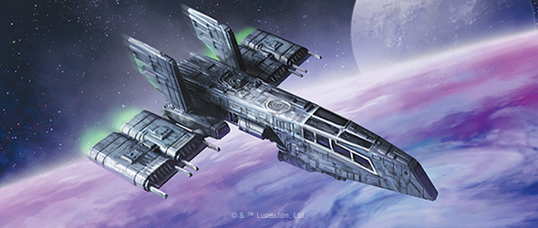
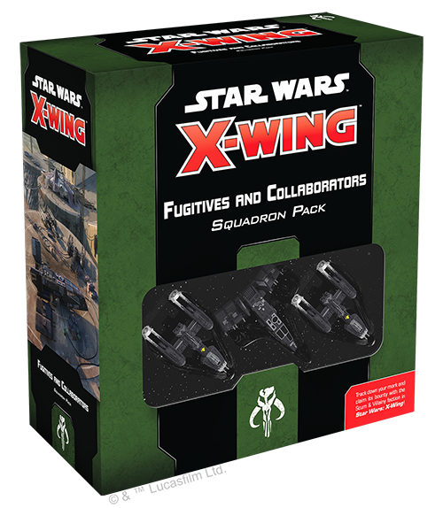
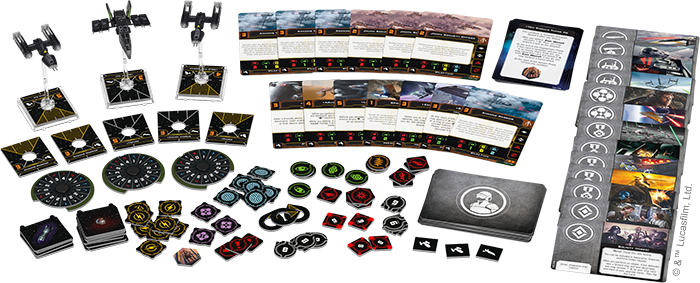
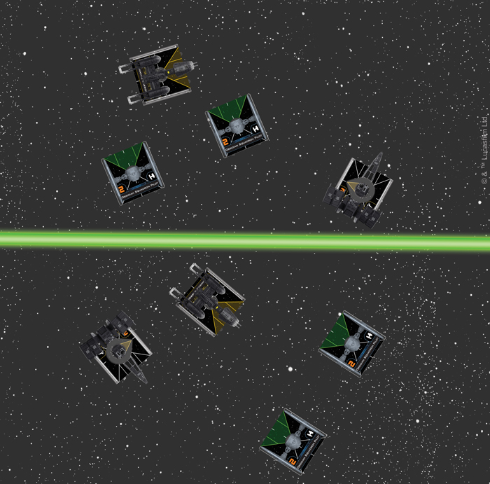
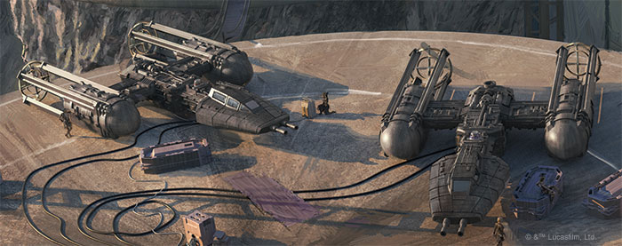
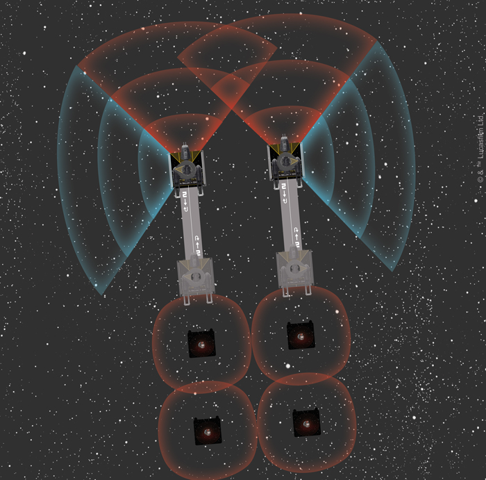
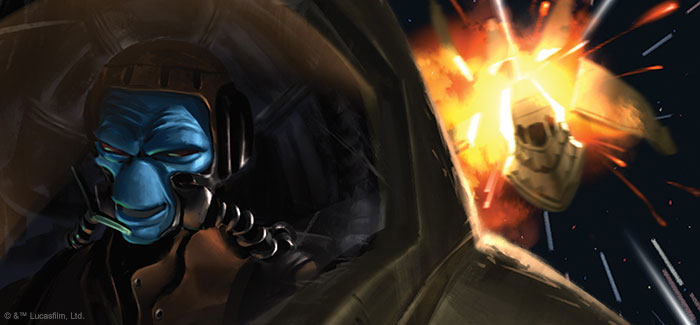
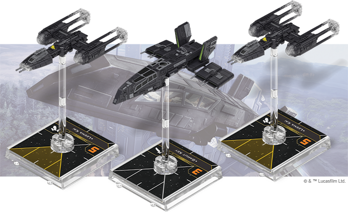

This article was originally published on [https://www.fantasyflightgames.com/en/news/2021/2/26/the-desperate-and-the-devious/](https://www.fantasyflightgames.com/en/news/2021/2/26/the-desperate-and-the-devious/)

&laquo; [Back to index](../index.md)

---

26 February 2021

The Desperate and the Devious
=============================

Preview the Fugitives and Collaborators Squadron Pack for _Star Wars_™: X-Wing

_“Caleb Dume died with Depa Billaba. Me, I barely remember the guy.”_  
– Kanan Jarrus, _Kanan: the Last Padawan_

Throughout the history of the _Star Wars™_ galaxy, there have been those who stood in the shadows between the great powers of each era. From outcast Jedi padawans trying to forget their pasts after Order 66 to mercenaries who serve the nefarious First Order for credits, there have always been Fugitives and Collaborators.

_[The Fugitives and Collaborators Squadron Pack](https://www.fantasyflightgames.com/en/products/x-wing-second-edition/products/fugitives-and-collaborators-squadron-pack/)_ for Scum and Villainy includes one HWK-290 light freighter and two BTL-A4 Y-wing starfighters, all flown by outsiders who find themselves drawn into deadly conflicts. Some are mercenaries like [Arliz Hadrassian](6562470387fe71eacff05291aa086e1a.png) who has been playing Scum and Villainy for years, this squadron pack delivers the best and worst of the galactic underworld to the game table.

_The Fugitives and Collaborators squadron pack comes with three ship miniatures, 13 ship cards, and 37 upgrade cards._

Surviving on the Fringe
-----------------------

After Order 66 and the death of his mentor Depa Billaba, Kanan Jarrus found himself an orphan in an unfriendly galaxy. During this time, he learned to survive—and never to trust others. Kanan’s pilot ability helps himself or an ally stay alive under fire, but since he only has one Force charge, you’ll have to fly him cautiously if you want to keep his ship in one piece.

_Kanan’s ability can benefit himself or an ally. If he’s on the outskirts of the conflict (top), he can usually afford to help his comrades, but if he’s got foes bearing down on him (below), he might need to be selfish just to survive!_

Kanan’s distrust was not misplaced, however. During his time in the galactic underworld avoiding the rising Empire, he interacted with shady characters like [Gamut Key](fba1b8a4f15bb7acb8ce4e83be04708d.png) . Hondo can coordinate one ship and jam another—as long both of those ships are on the same side. This means Hondo can jam a friendly ship to coordinate another friendly ship or coordinate an enemy to jam another enemy. Then, Gamut Key can cause a green token from the coordinated action or a jam token to persist for an additional round, magnifying the effect.

Experimental Technologies
-------------------------

The other interesting inclusion in Fugitives and Collaborators is a number of tech upgrades. While the Scum and Villainy faction has had access to tech upgrades for some time via the Quadjumper, the BTL-A Y-wing pilots like the [Amaxine Warrior](474bc60755172f34edaa898be5e0aab4.png) setting up shots for nimble M-3A interceptors carrying devastating missiles or torpedoes.

Building in a completely different direction, [Automated Targeting Priority](62d11a14c65d610a457e29c71343cf80.png) , and these two Y-wings can be an extremely effective area-denial tool even when flying in a straight line (to say nothing of what possibilities more daring maneuvers can create).

_A dangerous threat area that your opponent will want to avoid, freeing your other ships to attack more freely._

Another major upgrade in this expansion is the new Scum and Villainy talent: [Cutthroat](8d00f5490d6d2b0f87ad9d52a6b56c24.png) .

Cutthroat builds upon the cycle established by designer Brooks Flugaur-Leavitt with [Hopeful](d809652e471d1a5bb7cc3f3099764115.png) , a devious droid who lets you finish off a friendly ship at a key moment if your opponent won’t oblige you.

Irregular Entanglements
-----------------------

Some of the most famous team-ups in _Star Wars_ feature callous bounty hunters, deadly mercenaries, or smugglers with a heart of gold choosing to throw in their lot with the forces of good or evil. And so, in Fugitives and Collaborators, Brooks Flugaur-Leavitt designed two cards to bring these iconic alliances to life in the Epic Battles game mode: Bounty and In It for the Money.

Each of these cards grants a list of another faction access to a Scum and Villainy ship as an allied ship and grants a benefit if a particular goal is completed during the game. If a ship with [Bounty (Hired)](5684feb5def1568fda240d0353a93cc0.png) , making the ship friendly instead of allied (which allows it to share abilities that affect friendly ships).

Here are some of Brooks’ thoughts on designing these cards:

_The daring scoundrel and merciless bounty hunter are recurring archetypes in_ Star Wars _media, and while inarguably popular, their mercenary behavior often leaves these individuals and their customized vessels difficult to categorize in games that feature squadrons of military pilots in standardized ships. Since each faction in_ X-Wing _is first and foremost a cast of characters and ships that fly and fight together, only the most soft-hearted rogues (Han Solo), or committed foes (Jango Fett), find a place in the ranks of the faction that they serve, with the rest joining the Scum & Villainy._

_This categorization is a useful standard for listbuilding and compartmentalizes the game effects that we developers have to balance while keeping each player's squadron recognizable to the setting. However,_ Star Wars _stories are replete with uncomfortable truces and rival team-ups that defy rigid categorization, and Epic Battles is the game mode best suited to handle these adventures. The cast of Fugitives & Collaborators included quite a few characters who might be inclined to just such behavior, and so I took the opportunity to include mechanics for fielding Scum & Villainy ships as allies, distinguishing them by preventing them from benefiting from "friendly" card effects so as to head off some of the most egregious combos._

_Simply being able to field one or more of your favorite Scum & Villainy alongside the rest of your squadron was reason enough to develop these cards, but once we started looking at art for them, they took on a life of their own! I was inspired to add a narrative effect to each reflecting the matching pairs of art pieces we'd come up with, encouraging villainous factions to unleash independent and heavily upgraded mercenaries on their foes while heroic factions try to recruit sympathetic compatriots to their cause. I look forward to players using these cards to tell all kinds of dramatic stories in their games!_

Expanding Your Operations
-------------------------

As a first step into the wretched hive of the Scum and Villainy faction, the _Fugitives and Collaborators Squadron Pack_ starts new players off with a solid gallery of rogues to populate their X-Wing squadrons. With two resilient Y-wings and a versatile HWK-290, a player can form the basis of many squadrons. From here, either of the following products would open your options up even further:

The _[Slave I Expansion](https://www.fantasyflightgames.com/en/products/x-wing-second-edition/products/x-wing-second-edition-slave-i-expansion-pack/)_ will not only give you the infamous bounty hunter [Boba Fett](684f6bd6f18cc4a8c204325df4bb1f7b.png) , but will also give you a sturdy, hard-hitting ship around which to base your squadron. With Kanan providing defensive backup or Gamut Key letting you keep a reinforce token for an extra round, a Firespray is a solid addition to any Scum and Villainy collection that starts with Fugitives and Collaborators.

On the other end of the spectrum, if you want to add a highly maneuverable ace to take advantage of the disruption your Y-wings and HWK-290 can create with bombs, the [Fang Fighter Expansion](https://www.fantasyflightgames.com/en/products/x-wing-second-edition/products/fang-fighter-expansion-pack/) is also an excellent choice. This lightning-quick knife fighter is deadly in a head-on attack or when striking from unexpected angles and adding one to your collection will give you a flexible set of options when list-building.

Fugitives and Collaborators Squadron Pack _at your local retailer on March 26. You can pre-order your copies of these expansions at your local retailer or online [through our website](https://store.us.asmodee.com/preorders/create/SWL81/)—with free shipping in the continental United States!_