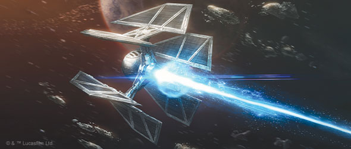
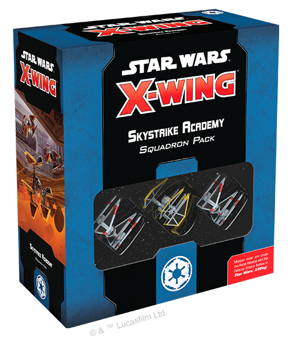
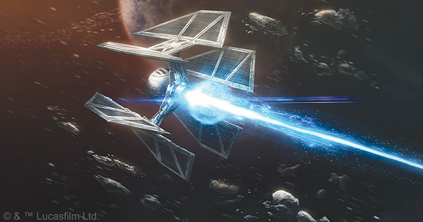
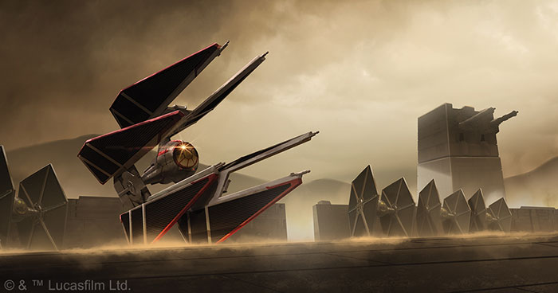
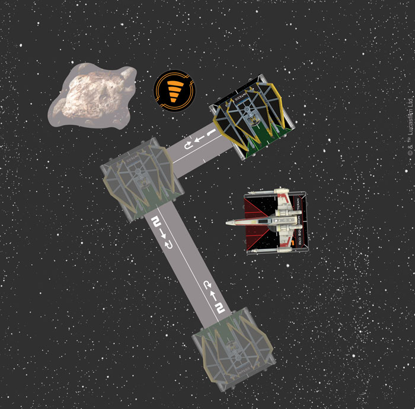
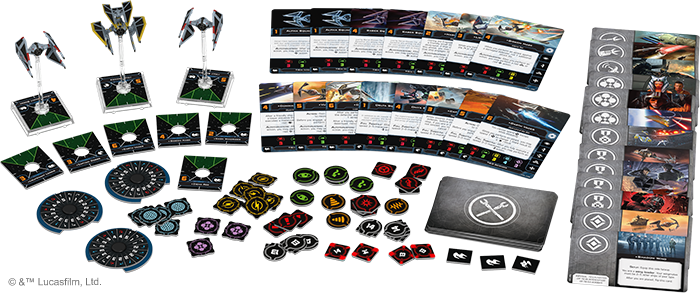

This article was originally published on [https://www.fantasyflightgames.com/en/news/2021/3/19/skystrike-academy-squadron-pack/](https://www.fantasyflightgames.com/en/news/2021/3/19/skystrike-academy-squadron-pack/)

&laquo; [Back to index](../index.md)

---

19 March 2021

Designing the Dark Lord of the Sith
===================================

Thoughts on designing Darth Vader in the TIE/D Defender for _Star Wars_™: X-Wing

_“Anakin Skywalker was weak. I destroyed him.”_  
\- Darth Vader \[Twilight of the Apprentice\]

Designer Brooks Flugaur-Leavitt discusses the TIE/D Defender and the Dark Lord of the Sith:

Darth Vader in a TIE Defender. After Timothy Zahn put the best star-pilot in the galaxy at the helm of the Empire's most potent starfighter in _Thrawn: Alliances_, the idea both thrilled and terrified X-Wing fans. Even we as developers weren't immune, and when the planning for the _Skystrike Academy Squadron Pack_ began, I had to give it a shot! In designing Darth Vader, I aimed to strike a balance that would capture his terrible power while also allowing for his inclusion in normal gameplay.

The greatest hurdle in designing Darth Vader for the expansion was, of course, his pilot ability. Players who have fielded or faced [Darth Vader, Black Leader](b0e54e6d3136a7714caee77615acc843.png) , know how powerful his additional actions can be, and the TIE/D Defender's ship ability, **_Full Throttle_**, also granted an additional evade action that matched its unique maneuver dial. The combination of Darth Vader's Force Points, additional actions from the Defender's generous action bar, a free evade, and the ship's impressive statline was simply too much. Thankfully, the system of subtitles implemented in _Star Wars_: X-wing Second Edition gave me room to design a new pilot ability that would focus Lord Vader's abilities in a way that would portray him thematically without being overpowered in gameplay.

After going over the various card interactions and re-reading the relevant portions of _Thrawn: Alliances_ several times, I determined a solution to this challenge through a fusion of mechanics and theme. Throughout the scene where Darth Vader pilots the TIE Defender he gives no thought or effort to his own protection, and senses no danger from enemy fire even when it strikes his fighter's shields. This very neatly echoed the simplest mechanical option to balance him, which was to bar him from spending his force tokens while defending so that they would not stack with the ship's own impressive defenses. This decision formed the foundation of his new ability, allowing me to focus on developing Lord Vader into a lethal offensive threat, now that his defense had been brought down to a manageable (although still impressive) level.

**Dark Lord of the Sith**
-------------------------

Darth Vader pilots the TIE/D Defender with a new subtitle: _[Dark Lord of the Sith](f537f742401e89667d0232dee4bc5b76.png)_ , with a new pilot ability to reflect the relentlessness with which he pursues and overwhelms his foes. Giving up the ability to spend force charges at other times, he channels his anger into his attacks, spending 1 force charge to change 1 blank result to a hit result. This powerful ability, combined with the standard effect of force charges, means each of his attacks will result in at least 1 hit, and likely many more as long as he has the force charge to spend.

_Unleashing his hatred, Darth Vader overcomes a poor dice roll, spending his force for both their standard effect and his ability to turn it into a powerful attack regardless._

**Finding Balance**
-------------------

While this new ability is quite powerful, it does prevent Darth Vader from using his force charge from modifying his defense rolls, and he will have to rely on the TIE Defender's already-impressive defenses. The ship's **_Full Throttle_** ship ability is one of the major reasons for the limitation included in Darth Vader's pilot ability, as without it he would have access to so many defensive modifiers that it would be unlikely for enemies to ever land a hit on him, which wouldn't have made for a very interesting game.

Other combinations denied to him are [Supernatural Reflexes](c088de224795de0ebcebdd29789d0001.png) by his altered upgrade bar, which lacks the sensors icon that all other TIE/D Defender pilots have access to. At the helm of such a powerful ship, his high initiative combined with the pre-maneuver repositioning granted by either of those upgrade cards proved to be overwhelming in testing. With these restrictions, he will be included in the Extended game mode, where he warrants more than half of a player's total squadron points _before_ taking any upgrades. **However, he will not be included in Hyperspace on his release, as he has too much potential to be a gate-keeper in the more limited format of that game mode.**

Although his use of force charge is limited to his attacks, Darth Vader does still have access to the Force Power upgrade slot, and there are several options for him there. [Instinctive Aim](fd49285bf4cb951e55ab4222497c6833.png) , allowing him to regain force charges as his ship suffers damage and fuelling his relentless attacks.

**TIE Defender Elite**
----------------------

Beyond the inclusion of Darth Vader as a pilot, the _Skystrike Academy_ squadron pack was also an opportunity to revisit the fan-favorite TIE Defender itself. Despite the ship's fearsome reputation, most of the Defender's strengths in-game are defensive, so I focused on upgrade options that would encourage and reward more aggressive maneuvering. The _Standardized_ upgrade cards that I developed for other ships are a key way to change the emphasis of a ship chassis, applying their effect across all ships of that type in the squadron to avoid mix-ups in game, and so the TIE/D Defender receives its own version in this squadron pack.

[TIE Defender Elite](d04fd8cc759ff1a4bc421d9e88015a1d.png) replaces the TIE/D's ship ability as well as altering the difficulty of its turn and koiogran turn maneuvers. The changes to these maneuvers mean TIE Defenders so equipped can no longer perform back-to-back 4-speed koiogran turns, as this maneuver is now red, but gain greater freedom of maneuver with white 1- and 2-speed and blue 3-speed turns. Similarly, the loss of **_Full Throttle_** is a significant reduction of the ship's defensive action economy, but it is still incredibly tough with 3 hull, 4 shields, and 3 agility.  In return it gains **_Advanced Fire Control_**, allowing it to follow up its cannon or missile attacks with a primary attack against the same target if it has a lock on the defender.

As its name suggests, **_Advanced Fire Control_** combines well with [Fire-Control System](4f1184cdd50608561fb6c12970fa9192.png) are not a good option for a TIE Defender Elite.

As dangerous as Darth Vader is at the controls of the TIE Defender Elite, veteran pilots like [Rexler Brath](66b2834f5e273e3d3b9b0fe83e5ddece.png) , giving her incredible close-in maneuverability, and two copies of both TIE/D Defender-specific upgrades are included in the _[Skystrike Academy Squadron Pack](https://www.fantasyflightgames.com/en/products/x-wing-second-edition/products/skystrike-academy-squadron-pack/)_.

_Countess Ryad's pilot ability uses the legacy language "while you would execute a...maneuver", but the opportunity for her effect to resolve is before she executes that maneuver, so her ability works in combination with Interloper Turn._

Not all Defender pilots rely on fancy flying to outmaneuver their enemies, however. [Captain Dobbs](c27280f98340a3c70663c3d2f6028946.png) is a rare opportunity for Imperial players to field a pilot who protects their other ships, allowing himself to be ionized to prevent damage to them. Doing so sacrifices his ship's vaunted maneuverability, so it isn't a decision to be made lightly, but the TIE Defender is a durable ship and he can be counted on to do his part if the situation demands it.

The pilots and upgrades in the _Skystrike Academy_ squadron pack are an homage to these iconic Imperial starfighters, and it was a joy to design and depict them for **_Star Wars X-Wing_**! I hope you enjoy playing with them in your games!

Skystrike Academy Squadron Pack _at your local retailer on March 26. You can pre-order your copies of these expansions at your local retailer or online [through our website](https://store.us.asmodee.com/preorders/create/SWZ85/)—with free shipping in the continental United States!_